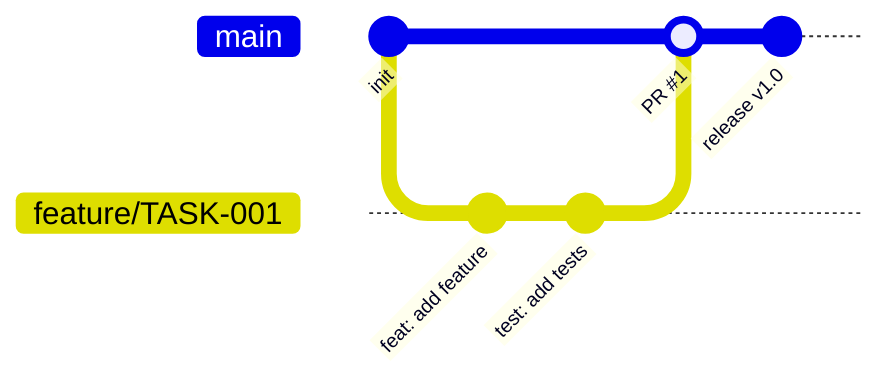

# 分支管理策略

## 1. 策略選擇

| 項目 | 內容 |
|------|------|
| 策略 | {GitHub Flow / GitFlow / Trunk-based} |
| 理由 | {選擇此策略的理由} |

## 2. 分支結構



## 3. 分支命名規範

| 類型 | 格式 | 範例 |
|------|------|------|
| 功能 | feature/{TASK-ID}-{描述} | feature/TASK-001-user-auth |
| 修復 | fix/{TASK-ID}-{描述} | fix/TASK-002-login-error |
| 熱修 | hotfix/{描述} | hotfix/security-patch |
| 發布 | release/{version} | release/v1.0.0 |

## 4. Merge 策略

| 場景 | 策略 | 理由 |
|------|------|------|
| Feature → main | Squash merge | 保持主線清潔 |
| Hotfix → main | Merge commit | 保留修復歷史 |
| Release → main | Merge commit | 保留發布歷史 |

## 5. PR 規範

### PR Template

```markdown
## 變更說明
{簡述變更內容}

## 變更類型
- [ ] 新功能
- [ ] Bug 修復
- [ ] 重構
- [ ] 文件更新
- [ ] 其他

## 測試
- [ ] 單元測試通過
- [ ] 整合測試通過
- [ ] 手動測試完成

## 對應任務
TASK-{ID}

## 截圖（UI 變更時必填）
```

### PR 規則

| 規則 | 說明 |
|------|------|
| Reviewer | 至少 1 人審核通過 |
| CI | 所有 CI 檢查通過才能 merge |
| 衝突 | 必須解決所有衝突 |
| 描述 | PR 描述不可為空 |

## 6. 主分支保護規則

| 規則 | 設定 |
|------|------|
| Require PR | 是 |
| Require reviews | ≥ 1 |
| Require CI pass | 是 |
| Dismiss stale reviews | 是 |
| Include administrators | 是 |
| Allow force push | 否 |
| Allow deletions | 否 |

## 7. CI/CD 分支觸發規則

### 分支 → Pipeline 階段映射

| 分支/事件 | Build | Lint | Test | Security | Deploy 目標 | 人工審批 |
|-----------|:-----:|:----:|:----:|:--------:|:-----------:|:--------:|
| Push to `feature/*` / `sdlc/*` | ✅ | ✅ | ✅ | ❌ | 不部署 | ❌ |
| PR to `main` / `develop` | ✅ | ✅ | ✅ | ✅ | 不部署 | ❌ |
| Merge to `develop` | ✅ | ✅ | ✅ | ✅ | dev 環境 | ❌ |
| Merge to `main` | ✅ | ✅ | ✅ | ✅ | staging 環境 | ❌ |
| Tag `v*` | ✅ | ✅ | ✅ | ✅ | production | ✅ |
| `hotfix/*` merge | ✅ | ✅ | ✅ | ✅ | staging → prod | ✅(prod) |

### 環境對照

| 環境配置 | develop 分支 | main 分支 | Tag v* |
|---------|:----------:|:--------:|:------:|
| dev + prod | dev | — | prod |
| dev + staging + prod | dev | staging | prod |
| dev + staging + uat + prod | dev | staging（→ uat 手動） | prod |

> 以上為預設規則，使用者可在 deploy-env.json 中覆蓋自訂觸發條件。

## 8. Git Tag 策略

| 時機 | Tag 格式 | 範例 |
|------|---------|------|
| 階段通過 | sdlc/{TASK-ID}/{phase}-approved | sdlc/TASK-001/ba-approved |
| 版本發布 | v{major}.{minor}.{patch} | v1.0.0 |
| 熱修 | v{major}.{minor}.{patch} | v1.0.1 |
