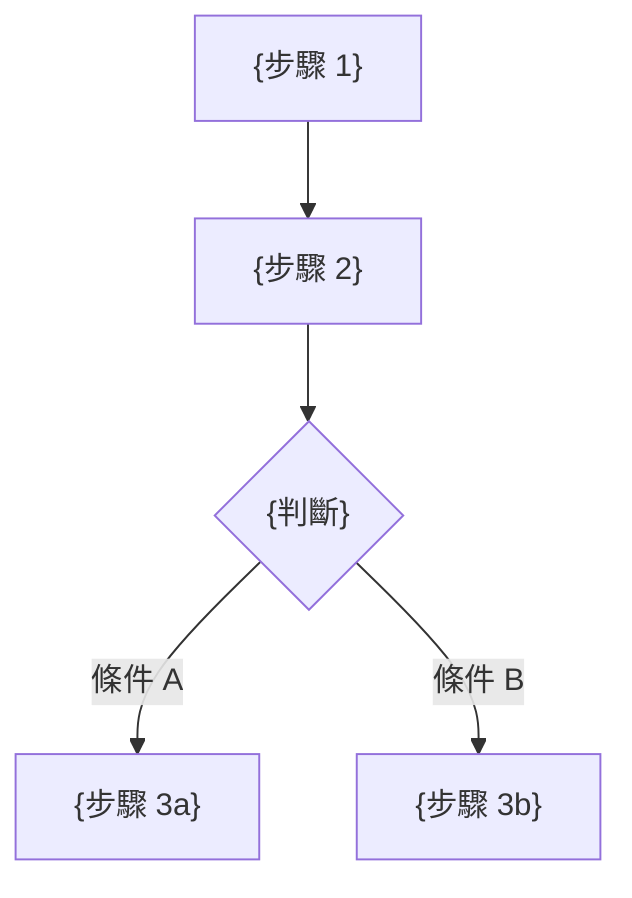
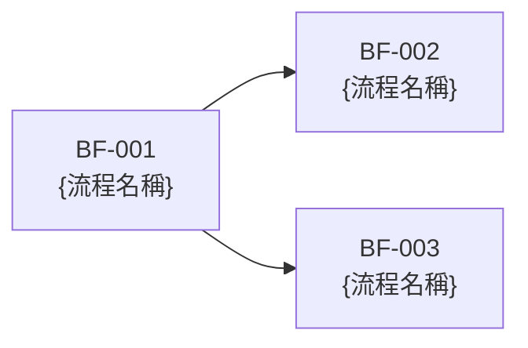

# 業務流程圖

## 1. 流程概述

{整體業務流程的描述}

## 2. 角色定義（業務角色，非系統角色）

| 角色ID | 角色名稱 | 描述 |
|--------|---------|------|
| ROLE-001 | {角色名稱} | {描述} |

## 3. 業務流程

### BF-001: {流程名稱}
- **觸發條件**: {什麼事件啟動此流程}
- **參與角色**: {哪些業務角色}
- **前置條件**: {必須滿足的條件}
- **對應需求**: FR-001, FR-002

#### 流程步驟

| 步驟 | 角色 | 動作 | 產出 |
|------|------|------|------|
| 1 | {角色} | {動作描述} | {產出} |
| 2 | {角色} | {動作描述} | {產出} |

#### 流程圖

#### 異常流程

| 異常 | 觸發條件 | 處理方式 |
|------|---------|---------|
| {異常名稱} | {觸發條件} | {處理方式} |

### BF-002: {流程名稱}
{同上格式}

## 4. 流程間關係

## 5. 追溯矩陣

| 流程ID | 對應需求 | 參與角色 |
|--------|---------|---------|
| BF-001 | FR-001, FR-002 | ROLE-001 |
