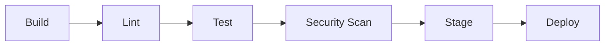

# CI/CD Pipeline 規格

## 1. Pipeline 概覽



## 2. Pipeline 各階段

### 2.1 Build

| 項目 | 內容 |
|------|------|
| 觸發條件 | {push to main / PR merge / tag} |
| 建置命令 | {npm run build / go build / ...} |
| 產出物 | {artifact 描述} |
| 失敗處理 | 停止，通知作者 + 團隊頻道 |
| 重試 | 否 |

### 2.2 Lint

| 項目 | 內容 |
|------|------|
| 工具 | {ESLint / Prettier / golint / ...} |
| 命令 | {npm run lint} |
| 失敗處理 | 停止，通知作者 |
| 重試 | 否 |

### 2.3 Test

| 項目 | 內容 |
|------|------|
| 單元測試 | {npm test / go test} |
| 整合測試 | {npm run test:integration} |
| 覆蓋率門檻 | 行覆蓋 > 80%, 分支覆蓋 > 70% |
| 失敗處理 | 停止，1 次重試（記錄 flaky），通知作者 + 測試擁有者 |

### 2.4 Security Scan

| 項目 | 內容 |
|------|------|
| SAST 工具 | {Semgrep / SonarQube / ...} |
| 依賴掃描 | {npm audit / Snyk / ...} |
| 密鑰偵測 | {gitleaks / trufflehog / ...} |
| 失敗處理 | Critical/High 停止，通知安全團隊 + 作者 |
| 重試 | 否 |

### 2.5 Stage

| 項目 | 內容 |
|------|------|
| 環境 | staging |
| 部署方式 | {Docker / K8s / Serverless / ...} |
| 煙霧測試 | {健康檢查 URL} |
| 失敗處理 | 停止，1 次重試，通知 DevOps + 作者 |

### 2.6 Deploy

| 項目 | 內容 |
|------|------|
| 環境 | production |
| 部署策略 | {Rolling / Blue-Green / Canary} |
| 健康檢查 | {檢查 URL + 條件} |
| 失敗處理 | 停止，自動回滾，全團隊警報 |
| 重試 | 否 |

## 3. Pipeline 配置範例

```yaml
# GitHub Actions 範例
name: CI/CD Pipeline
on:
  push:
    branches: [main]
  pull_request:
    branches: [main]

jobs:
  build:
    runs-on: ubuntu-latest
    steps:
      - uses: actions/checkout@v4
      - name: Build
        run: {build_command}

  lint:
    needs: build
    runs-on: ubuntu-latest
    steps:
      - name: Lint
        run: {lint_command}

  test:
    needs: lint
    runs-on: ubuntu-latest
    steps:
      - name: Test
        run: {test_command}

  security:
    needs: test
    runs-on: ubuntu-latest
    steps:
      - name: Security Scan
        run: {security_command}

  deploy:
    needs: security
    if: github.ref == 'refs/heads/main'
    runs-on: ubuntu-latest
    steps:
      - name: Deploy
        run: {deploy_command}
```

## 4. 回滾機制

> 實際指令依 `deploy-env.json.platform` 決定，詳見 `deploy-guide.md §6`（Deploy(Execute) 會依平台填入該檔）。

| 觸發條件 | 回滾方式 | 平台實指令（範例）| 預期時間 |
|---------|---------|------------------|---------|
| 健康檢查失敗 > 2 分鐘 | 自動回滾到前一版本 | K8s readiness probe / Vercel health / ECS CodeDeploy | < 2 min |
| 手動觸發 | 依平台手動指令 | `kubectl rollout undo` / `vercel rollback <url>` / `docker compose pull {prev-tag}` / `aws ecs update-service --task-definition` | < 5 min |
| 資料庫回滾 | migration down（僅向後相容時）；否則 fix forward | `prisma migrate resolve --rolled-back` / `alembic downgrade -1` | 視資料量 |

**禁止使用**虛構的 `deploy rollback --to X` 或 `git tag v-rollback`（後者不是 rollback，是觸發 CI 重新部署舊代碼）。
