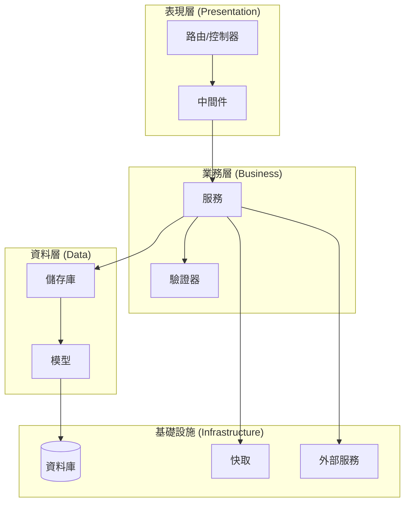
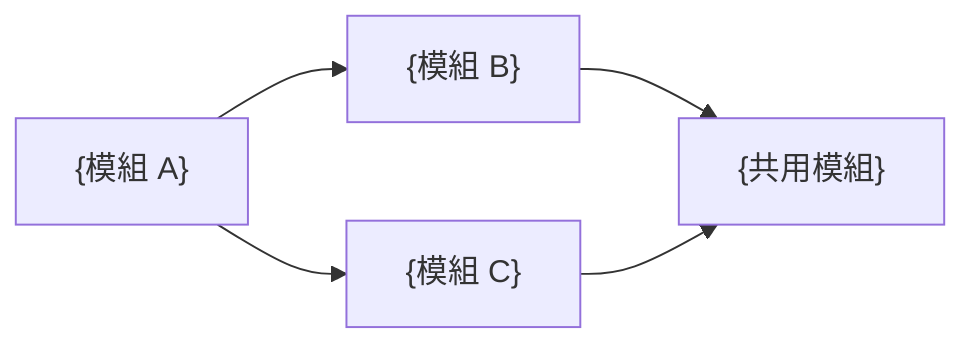

# 程式碼架構設計

## 1. 目錄結構

```
project/
├── src/
│   ├── {layer}/
│   │   ├── {module}/
│   │   │   ├── {file}.{ext}
│   │   │   └── ...
│   │   └── ...
│   ├── shared/
│   │   ├── utils/
│   │   ├── types/
│   │   └── constants/
│   └── config/
├── tests/
│   ├── unit/
│   ├── integration/
│   └── e2e/
├── migrations/
├── scripts/
└── docs/
```

## 2. 分層架構圖



## 3. 模組職責表

| 模組路徑 | 職責 | 依賴 | 對應 API |
|---------|------|------|---------|
| src/{layer}/{module} | {職責描述} | {依賴模組} | API-001 |

## 4. 依賴關係圖



## 5. 共用工具/函式清單

| 工具/函式 | 路徑 | 用途 | 使用者 |
|---------|------|------|--------|
| {函式名} | src/shared/utils/{file} | {用途} | {使用此函式的模組} |

## 6. 前端佈局架構（MANDATORY — 若專案含前端）

> **規則**: Layout 為全域共用元件，所有頁面路由共用同一個 Layout 實例。
> Sidebar 導航項目從統一配置讀取，不可逐頁硬編碼。

### 6.1 佈局元件結構

```
src/
├── components/
│   └── layout/
│       ├── AppLayout.{ext}       ← 全域佈局（Header + Sidebar + Content + Footer）
│       ├── Sidebar.{ext}         ← 側邊導航（導航項從 navConfig 讀取）
│       ├── Header.{ext}          ← 頂部欄
│       ├── Footer.{ext}          ← 頁腳
│       └── navConfig.{ext}       ← 導航項目統一定義（對應 wireframes.md 第 2 章）
├── pages/
│   ├── {PageName}/
│   │   └── index.{ext}          ← 僅 Content 區域內容
│   └── ...
```

### 6.2 路由佈局模式

```
路由配置 → AppLayout（全域共用）
             ├── Header（固定）
             ├── Sidebar（固定，active 狀態隨路由變化）
             ├── Content → 各頁面元件（動態替換）
             └── Footer（固定）
```

### 6.3 導航配置規則

| 規則 | 說明 |
|------|------|
| 單一來源 | 導航項目定義在 `navConfig` 中，Sidebar 元件讀取此配置渲染 |
| 與 wireframes 一致 | navConfig 的項目清單 = wireframes.md 第 2 章 Sidebar 導航項目 |
| Active 狀態 | 根據當前路由自動高亮對應導航項，不可硬編碼 |
| 權限控制 | 根據使用者角色過濾可見導航項（若有權限需求） |

## 7. Dev Container 規格（MANDATORY）

> **規則**: 每個專案必須提供 `.devcontainer/` 目錄，FE/BE 階段必須實際產出此目錄。

### 7.1 目錄結構

```
.devcontainer/
├── devcontainer.json          ← 主配置（MANDATORY）
├── Dockerfile.dev             ← 開發環境 Dockerfile（若需自訂）
├── docker-compose.dev.yml     ← 開發環境 compose（含 DB 等依賴服務）
└── post-create.sh             ← 容器建立後自動執行的設定腳本
```

### 7.2 devcontainer.json 規格

```json
{
  "name": "{project-name}-dev",
  "build": {
    "dockerfile": "Dockerfile.dev",
    "context": ".."
  },
  "features": {
    "ghcr.io/devcontainers/features/docker-in-docker:2": {},
    "ghcr.io/devcontainers/features/node:1": { "version": "{node_version}" }
  },
  "forwardPorts": ["{frontend_port}", "{backend_port}", "{db_port}"],
  "postCreateCommand": "bash .devcontainer/post-create.sh",
  "containerEnv": {
    "NODE_ENV": "development",
    "DATABASE_URL": "postgresql://{user}:{pass}@db:5432/{dbname}"
  },
  "customizations": {
    "vscode": {
      "extensions": ["{按技術棧列出必要 extensions}"],
      "settings": {"{按技術棧設定}"}
    }
  }
}
```

### 7.3 Dockerfile.dev 規格

```dockerfile
# Dev Container Dockerfile — 開發環境用
FROM {base_image}

# 系統依賴
RUN apt-get update && apt-get install -y {dev_dependencies} && rm -rf /var/lib/apt/lists/*

# 工作目錄
WORKDIR /workspace

# 安裝專案依賴（利用 Docker cache layer）
COPY package*.json ./
RUN npm ci

# 開發伺服器（非 production build）
CMD ["{dev_server_command}"]
```

## 8. Dockerfile 規格 — Buildx Multi-Stage（MANDATORY）

> **規則**: 所有 Dockerfile 必須使用 Multi-Stage 結構，CI/CD 必須使用 `docker buildx build` 構建。
> 禁止使用傳統 `docker build` 命令。

### 8.1 前端 Dockerfile（Multi-Stage + Buildx）

```dockerfile
# syntax=docker/dockerfile:1
# ─── Stage 1: Dependencies ───
FROM node:{version}-alpine AS deps
WORKDIR /app
COPY package*.json ./
RUN npm ci --only=production

# ─── Stage 2: Builder ───
FROM node:{version}-alpine AS builder
WORKDIR /app
COPY --from=deps /app/node_modules ./node_modules
COPY . .
RUN npm run build

# ─── Stage 3: Production ───
FROM nginx:{version}-alpine AS production
COPY --from=builder /app/dist /usr/share/nginx/html
COPY nginx.conf /etc/nginx/conf.d/default.conf
EXPOSE 80
HEALTHCHECK --interval=30s --timeout=3s CMD wget -qO- http://localhost/health || exit 1
USER nginx
CMD ["nginx", "-g", "daemon off;"]
```

### 8.2 後端 Dockerfile（Multi-Stage + Buildx）

```dockerfile
# syntax=docker/dockerfile:1
# ─── Stage 1: Dependencies ───
FROM node:{version}-alpine AS deps
WORKDIR /app
COPY package*.json ./
RUN npm ci --only=production

# ─── Stage 2: Builder ───
FROM node:{version}-alpine AS builder
WORKDIR /app
COPY --from=deps /app/node_modules ./node_modules
COPY . .
RUN npm run build

# ─── Stage 3: Production ───
FROM node:{version}-alpine AS production
WORKDIR /app
COPY --from=builder /app/dist ./dist
COPY --from=deps /app/node_modules ./node_modules
EXPOSE {port}
HEALTHCHECK --interval=30s --timeout=3s CMD wget -qO- http://localhost:{port}/health/live || exit 1
USER node
CMD ["node", "dist/main.js"]
```

### 8.3 Buildx 構建命令規範

```bash
# MANDATORY: 使用 buildx 構建（禁止 docker build）
docker buildx create --use --name multiarch-builder || true
docker buildx build \
  --platform {platforms} \
  --tag {registry}/{org}/{service}:{tag} \
  --cache-from type=gha \
  --cache-to type=gha,mode=max \
  --push \
  -f Dockerfile .
```

### 8.4 Container Registry 命名規範

| 項目 | 格式 |
|------|------|
| Image 名稱 | `{registry}/{org}/{project}-{service}:{tag}` |
| Tag: 最新 | `latest`（僅 main branch） |
| Tag: Commit | `{git-sha-short}`（每次 build） |
| Tag: Release | `v{semver}`（正式發版） |
| 範例 | `ghcr.io/myorg/myapp-api:a1b2c3d` |

## 9. 錯誤處理策略

### 6.1 錯誤分層

| 層級 | 錯誤類型 | 處理方式 |
|------|---------|---------|
| 表現層 | 請求驗證錯誤 | 400 + 結構化錯誤訊息 |
| 業務層 | 業務邏輯錯誤 | 自訂錯誤碼 + 訊息 |
| 資料層 | 資料庫錯誤 | 轉換為業務錯誤 |
| 基礎設施 | 外部服務錯誤 | 重試/降級/熔斷 |

### 6.2 錯誤碼定義

| 錯誤碼 | HTTP Status | 說明 |
|--------|------------|------|
| {ERROR_CODE} | {status} | {說明} |

## 10. 環境配置

| 變數名 | 用途 | 預設值 | 必填 |
|--------|------|--------|------|
| DATABASE_URL | 資料庫連線字串 | - | 是 |
| PORT | 服務埠號 | 3000 | 否 |
| NODE_ENV | 環境 | development | 否 |

## 11. 允許的依賴清單

| 依賴名稱 | 版本 | 用途 | 類別 |
|---------|------|------|------|
| {package} | ^{version} | {用途} | runtime/dev |
