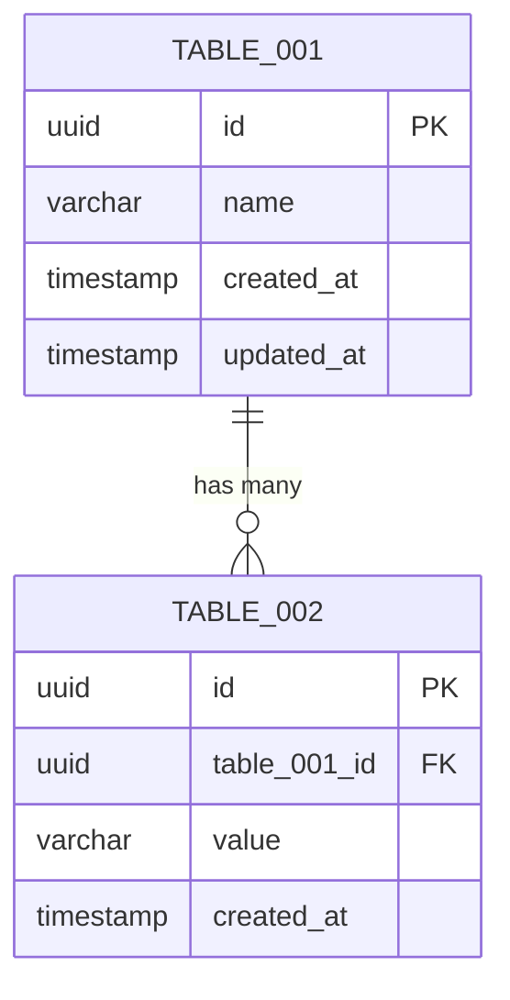

# 資料庫設計

## 1. ER 圖



## 2. 資料表定義

### TBL-001: {資料表名稱}
- **對應實體**: ENTITY-001
- **說明**: {描述}

#### DDL

```sql
CREATE TABLE {table_name} (
    id UUID PRIMARY KEY DEFAULT gen_random_uuid(),
    {column_name} VARCHAR(255) NOT NULL,
    {column_name} INTEGER DEFAULT 0,
    {column_name} BOOLEAN DEFAULT false,
    {foreign_key}_id UUID NOT NULL REFERENCES {other_table}(id),
    created_at TIMESTAMP WITH TIME ZONE DEFAULT NOW(),
    updated_at TIMESTAMP WITH TIME ZONE DEFAULT NOW(),

    CONSTRAINT {constraint_name} CHECK ({condition})
);

-- Trigger for updated_at
CREATE OR REPLACE FUNCTION update_updated_at_column()
RETURNS TRIGGER AS $$
BEGIN
    NEW.updated_at = NOW();
    RETURN NEW;
END;
$$ language 'plpgsql';

CREATE TRIGGER update_{table_name}_updated_at
    BEFORE UPDATE ON {table_name}
    FOR EACH ROW
    EXECUTE FUNCTION update_updated_at_column();
```

### TBL-002: {資料表名稱}
{同上格式}

## 3. 索引策略

| 索引名 | 資料表 | 欄位 | 類型 | 理由 |
|--------|--------|------|------|------|
| idx_{table}_{column} | {table} | {column} | B-tree | {查詢場景} |
| idx_{table}_{column}_unique | {table} | {column} | Unique | {唯一性約束} |
| idx_{table}_{col1}_{col2} | {table} | {col1}, {col2} | Composite | {複合查詢場景} |

## 4. 資料遷移考量

| 項目 | 說明 |
|------|------|
| 初始資料 | {是否需要 seed data} |
| 遷移順序 | {資料表建立順序，考慮 FK 依賴} |
| 大資料量處理 | {是否需要分批遷移} |
| 回滾策略 | {每個 migration 的 down 操作} |

## 5. 追溯矩陣

| 資料表ID | 對應實體 | 相關功能 | 使用的 API |
|---------|---------|---------|-----------|
| TBL-001 | ENTITY-001 | FUNC-001 | API-001, API-002 |
