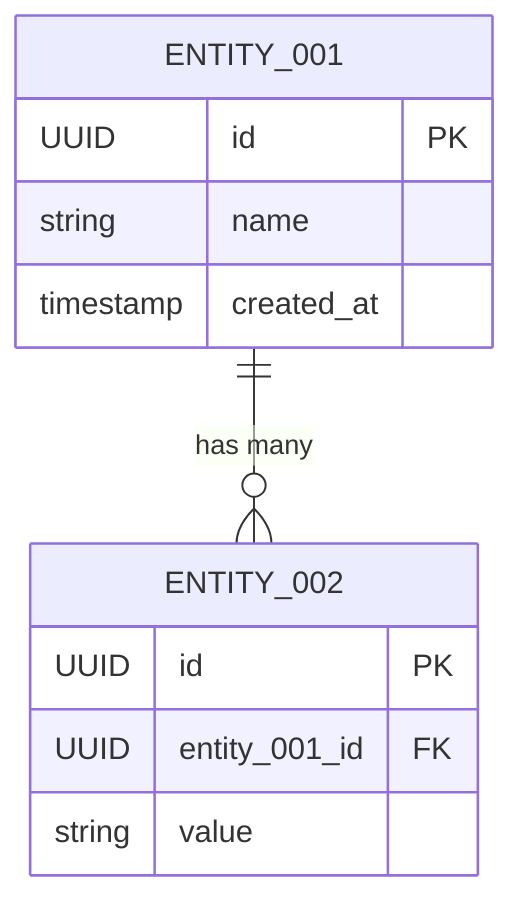

# 欄位規格書

## 1. 實體清單

| 實體ID | 實體名稱 | 描述 | 相關功能 |
|--------|---------|------|---------|
| ENTITY-001 | {實體名稱} | {描述} | FUNC-001, FUNC-002 |

## 2. 實體欄位定義

### ENTITY-001: {實體名稱}

| 欄位名 | 類型 | 必填 | 預設值 | 驗證規則 | 描述 | 來源需求 |
|--------|------|------|--------|---------|------|---------|
| id | UUID | 是 | auto-gen | - | 唯一識別碼 | - |
| {欄位名} | {類型} | 是/否 | {預設值} | {規則} | {描述} | FR-001 |
| created_at | TIMESTAMP | 是 | NOW() | - | 建立時間 | - |
| updated_at | TIMESTAMP | 是 | NOW() | - | 更新時間 | - |

**驗證規則說明**:
- {欄位名}: {詳細驗證規則描述}

### ENTITY-002: {實體名稱}
{同上格式}

## 3. 實體關係

## 4. 追溯矩陣

| 實體ID | 相關功能 | 來源需求 |
|--------|---------|---------|
| ENTITY-001 | FUNC-001, FUNC-002 | FR-001, FR-002 |
| ENTITY-002 | FUNC-003 | FR-003 |
