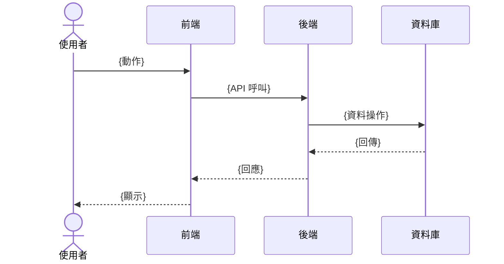
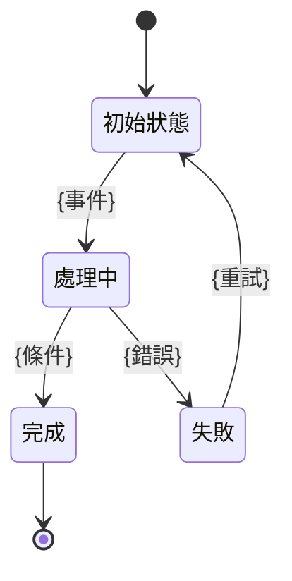
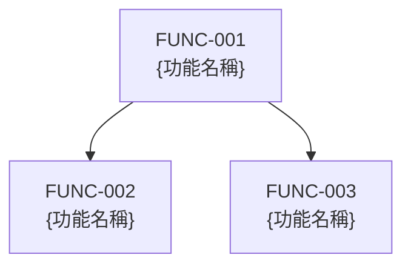

# 功能流程圖

## 1. 功能清單

| 功能ID | 功能名稱 | 描述 | 所屬模組 | 來源需求 | 優先順序 |
|--------|---------|------|---------|---------|---------|
| FUNC-001 | {功能名稱} | {描述} | MOD-001 | FR-001 | P0 |
| FUNC-002 | {功能名稱} | {描述} | MOD-001 | FR-002 | P1 |

## 2. 功能流程

### FUNC-001: {功能名稱}
- **觸發**: {觸發條件}
- **輸入**: {輸入資料}
- **輸出**: {輸出資料}
- **前置條件**: {必須滿足的條件}

#### 系統流程圖

#### 狀態轉換圖（如適用）

### FUNC-002: {功能名稱}
{同上格式}

## 3. 功能關係圖

## 4. 追溯矩陣

| 功能ID | 來源需求 | 所屬模組 | 相關業務流程 |
|--------|---------|---------|------------|
| FUNC-001 | FR-001 | MOD-001 | BF-001 |
| FUNC-002 | FR-002 | MOD-001 | BF-001, BF-002 |
