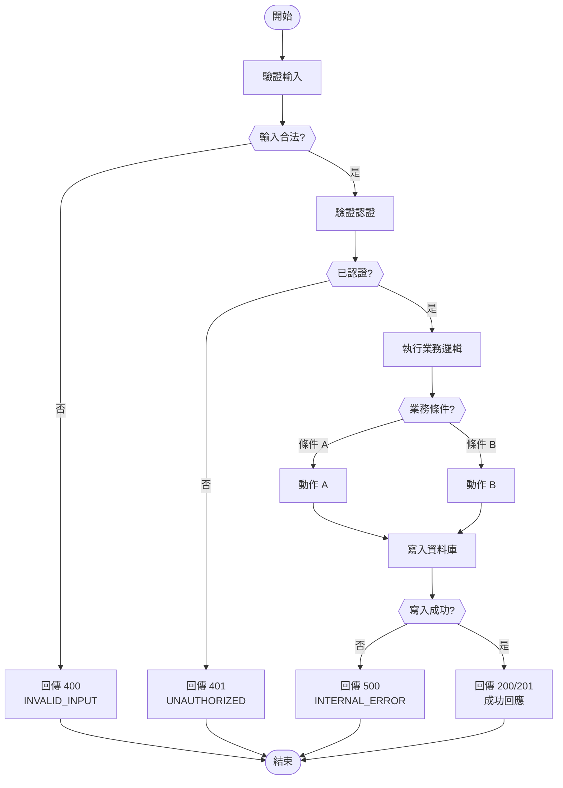

# 邏輯判斷圖

## 1. 邏輯清單

| 邏輯ID | 名稱 | 對應 API | 對應功能 | 複雜度 |
|--------|------|---------|---------|--------|
| LOGIC-001 | {邏輯名稱} | API-001 | FUNC-001 | 高/中/低 |

## 2. 邏輯詳細設計

### LOGIC-001: {邏輯名稱}
- **對應 API**: API-001
- **對應功能**: FUNC-001
- **複雜度**: 高/中/低
- **說明**: {邏輯描述}

#### 流程圖

#### 判斷條件表

| 判斷節點 | 條件 | True 路徑 | False 路徑 |
|---------|------|----------|-----------|
| 輸入合法? | {具體驗證規則} | 繼續 | 400 錯誤 |
| 已認證? | {認證檢查邏輯} | 繼續 | 401 錯誤 |
| 業務條件? | {具體業務條件} | 動作 A | 動作 B |

#### 邊界案例

| 案例 | 輸入 | 預期行為 | 理由 |
|------|------|---------|------|
| {案例 1} | {輸入描述} | {預期結果} | {理由} |
| {案例 2} | {輸入描述} | {預期結果} | {理由} |

### LOGIC-002: {邏輯名稱}
{同上格式}

## 3. 追溯矩陣

| 邏輯ID | 對應 API | 對應功能 | 來源需求 |
|--------|---------|---------|---------|
| LOGIC-001 | API-001 | FUNC-001 | FR-001 |
