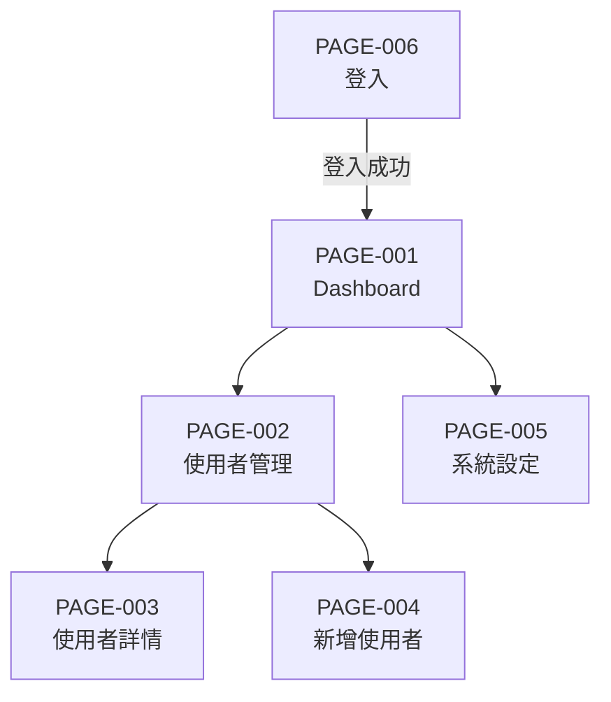

# 頁面架構（Sitemap）

> **用途**: 定義頁面階層結構、導航關係、存取權限。此文件放入 shared 層，跨 TASK 累積。
> **位置**: `.sdlc/shared/apps/{app}/sitemap.md`

## 1. 頁面階層樹

```
{App 名稱}
├── / (首頁/Dashboard)                    [PAGE-001] [公開/登入後/管理員]
├── /users (使用者管理)                    [PAGE-002] [管理員]
│   ├── /users/:id (使用者詳情)            [PAGE-003] [管理員]
│   └── /users/create (新增使用者)         [PAGE-004] [管理員]
├── /settings (系統設定)                   [PAGE-005] [管理員]
└── /login (登入)                          [PAGE-006] [公開]
```

## 2. 共用佈局定義（MANDATORY — 所有頁面共用）

> **規則**: 以下佈局元件在所有頁面中**完全一致**，不可逐頁修改。
> 各頁面僅替換 Content 區域內容，Header/Sidebar/Footer 保持不變。

### 全域佈局結構

```
┌─────────────────────────────────────────────┐
│                  Header                      │
│  [Logo]              [Nav] [Nav] [User Menu] │
├──────────┬──────────────────────────────────┤
│ Sidebar  │                                   │
│          │          Content                  │
│ [Nav-1]  │     （各頁面獨立內容）              │
│ [Nav-2]  │                                   │
│ [Nav-3]  │                                   │
│ [Nav-4]  │                                   │
│ [Nav-5]  │                                   │
│          │                                   │
├──────────┴──────────────────────────────────┤
│                  Footer                      │
└─────────────────────────────────────────────┘
```

### Sidebar 導航項目（固定清單）

| 順序 | 圖標 | 標籤 | 目標頁面 | 權限 |
|------|------|------|---------|------|
| 1 | {icon} | {導航項名稱} | PAGE-001 | {公開/登入後/管理員} |
| 2 | {icon} | {導航項名稱} | PAGE-002 | {公開/登入後/管理員} |
| 3 | {icon} | {導航項名稱} | PAGE-003 | {公開/登入後/管理員} |

> **注意**: 此導航清單為全域唯一定義。所有頁面的 Sidebar 必須渲染相同的導航項目，
> 僅 active 狀態隨當前頁面變化（高亮當前頁面對應的導航項）。

### Header 元件配置

| 區塊 | 元件 | 元件ID | 固定/動態 |
|------|------|--------|----------|
| 左側 | Logo | COMP-LOGO | 固定 |
| 中間 | {導航/麵包屑/空} | {COMP-ID} | {固定/動態} |
| 右側 | UserMenu | COMP-USERMENU | 固定（顯示登入使用者） |

### Footer 元件配置（若有）

| 區塊 | 內容 | 固定/動態 |
|------|------|----------|
| {區塊} | {內容描述} | 固定 |

## 3. 導航結構



## 4. 頁面清單

| 頁面ID | 頁面名稱 | 路由 | 對應功能 | 存取權限 | 新增 TASK | 說明 |
|--------|---------|------|---------|---------|----------|------|
| PAGE-001 | {頁面名稱} | /{路由} | FUNC-001 | {公開/登入後/管理員} | TASK-001 | {說明} |
| PAGE-002 | {頁面名稱} | /{路由} | FUNC-002 | {權限} | TASK-001 | {說明} |

## 5. 頁面轉場定義

| 來源頁面 | 目標頁面 | 觸發動作 | 轉場方式 | 參數傳遞 |
|---------|---------|---------|---------|---------|
| PAGE-001 | PAGE-002 | Sidebar 點擊 | 路由導航 | — |
| PAGE-002 | PAGE-003 | 列表項點擊 | 路由導航 | :id |
| PAGE-002 | PAGE-002 | 刪除成功 | 頁面刷新 | — |

## 6. 存取權限矩陣

| 頁面ID | 禁止檢視 | 檢視（唯讀） | 編輯（完整） |
|--------|---------|------------|------------|
| PAGE-001 | Sidebar 隱藏 + 不可存取 | 可看 + 操作按鈕 disabled | 全部可操作 |
| PAGE-002 | Sidebar 隱藏 + 不可存取 | 可看 + 新增/編輯/刪除 disabled | 全部可操作 |

> **規則**（遵循 sdlc-uiux.md Rule 4）: 「檢視」權限下操作按鈕為 disabled 狀態，不可隱藏。
> disabled 按鈕顯示 tooltip「您無編輯權限」。

## 7. 追溯矩陣

| 頁面ID | 對應功能 | 來源需求 |
|--------|---------|---------|
| PAGE-001 | FUNC-001, FUNC-002 | FR-001, FR-002 |
| PAGE-002 | FUNC-003, FUNC-004 | FR-003, FR-004 |
