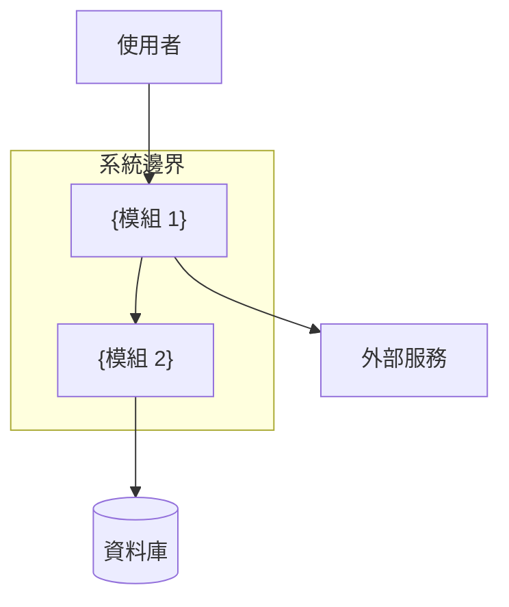

# 系統架構設計

## 1. 架構概述

{系統架構的高層描述}

## 2. 系統邊界圖

## 3. 模組拆分

### MOD-001: {模組名稱}
- **職責**: {模組職責描述}
- **輸入**: {接收的資料/請求}
- **輸出**: {產出的資料/回應}
- **依賴**: {依賴的其他模組}
- **技術選型**: {使用的技術}
- **對應需求**: FR-001, FR-002

### MOD-002: {模組名稱}
{同上格式}

## 4. 技術選型

| 層級 | 技術 | 版本 | 理由 | 對應 config.json |
|------|------|------|------|-----------------|
| 前端框架 | {技術} | {版本} | {理由} | ✅ 一致 / ⚠️ [SA建議] |
| 後端框架 | {技術} | {版本} | {理由} | ✅ 一致 |
| 資料庫 | {技術} | {版本} | {理由} | ✅ 一致 |

## 5. 非功能架構

### 5.1 安全架構
{認證/授權機制}

### 5.2 效能考量
{快取策略/負載均衡}

### 5.3 可擴展性
{擴展策略}

## 6. 追溯矩陣

| 模組ID | 對應需求 | 依賴模組 |
|--------|---------|---------|
| MOD-001 | FR-001, FR-002 | MOD-002 |
| MOD-002 | FR-003 | - |

## 7. 容器化策略（MANDATORY）

> **規則**: 所有專案必須使用 Dev Container 開發環境 + Docker Buildx 構建 + Container Registry 推送。
> 從 `.sdlc/config.json` 的 `containerStrategy` 讀取設定。

### 7.1 Dev Container 策略

| 項目 | 定義 |
|------|------|
| 必要性 | MANDATORY — 所有專案必須提供 `.devcontainer/devcontainer.json` |
| 用途 | 統一開發環境，消除「在我機器上可以跑」的問題 |
| 範圍 | 前端 + 後端共用，或各自獨立（依架構決定） |
| 基礎 Image | {從 config.json techStack 推導，如 `mcr.microsoft.com/devcontainers/typescript-node`} |
| Features | {按技術棧選擇，如 Docker-in-Docker、PostgreSQL client} |

### 7.2 Docker Buildx 策略

| 項目 | 定義 |
|------|------|
| 構建工具 | Docker Buildx（MANDATORY — 禁止使用傳統 `docker build`） |
| 平台 | {從 config.json containerStrategy.buildxPlatforms 讀取} |
| Dockerfile 結構 | Multi-stage 必要（builder → production） |
| Cache 策略 | `--cache-from type=gha` / `--cache-to type=gha,mode=max`（GitHub Actions） |
| 命名規範 | `{registry}/{org}/{project}-{service}:{git-sha-short}` |

### 7.3 Container Registry 策略

| 項目 | 定義 |
|------|------|
| Registry | {從 config.json containerStrategy.registry 讀取} |
| Registry URL | {從 config.json containerStrategy.registryUrl 讀取} |
| Image Tag 策略 | `latest`（main branch）+ `{git-sha-short}`（每次 build）+ `{semver}`（release） |
| 認證方式 | {CI/CD 環境變數，如 `GITHUB_TOKEN` / `DOCKER_PASSWORD` / `AWS_ACCESS_KEY`} |

## 8. 自我驗證

| 檢查項 | 通過 | 說明 |
|--------|------|------|
| 每個 FR 都有模組對應 | ✅/❌ | |
| 無循環依賴 | ✅/❌ | |
| 技術選型與 config 一致 | ✅/❌ | |
| 模組邊界清晰 | ✅/❌ | |
