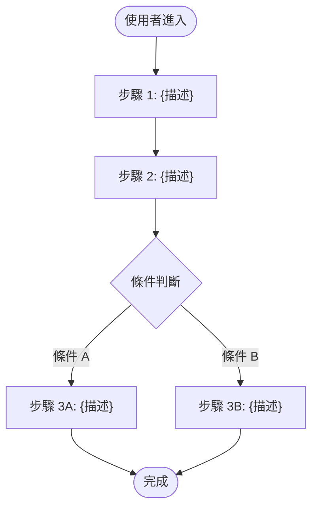
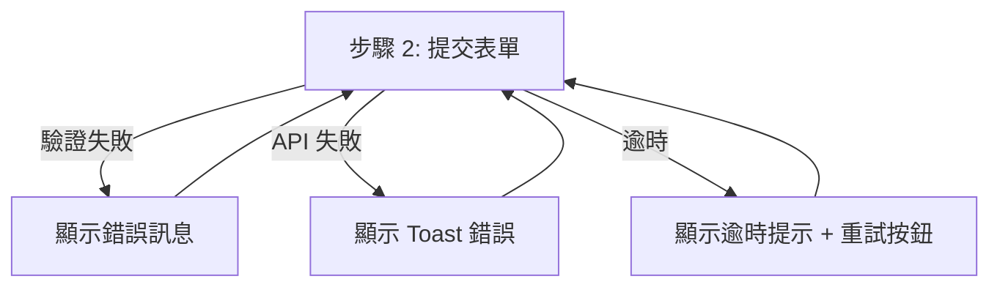

# 使用者流程（User Flow）

> **用途**: 定義每個功能的使用者操作流程，包含正常路徑、異常路徑、邊界情況。
> **位置**: `.sdlc/tasks/{TASK-ID}/uiux/user-flow.md`（每 TASK 獨立）

## 1. 流程總覽

| 流程ID | 流程名稱 | 對應功能 | 觸發條件 | 主要路徑步驟數 |
|--------|---------|---------|---------|-------------|
| FLOW-001 | {流程名稱} | FUNC-001 | {使用者點擊/系統觸發/URL 直接存取} | {N} 步 |
| FLOW-002 | {流程名稱} | FUNC-002 | {觸發條件} | {N} 步 |

## 2. 流程詳細設計

### FLOW-001: {流程名稱}
- **對應功能**: FUNC-001
- **觸發條件**: {描述使用者如何進入此流程}
- **前置條件**: {需要先完成什麼，如已登入、已有資料等}

#### 正常路徑（Happy Path）

#### 異常路徑（Error Path）

#### 邊界情況（Edge Cases）

| 情況 | 觸發條件 | 系統行為 | UI 呈現 |
|------|---------|---------|--------|
| 無權限 | 使用者權限不足 | 阻擋操作 | 按鈕 disabled + tooltip |
| 資料不存在 | URL 直接存取已刪除資料 | 導回列表頁 | Toast 提示「資料不存在」 |
| 並發衝突 | 其他使用者已修改 | 提示衝突 | Dialog 顯示衝突內容 |
| 網路中斷 | 離線狀態 | 快取/重試 | Banner 提示離線 |

#### 步驟明細

| 步驟 | 使用者操作 | 系統回應 | 涉及頁面 | 涉及元件 |
|------|----------|---------|---------|---------|
| 1 | {操作描述} | {回應描述} | PAGE-001 | COMP-001, COMP-002 |
| 2 | {操作描述} | {回應描述} | PAGE-001 | COMP-003 |
| 3 | {操作描述} | {回應描述} | PAGE-002 | COMP-004 |

### FLOW-002: {流程名稱}
{同上格式}

## 3. 追溯矩陣

| 流程ID | 對應功能 | 來源需求 | 涉及頁面 |
|--------|---------|---------|---------|
| FLOW-001 | FUNC-001 | FR-001 | PAGE-001, PAGE-002 |
| FLOW-002 | FUNC-002 | FR-002 | PAGE-002, PAGE-003 |
