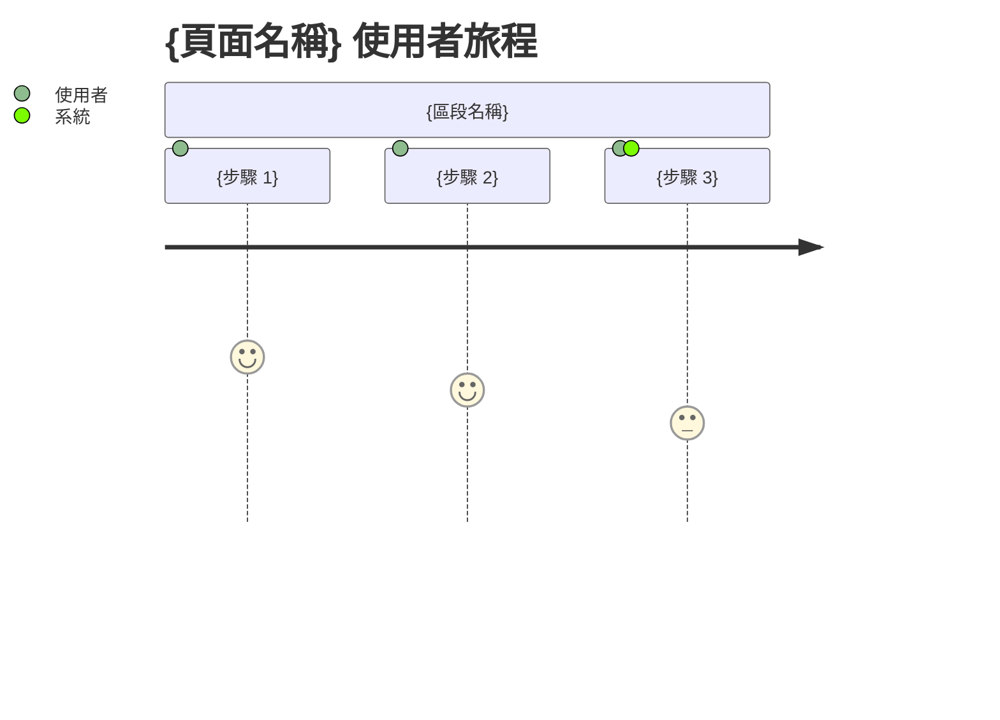

# 線框圖

## 1. 頁面清單

| 頁面ID | 頁面名稱 | 路由 | 對應功能 | 說明 |
|--------|---------|------|---------|------|
| PAGE-001 | {頁面名稱} | /{路由} | FUNC-001 | {說明} |

## 2. 頁面設計

> **共用佈局**: Header/Sidebar/Footer 的定義位於 `sitemap.md` 第 2 章。
> 以下每頁僅定義 **Content 區域**的內容，不重複定義共用佈局。

> **規則**: 以下每頁僅定義 **Content 區域** 的內容。
> Header/Sidebar/Footer 已在第 2 章統一定義，各頁面不可重複定義或修改。

### PAGE-001: {頁面名稱}
- **路由**: /{路由}（與 sitemap.md 一致）
- **對應功能**: FUNC-001, FUNC-002
- **存取權限**: {公開 / 登入後 / 管理員}

#### Layer 1 — 頁面結構（區塊佈局）

```
┌─────────────────────────────────────────────┐
│                  Header                      │
│  [Logo]              [Nav] [Nav] [User Menu] │
├─────────────────────────────────────────────┤
│                                              │
│                  Content                     │
│                                              │
│  ┌──────────────────────────────────────┐   │
│  │           {區塊名稱}                   │   │
│  │                                       │   │
│  └──────────────────────────────────────┘   │
│                                              │
│  ┌──────────────────────────────────────┐   │
│  │           {區塊名稱}                   │   │
│  │                                       │   │
│  └──────────────────────────────────────┘   │
│                                              │
├─────────────────────────────────────────────┤
│                  Footer                      │
└─────────────────────────────────────────────┘
```

#### Layer 2 — 元件配置

| 區塊 | 元件 | 元件ID | Props |
|------|------|--------|-------|
| Header | Logo | COMP-001 | - |
| Header | NavLink | COMP-002 | label, href |
| Content | {元件} | COMP-xxx | {props} |

#### Layer 3 — 互動標註

| 元素 | 觸發 | 行為 | 動畫 |
|------|------|------|------|
| {元素} | hover | {行為描述} | transition.default |
| {元素} | click | {行為描述} | - |
| {元素} | focus | {行為描述} | - |

#### Layer 4 — 響應式變化

| 斷點 | 佈局變化 |
|------|---------|
| mobile (375px) | {描述佈局變化} |
| tablet (768px) | {描述佈局變化} |
| desktop (1024px) | {描述佈局變化，通常是預設} |
| wide (1440px) | {描述佈局變化} |

#### Layer 5 — 多狀態場景（MANDATORY）

##### 空資料狀態（Empty State）

```
┌─────────────────────────────────────────────┐
│                  Header                      │
├─────────────────────────────────────────────┤
│                                              │
│          ┌──────────────────┐               │
│          │   {empty icon}    │               │
│          │                   │               │
│          │  {空資料提示文字}   │               │
│          │  [新增{實體}按鈕]  │               │
│          └──────────────────┘               │
│                                              │
├─────────────────────────────────────────────┤
│                  Footer                      │
└─────────────────────────────────────────────┘
```

##### 有資料狀態（Data Loaded）

{主要 Layer 1 結構，填入範例資料，展示正常使用時的完整畫面}

##### 新增場景（Create — 若適用）

```
┌─────────────────────── Modal ───────────────┐
│ ┌─────────────────────────────────────────┐ │
│ │  新增 {實體名稱}                    [X]  │ │
│ ├─────────────────────────────────────────┤ │
│ │                                          │ │
│ │  {欄位 1 Label}                          │ │
│ │  ┌──────────────────────────────────┐   │ │
│ │  │ {placeholder}                     │   │ │
│ │  └──────────────────────────────────┘   │ │
│ │                                          │ │
│ │  {欄位 2 Label}                          │ │
│ │  ┌──────────────────────────────────┐   │ │
│ │  │ {placeholder}                     │   │ │
│ │  └──────────────────────────────────┘   │ │
│ │                                          │ │
│ ├─────────────────────────────────────────┤ │
│ │              [取消]  [確認新增]           │ │
│ └─────────────────────────────────────────┘ │
└─────────────────────────────────────────────┘
```

##### 編輯場景（Edit — 若適用）

{同新增場景結構，但標題為「編輯 {實體名稱}」，欄位帶預填資料}

##### 刪除確認場景（Delete — 若適用）

```
┌──────────── Confirm Dialog ─────────────┐
│ ┌─────────────────────────────────────┐ │
│ │  ⚠️  確認刪除                        │ │
│ ├─────────────────────────────────────┤ │
│ │                                      │ │
│ │  確定要刪除「{實體名稱}」嗎？         │ │
│ │  此操作無法復原。                     │ │
│ │                                      │ │
│ ├─────────────────────────────────────┤ │
│ │          [取消]  [確認刪除]           │ │
│ └─────────────────────────────────────┘ │
└─────────────────────────────────────────┘
```

##### 載入中狀態（Loading / Skeleton）

{Layer 1 結構，內容區域替換為 skeleton 區塊（灰色條紋佔位）}

##### 錯誤狀態（Error）

```
┌─────────────────────────────────────────────┐
│                  Header                      │
├─────────────────────────────────────────────┤
│                                              │
│          ┌──────────────────┐               │
│          │   {error icon}    │               │
│          │                   │               │
│          │  {錯誤提示訊息}    │               │
│          │  [重試按鈕]        │               │
│          └──────────────────┘               │
│                                              │
├─────────────────────────────────────────────┤
│                  Footer                      │
└─────────────────────────────────────────────┘
```

#### 使用者旅程



#### UX 補充欄位表

| SA 原始欄位 | UIUX 補充 | 標記 | 理由 |
|------------|----------|------|------|
| - | loading state | [UIUX-REQUIRED] | 提升使用者感知效能 |
| - | empty state | [UIUX-REQUIRED] | 無資料時的顯示 |
| - | error state | [UIUX-REQUIRED] | 錯誤時的顯示 |
| - | skeleton screen | [UIUX-RECOMMENDED] | 載入中的骨架畫面 |

### PAGE-002: {頁面名稱}
{同上格式}

> **頁面流程**: 頁面間的導航關係定義在 `sitemap.md` 第 3 章（導航結構）和 `user-flow.md`（使用者操作流程）。

## 3. 追溯矩陣

| 頁面ID | 對應功能 | 來源需求 |
|--------|---------|---------|
| PAGE-001 | FUNC-001, FUNC-002 | FR-001, FR-002 |

## 4. 截圖映射（Screenshot Mapping）

> **目的**: 建立 Pencil 節點 ID ↔ PAGE ID ↔ 截圖檔名的三方對應關係，確保截圖命名語義化、可追溯、與 wireframes 一致。
> **命名規範**: 所有截圖檔名必須符合 `PAGE-{NNN}-{slug}-{state}.png` 格式，禁止使用 Pencil 原生節點 ID（如 `node-abc123.png`）。

### 4.1 Pencil 節點對應表

> **用途**: 從 Pencil 原生節點 ID 反查對應的 PAGE ID 與檔名，方便 UIUX 交接 / 後續維護 / 工具自動化。
> **必填**: 每個出現在 .pen 視覺稿中的 Frame 都必須登記，不可有遺漏。

| Pencil Node ID | Pencil Frame 名稱 | 對應 PAGE ID | 狀態（state） | 截圖檔名 |
|----------------|-------------------|--------------|--------------|---------|
| {node-abc123} | {Pencil 中的 Frame 名} | PAGE-001 | default | PAGE-001-user-list-default.png |
| {node-abc124} | {Pencil 中的 Frame 名} | PAGE-001 | empty | PAGE-001-user-list-empty.png |
| {node-abc125} | {Pencil 中的 Frame 名} | PAGE-001 | loading | PAGE-001-user-list-loading.png |
| {node-abc126} | {Pencil 中的 Frame 名} | PAGE-001 | error | PAGE-001-user-list-error.png |
| {node-def200} | {Pencil 中的 Frame 名} | PAGE-002 | default | PAGE-002-user-create-default.png |

### 4.2 狀態字彙表（state vocabulary）

> 所有狀態必須使用以下詞彙，不可自創：

| state | 用途 | 對應 Layer 5 場景 |
|-------|------|------------------|
| `default` | 有資料的正常畫面 | 有資料狀態 |
| `empty` | 空資料畫面 | 空資料狀態 |
| `loading` | 載入中 / skeleton | 載入中狀態 |
| `error` | 錯誤提示 | 錯誤狀態 |
| `create` | 新增 Modal | 新增場景 |
| `edit` | 編輯 Modal | 編輯場景 |
| `delete` | 刪除確認 Dialog | 刪除確認場景 |
| `hover` | Hover 互動態 | Layer 3 互動 |
| `focus` | Focus 互動態 | Layer 3 互動 |
| `disabled` | 禁用態（權限） | 權限場景 |

### 4.3 完整性驗證（UIUX 自我驗證必須通過）

UIUX 階段產出截圖後，必須執行以下三項驗證：

- [ ] **檔名格式驗證**: `.sdlc/tasks/{TASK-ID}/uiux/screenshots/` 下所有 `.png` 檔名符合 `PAGE-{NNN}-{slug}-{state}.png`
  ```bash
  # 偵測違規檔名（應為空輸出）
  ls .sdlc/tasks/{TASK-ID}/uiux/screenshots/*.png | grep -vE 'PAGE-[0-9]{3}[a-z]?-[a-z0-9-]+-(default|empty|loading|error|create|edit|delete|hover|focus|disabled)\.png$'
  ```
- [ ] **節點對應表完整性**: 4.1 表格的 Node ID 必須唯一，不可重複；PAGE ID 必須存在於第 1 章頁面清單
- [ ] **截圖 ↔ 對應表一致性**: 檔案系統的截圖數量必須 = 4.1 表格列數
  ```bash
  # 檔案數
  FILE_COUNT=$(ls .sdlc/tasks/{TASK-ID}/uiux/screenshots/*.png 2>/dev/null | wc -l)
  # 對應表列數（以 PAGE- 起首的資料列）
  TABLE_COUNT=$(grep -cE '^\|\s*\{?node-' .sdlc/tasks/{TASK-ID}/uiux/wireframes.md)
  # 兩者必須相等
  [ "$FILE_COUNT" = "$TABLE_COUNT" ] || echo "FAIL: 截圖數 ($FILE_COUNT) ≠ 對應表列數 ($TABLE_COUNT)"
  ```

> 任一驗證失敗 → UIUX 自我驗證扣 10 分 / 項，分數 < 90 不得交付。
