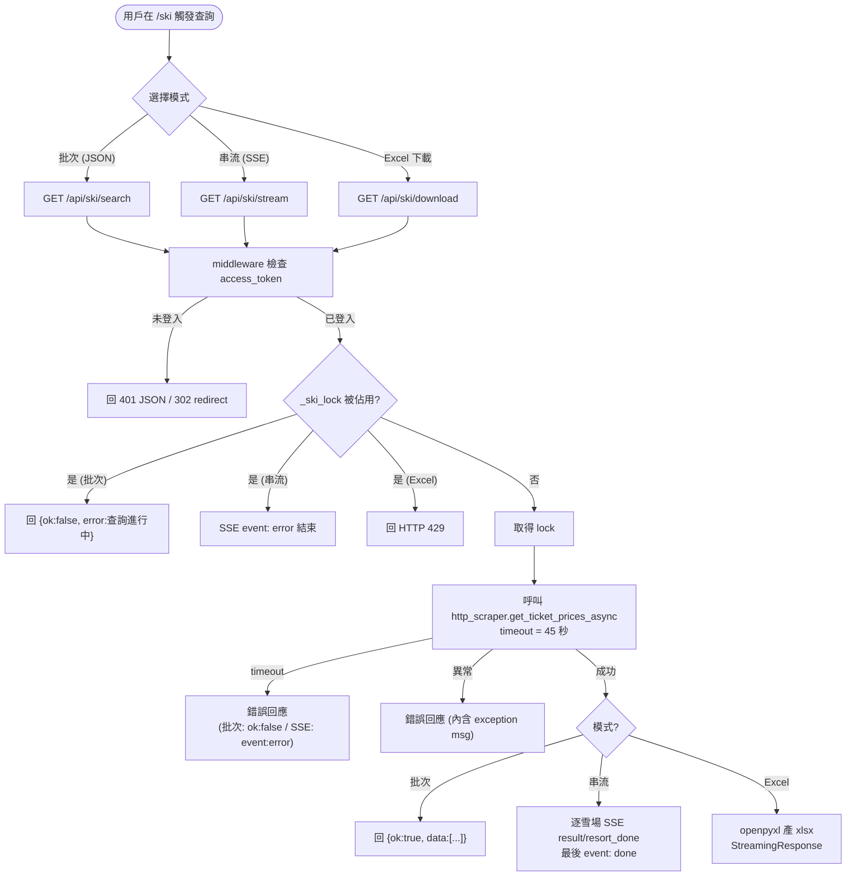
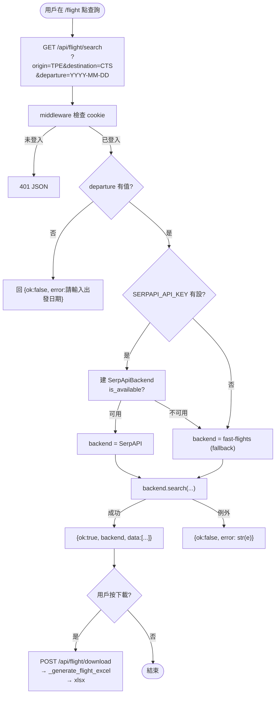
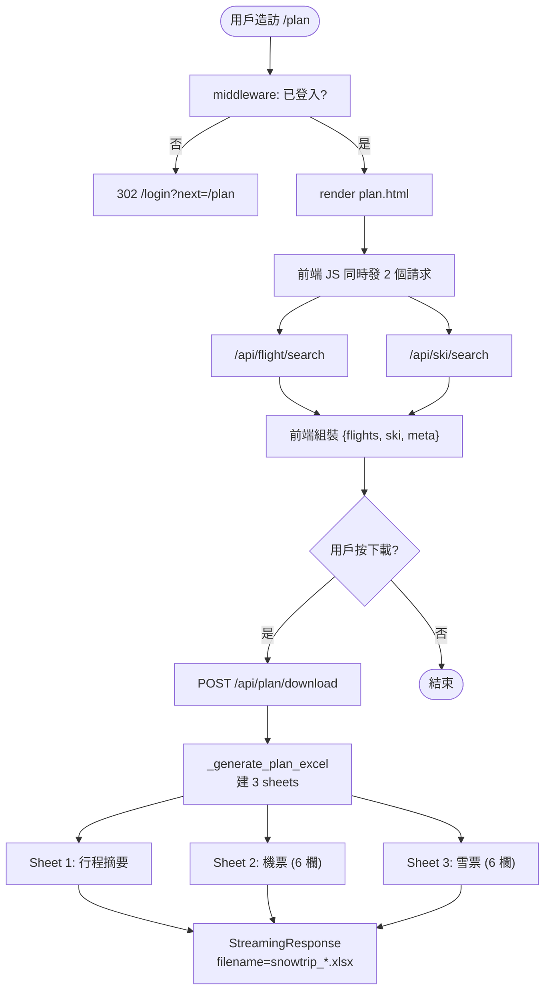
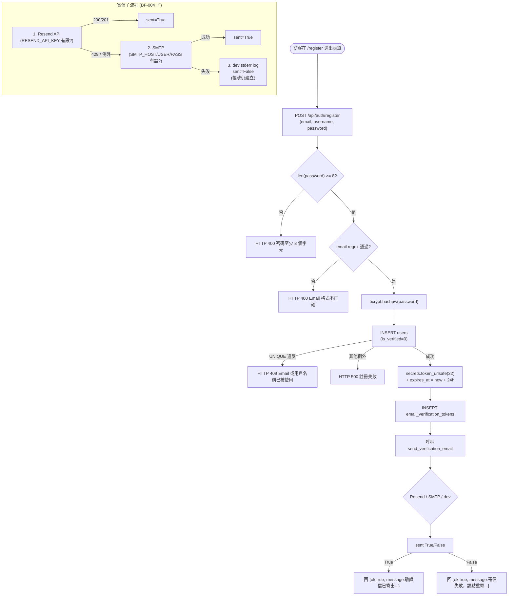
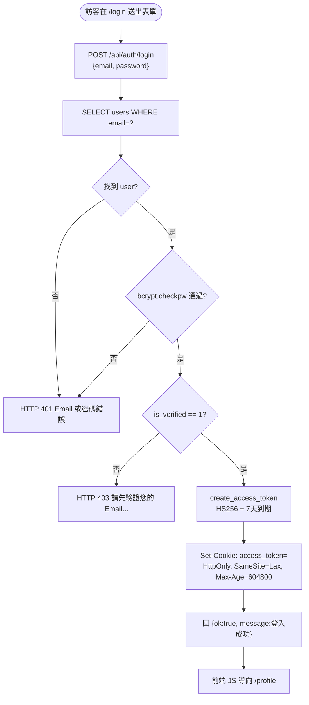
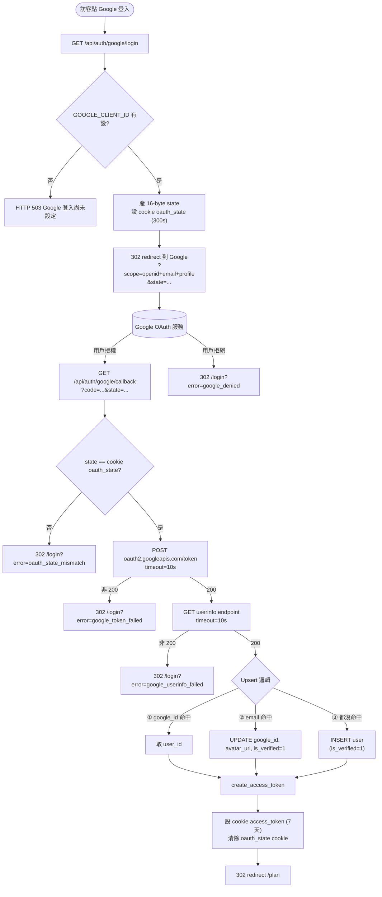
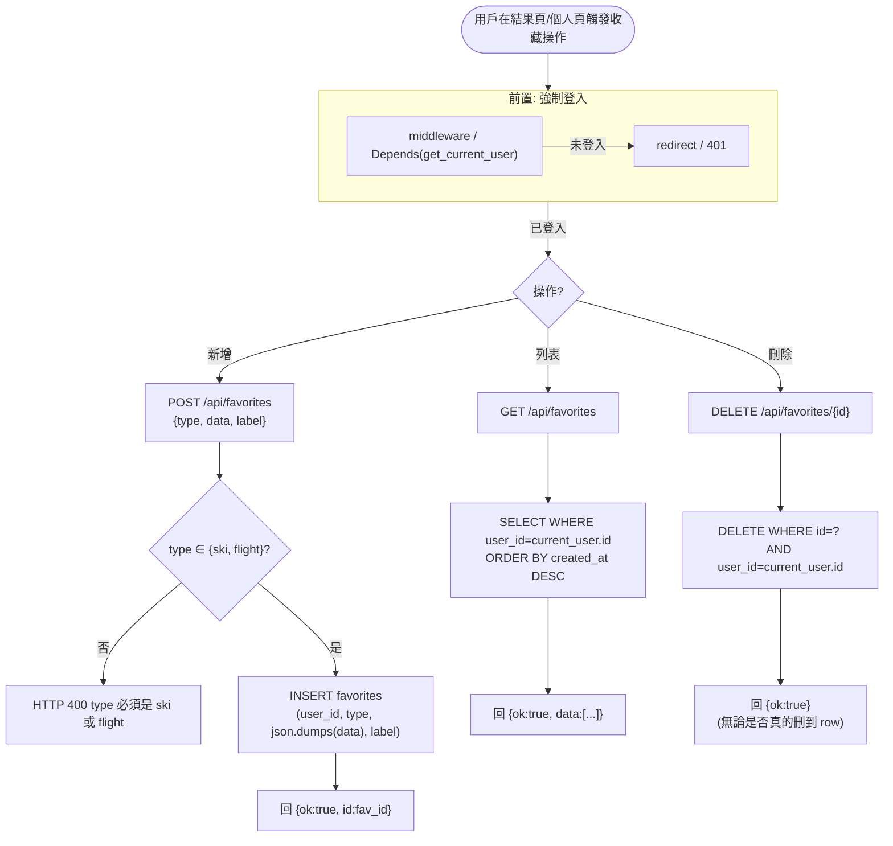
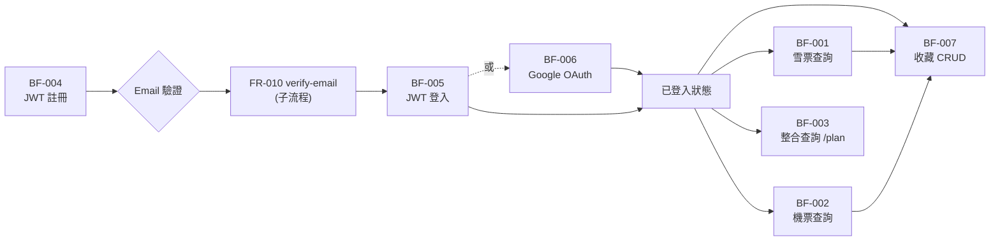

# 業務流程圖 — snowboarding_support brownfield 7 大流程

> **註**: 所有流程以**用戶視角**繪製（業務流程，非系統內部呼叫）。系統角色（middleware / API 層）抽象為「系統」一個 actor。Mermaid 流程圖搭配「步驟表」+「異常表」。

## 1. 流程概述

snowboarding_support 提供 7 大核心業務流程，覆蓋訪客（ROLE-001）/ 已登入用戶（ROLE-002）的完整生命週期：

1. **BF-001** 雪票查詢（批次 + SSE 串流分支）
2. **BF-002** 機票查詢（含多 backend fallback）
3. **BF-003** 整合查詢 `/plan`（含 3-sheet Excel 生成）
4. **BF-004** JWT 註冊（含密碼複雜度 + Email 驗證觸發）
5. **BF-005** JWT 登入（含 cookie 設定 + is_verified 檢查）
6. **BF-006** Google OAuth 登入（含 callback Upsert 邏輯）
7. **BF-007** 收藏 CRUD（含強制登入 + 跨用戶權限隔離）

## 2. 角色定義（業務角色，非系統角色）

| 角色 ID | 角色名稱 | 描述 | 來源 |
|---------|---------|------|------|
| ROLE-001 | 訪客（Guest） | 未登入；可瀏覽首頁、註冊、登入、Google OAuth；無法存取保護路徑 | `web/main.py:33-60` |
| ROLE-002 | 已登入用戶（Authenticated User） | 持有有效 JWT cookie；可用所有功能（雪票/機票/整合/收藏/個人頁）| `web/main.py:33-60` + 各 router |
| ROLE-003 | 系統維運者（Operator/Admin） | 透過 CLI `verify_client.py` 或 API `/api/auth/verify?email=` 查用戶狀態（無正式 admin 介面） | `web/auth/verify_client.py:130-151` |

**系統 actor**: 「系統」= FastAPI app（含 middleware / 三個 router / DB / 第三方服務 Resend / SMTP / Google OAuth / SerpAPI）。

---

## 3. 業務流程

---

### BF-001: 雪票查詢（批次 + SSE 串流）

- **觸發條件**: 已登入用戶在 `/ski` 頁面點「查詢」（批次模式）或「串流查詢」（SSE 模式）
- **參與角色**: ROLE-002（已登入用戶）+ 系統 + http_scraper 模組
- **前置條件**: 用戶持有有效 `access_token` cookie
- **對應需求**: FR-001（批次）、FR-002（串流）、FR-003（Excel 下載）
- **對應 NFR**: NFR-001（45 秒 timeout）、NFR-002（單一鎖併發控制）
- **對應 BR**: BR-001（middleware 攔截）、BR-012（全域鎖）

#### 流程步驟（批次模式 — `/api/ski/search`）

| 步驟 | 角色 | 動作 | 產出 |
|------|------|------|------|
| 1 | ROLE-002 | 在 `/ski` 點「查詢」（可帶 region / name 篩選）| HTTP GET `/api/ski/search?region=長野` |
| 2 | 系統（middleware）| 檢查 cookie `access_token`；若無效 → 401 JSON | 401 或繼續 |
| 3 | 系統（API）| 檢查 `_ski_lock.locked()` | 若被鎖 → 立刻回 `{ok: false, error: "查詢進行中..."}` |
| 4 | 系統 | 取得 lock + 呼叫 `get_ticket_prices_async(region, name)`，timeout 45 秒 | 阻塞執行中 |
| 5 | 系統 | 收集所有 TicketPrice 結果（asdict 序列化）| `{ok: true, data: [...]}` |
| 6 | ROLE-002 | 瀏覽結果，可選「下載 Excel」→ GET `/api/ski/download` | xlsx 檔（同 §FR-003 流程，鎖佔用回 HTTP 429）|

#### 流程步驟（串流模式 — `/api/ski/stream`）

| 步驟 | 角色 | 動作 | 產出 |
|------|------|------|------|
| 1 | ROLE-002 | 在 `/ski` 點「串流查詢」 | HTTP GET `/api/ski/stream?region=長野`、`Accept: text/event-stream` |
| 2 | 系統（middleware）| 同批次步驟 2 | — |
| 3 | 系統 | 檢查 lock；佔用 → 立刻 SSE `event: error` 結束 | SSE 串流結束 |
| 4 | 系統 | 取得 lock + 載入 targets，發 `event: start` 帶 `{total: N}` | SSE 第一條訊息 |
| 5 | 系統 | 對每個雪場 yield → 對每筆 TicketPrice 發 `event: result`，雪場完成發 `event: resort_done` | SSE 串流（多條訊息）|
| 6 | 系統 | 全部完成發 `event: done` 帶 `{total_count: N}` | SSE 結束 |

#### 流程圖（批次 + 串流統一視覺）

#### 異常流程

| 異常 | 觸發條件 | 處理方式 | 來源 |
|------|---------|---------|------|
| 未登入存取 | cookie 無效 | middleware 回 401 JSON `{ok:false, error:"請先登入", redirect:"/login"}` | `web/main.py:54-59` |
| 查詢鎖被佔用（批次）| 另一查詢執行中 | 回 `{ok:false, error:"查詢進行中，請稍後再試"}` HTTP 200 | `web/main.py:130` |
| 查詢鎖被佔用（串流）| 同上 | SSE `event: error` `data: {message: "查詢進行中..."}` 結束 | `web/main.py:156` |
| 查詢鎖被佔用（Excel）| 同上 | HTTP 429 plain text「查詢進行中，請稍後再試」 | `web/main.py:203` |
| asyncio 逾時（>45s）| 雪場群組過大 | 批次: `{ok:false, error:"查詢逾時（45 秒）..."}`；串流: `event: error`；Excel: HTTP 500 plain text | `web/main.py:139, 185` |
| 其他例外 | 網路 / parse 失敗 | `{ok:false, error: str(e)}` 或 SSE `event: error data: {message: str(e)}` | `web/main.py:141, 187` |

---

### BF-002: 機票查詢

- **觸發條件**: 已登入用戶在 `/flight` 頁面輸入出發/目的地/日期/乘客數，點「查詢」
- **參與角色**: ROLE-002 + 系統 + SerpAPI（主）/ fast-flights（fallback）
- **前置條件**: 用戶持有有效 cookie；`departure` 參數必填
- **對應需求**: FR-004（查詢）、FR-005（Excel 下載）
- **對應 BR**: BR-001

#### 流程步驟

| 步驟 | 角色 | 動作 | 產出 |
|------|------|------|------|
| 1 | ROLE-002 | 在 `/flight` 輸入 origin / destination / departure / ret_date（可選）/ adults | GET `/api/flight/search?origin=TPE&destination=CTS&departure=2026-12-20&adults=1` |
| 2 | 系統 | middleware 檢查 cookie | 401 或繼續 |
| 3 | 系統 | 檢查 `departure` 必填 | 缺 → `{ok:false, error:"請輸入出發日期"}` |
| 4 | 系統 | 讀 `SERPAPI_API_KEY` env | — |
| 5 | 系統 | 有 key → 嘗試 SerpApiBackend；no key 或 not available → fast-flights fallback | backend 物件 |
| 6 | 系統 | 呼叫 `backend.search(...)` 取得 `FlightOption[]` | List of dataclass |
| 7 | 系統 | 回 `{ok:true, backend: "<name>", data: [...]}` | JSON |
| 8 | ROLE-002 | 瀏覽結果，可選「下載 Excel」→ POST `/api/flight/download` | 帶 `{flights, meta}` body |
| 9 | 系統 | `_generate_flight_excel` 產 13 欄 xlsx（排序、前 3 名高亮）| StreamingResponse |

#### 流程圖

#### 異常流程

| 異常 | 觸發條件 | 處理方式 | 來源 |
|------|---------|---------|------|
| 未登入 | cookie 無效 | middleware 回 401 | `web/main.py:54-59` |
| 缺 departure | query string 無 departure | `{ok:false, error:"請輸入出發日期"}` HTTP 200 | `web/main.py:262-263` |
| SerpAPI 配額耗盡或暫時不可用 | backend.search 例外 | 走 `{ok:false, error: str(e)}` HTTP 200 — **未明確 fallback 到 fast-flights**（已選定 backend 後不重試）`[CODE-AS-TRUTH: web/main.py:287-298]` | `web/main.py:297-298` |
| backend 全失敗 | 兩個 backend 都拋例外 | 同上 | 同上 |

---

### BF-003: 整合查詢 `/plan` + 3-sheet Excel

- **觸發條件**: 已登入用戶造訪 `/plan` 頁面，前端同時觸發 `/api/flight/search` 與 `/api/ski/search`，點下載 Excel
- **參與角色**: ROLE-002 + 系統
- **前置條件**: 同 BF-001 + BF-002
- **對應需求**: FR-006
- **對應 BR**: BR-001

#### 流程步驟

| 步驟 | 角色 | 動作 | 產出 |
|------|------|------|------|
| 1 | ROLE-002 | GET `/plan` | render `plan.html`（middleware 確認登入；未登入 302 `/login?next=/plan`）|
| 2 | ROLE-002 | 前端 JS 同時觸發 `/api/flight/search` + `/api/ski/search` | 兩組 JSON 結果 |
| 3 | ROLE-002 | 預覽結果，點「下載 Excel」 | 前端組 body `{flights, ski, meta}` |
| 4 | ROLE-002 | POST `/api/plan/download` | 帶 body |
| 5 | 系統 | `_generate_plan_excel` 建立 workbook 3 sheets | xlsx |
| 6 | 系統 | filename = `snowtrip_<origin>-<destination>_<departure>.xlsx` | StreamingResponse |

#### 流程圖

#### 異常流程

| 異常 | 觸發條件 | 處理方式 |
|------|---------|---------|
| 未登入存取 `/plan` | 同 BF-001 | 302 redirect `/login?next=/plan` |
| `/api/flight/search` 或 `/api/ski/search` 失敗 | 任一查詢 ok=false | 前端 UX 決定；後端 `_generate_plan_excel` 仍會接 empty list 而產出空 sheet |
| `/api/plan/download` body 缺欄位 | flights / ski / meta 為空 | xlsx 仍產出但 sheet 內無資料 row（容錯但無錯誤訊息）|

---

### BF-004: JWT 註冊（含密碼複雜度 + Email 驗證觸發）

- **觸發條件**: 訪客在 `/register` 頁面填寫 email/username/password 並送出
- **參與角色**: ROLE-001（訪客）+ 系統 + Resend / SMTP（外部寄信）
- **前置條件**: 無
- **對應需求**: FR-007、（觸發）FR-010 寄信
- **對應 NFR**: NFR-006（密碼 ≥ 8）、NFR-007（bcrypt）、NFR-008/009（token 24h, 32 byte）、NFR-010（寄信策略）
- **對應 BR**: BR-002/003/004

#### 流程步驟

| 步驟 | 角色 | 動作 | 產出 |
|------|------|------|------|
| 1 | ROLE-001 | 在 `/register` 填 email / username / password 送出 | POST `/api/auth/register` |
| 2 | 系統 | 驗 password 長度 ≥ 8 | 不通過 → HTTP 400 |
| 3 | 系統 | 驗 email regex | 不通過 → HTTP 400 |
| 4 | 系統 | bcrypt hash password | hashed_password |
| 5 | 系統 | INSERT users (email lower+strip, username strip, hashed, is_verified=0) | user_id |
| 6 | 系統 | 產 `secrets.token_urlsafe(32)` 與 expires_at = now + 24h | token |
| 7 | 系統 | INSERT email_verification_tokens | — |
| 8 | 系統 | 呼叫 `send_verification_email`（見 BF-004 寄信子流程）| sent True/False |
| 9 | 系統 | 回 `{ok:true, message: ...}` 帶不同訊息（寄成功 / 寄失敗）| JSON |

#### 寄信子流程（Resend → SMTP → stderr）

| 順序 | 來源 | 條件 | 行為 |
|------|------|------|------|
| 1 | Resend API | `RESEND_API_KEY` 有設 | POST `https://api.resend.com/emails` timeout 10 秒；200/201 → `True`；429 / 例外 → 落到 SMTP |
| 2 | SMTP | `SMTP_HOST/USER/PASS` 有設 | STARTTLS port 587（預設）寄信；成功 → `True`；例外 → 印到 stderr |
| 3 | dev stderr log | 上述都失敗 | 印「[DEV EMAIL] To: ... Verify URL: ...」到 stderr；回 `False`（帳號仍建立）|

#### 流程圖

#### 異常流程

| 異常 | 觸發條件 | 處理方式 | 來源 |
|------|---------|---------|------|
| 密碼過短 | `len < 8` | HTTP 400 `detail="密碼至少 8 個字元"` | `auth_router.py:87-88` |
| Email 格式錯誤 | regex 不符 | HTTP 400 `detail="Email 格式不正確"` | `auth_router.py:89-90` |
| Email 或 username 重複 | UNIQUE 違反 | HTTP 409 `detail="Email 或用戶名稱已被使用"` | `auth_router.py:106-107` |
| 其他 DB 例外 | I/O / 鎖定 | HTTP 500 `detail="註冊失敗"` | `auth_router.py:108` |
| 寄信全失敗 | 三層都失敗 | **不阻擋帳號建立**，回 `{ok:true, message:寄信失敗，請點重寄驗證信}` | `auth_router.py:111-113` |
| Resend 429（超量）| Resend rate limit | silently fall through SMTP | `email_service.py:64-66` |

---

### BF-005: JWT 登入（含 cookie 設定 + is_verified 檢查）

- **觸發條件**: 訪客在 `/login` 頁面填 email + password 送出
- **參與角色**: ROLE-001 → ROLE-002（成功時轉變）+ 系統
- **前置條件**: 用戶已註冊且 is_verified=1
- **對應需求**: FR-008
- **對應 NFR**: NFR-003（7 天）、NFR-004（HS256）、NFR-005（cookie 屬性）
- **對應 BR**: BR-005

#### 流程步驟

| 步驟 | 角色 | 動作 | 產出 |
|------|------|------|------|
| 1 | ROLE-001 | 在 `/login` 填 email + password 送出 | POST `/api/auth/login` |
| 2 | 系統 | SELECT users WHERE email = lower+strip | row or None |
| 3 | 系統 | bcrypt.checkpw(password, hashed) | True/False |
| 4 | 系統 | 失敗 → HTTP 401 | `detail="Email 或密碼錯誤"` |
| 5 | 系統 | 通過但 is_verified=0 → HTTP 403 | `detail="請先驗證您的 Email..."` |
| 6 | 系統 | 通過且 is_verified=1 → `create_access_token({"sub": str(id)})` | JWT |
| 7 | 系統 | 設 `Set-Cookie: access_token=<jwt>; HttpOnly; Max-Age=604800; SameSite=Lax; Secure=False` | JSON `{ok:true, message:"登入成功"}` |
| 8 | ROLE-002 | 前端 JS 收到成功 → 導向 `/profile` 或 `next` 頁面（前端控制）| — |

#### 流程圖

#### 異常流程

| 異常 | 觸發條件 | 處理方式 | 來源 |
|------|---------|---------|------|
| Email 不存在 | SELECT 0 rows | HTTP 401 `detail="Email 或密碼錯誤"`（與密碼錯誤合併訊息，防 enumeration）| `auth_router.py:124-125` |
| 密碼錯誤 | bcrypt.checkpw False | 同上 | 同上 |
| 未驗證 email | is_verified=0 | HTTP 403 帶具體訊息 | `auth_router.py:126-127` |
| JWT 簽章失敗 | secret 異常 | 例外傳播（生產不應發生）| `security.py:21-24` |

---

### BF-006: Google OAuth 登入

- **觸發條件**: 訪客在 `/login` 頁面點「Google 登入」連結
- **參與角色**: ROLE-001 → ROLE-002（成功時轉變）+ 系統 + Google OAuth 服務
- **前置條件**: `GOOGLE_CLIENT_ID` 與 `GOOGLE_CLIENT_SECRET` env 已設
- **對應需求**: FR-012
- **對應 NFR**: NFR-011（state cookie 300 秒）、NFR-012（10 秒 timeout）
- **對應 BR**: BR-008（Upsert）、BR-009（redirect 寫死 `/plan`）

#### 流程步驟

| 步驟 | 角色 | 動作 | 產出 |
|------|------|------|------|
| 1 | ROLE-001 | 點「Google 登入」 → GET `/api/auth/google/login` | — |
| 2 | 系統 | 檢查 `GOOGLE_CLIENT_ID` env；無 → HTTP 503 JSON | `{ok:false, error:"Google 登入尚未設定..."}` |
| 3 | 系統 | 產 16-byte state；設 cookie `oauth_state`（300 秒、HttpOnly、SameSite=Lax）| cookie |
| 4 | 系統 | 302 redirect 到 Google OAuth endpoint，帶 client_id / redirect_uri / scope=openid+email+profile / state | redirect |
| 5 | Google | 顯示授權頁；用戶同意（或拒絕）| redirect 回 `/api/auth/google/callback?code=...&state=...` |
| 6 | 系統 | 比對 callback state 與 cookie `oauth_state` | 不符 → 302 `/login?error=oauth_state_mismatch` |
| 7 | 系統 | POST `https://oauth2.googleapis.com/token` 換 access_token（timeout 10 秒）| Google access_token |
| 8 | 系統 | GET `https://www.googleapis.com/oauth2/v3/userinfo` 取 sub / email / name / picture | userinfo |
| 9 | 系統 | **Upsert 邏輯**: ① 找 google_id → 取 user_id；② 找 email → 綁定 google_id + is_verified=1；③ 都沒有 → 新建 user is_verified=1 | user_id |
| 10 | 系統 | 產 JWT、設 cookie `access_token`（同 BF-005 step 7）| — |
| 11 | 系統 | 302 redirect `/plan`；清除 `oauth_state` cookie | redirect |

#### 流程圖

#### 異常流程

| 異常 | 觸發條件 | 處理方式 | 來源 |
|------|---------|---------|------|
| 未設定 Google client | `GOOGLE_CLIENT_ID` 為空 | HTTP 503 JSON | `oauth_router.py:26-27` |
| 用戶在 Google 端拒絕 | callback `?error=...` | 302 `/login?error=google_denied` | `oauth_router.py:49-50` |
| state 不符 | CSRF 攻擊 / cookie 遺失 | 302 `/login?error=oauth_state_mismatch` | `oauth_router.py:51-52` |
| token endpoint 失敗 | 網路 / Google API 異常 | 302 `/login?error=google_token_failed` | `oauth_router.py:66-67` |
| userinfo 失敗 | 同上 | 302 `/login?error=google_userinfo_failed` | `oauth_router.py:76-77` |
| Email 已存在但 google_id 為 NULL | 既有帳號首次 OAuth 登入 | 自動綁定（UPDATE）+ 強制 is_verified=1 | `oauth_router.py:95-101` |

---

### BF-007: 收藏 CRUD（含強制登入 + 跨用戶權限隔離）

- **觸發條件**: 已登入用戶在雪票/機票結果頁點「收藏」、或在 `/profile` 看自己的收藏 / 刪除
- **參與角色**: ROLE-002 + 系統
- **前置條件**: cookie 有效
- **對應需求**: FR-014
- **對應 BR**: BR-010（權限隔離）、BR-011（type 白名單）

#### 流程步驟（新增）

| 步驟 | 角色 | 動作 | 產出 |
|------|------|------|------|
| 1 | ROLE-002 | 在結果頁點「收藏」 | POST `/api/favorites` body `{type, data, label}` |
| 2 | 系統 | `Depends(get_current_user)` 解析 JWT cookie | current_user 或 401 |
| 3 | 系統 | 驗 `type in ("ski", "flight")` | 不通過 → HTTP 400 |
| 4 | 系統 | INSERT favorites (user_id, type, json.dumps(data), label) | fav_id |
| 5 | 系統 | 回 `{ok:true, id: fav_id}` | JSON |

#### 流程步驟（列表 / 刪除）

| 步驟 | 角色 | 動作 | 產出 |
|------|------|------|------|
| 1 | ROLE-002 | GET `/api/favorites` 或 GET `/profile`（自動載入收藏）| — |
| 2 | 系統 | SELECT * FROM favorites WHERE user_id=? ORDER BY created_at DESC | rows |
| 3 | 系統 | json.loads(data) 還原物件 | 回 `{ok:true, data: [...]}` |
| 4 | ROLE-002 | 點「刪除」 → DELETE `/api/favorites/{fav_id}` | — |
| 5 | 系統 | `DELETE FROM favorites WHERE id=? AND user_id=?`（**用 user_id 防越權**）| 0 or 1 row deleted |
| 6 | 系統 | 回 `{ok:true}`（不洩漏存在性）| JSON |

#### 流程圖

#### 異常流程

| 異常 | 觸發條件 | 處理方式 | 來源 |
|------|---------|---------|------|
| 未登入 | 無 cookie / JWT 過期 | `Depends(get_current_user)` 拋 HTTP 401 | `dependencies.py` |
| type 不合法 | type 非 ski/flight | HTTP 400 `detail="type 必須是 ski 或 flight"` | `auth_router.py:234-235` |
| 跨用戶刪除 | fav_id 屬於別人 | DELETE WHERE 條件不符，0 rows affected；回 `{ok:true}` 不洩漏 | `auth_router.py:249` |
| 刪除不存在的 fav_id | id 不存在 | 同上 | 同上 |

---

## 4. 流程間關係

**橋接說明**:
- BF-004（註冊）→ 觸發 Email 驗證子流程（FR-010）→ 用戶才能進 BF-005 登入
- BF-005 與 BF-006 是兩條互斥的認證路徑（用戶選一）
- 登入後可重複進入 BF-001 / BF-002 / BF-003
- BF-001 / BF-002 的結果頁可觸發 BF-007 的新增收藏

---

## 5. 追溯矩陣

| 流程ID | 對應 FR | 對應 NFR | 對應 BR | 參與角色 |
|--------|---------|----------|---------|---------|
| BF-001 | FR-001, FR-002, FR-003 | NFR-001, NFR-002, NFR-017 | BR-001, BR-012 | ROLE-002 |
| BF-002 | FR-004, FR-005 | NFR-017 | BR-001 | ROLE-002 |
| BF-003 | FR-006 | NFR-017 | BR-001 | ROLE-002 |
| BF-004 | FR-007, FR-010 | NFR-006, NFR-007, NFR-008, NFR-009, NFR-010 | BR-002, BR-003, BR-004 | ROLE-001 |
| BF-005 | FR-008, FR-009 | NFR-003, NFR-004, NFR-005 | BR-005 | ROLE-001 → ROLE-002 |
| BF-006 | FR-012 | NFR-005, NFR-011, NFR-012 | BR-008, BR-009 | ROLE-001 → ROLE-002 |
| BF-007 | FR-014 | NFR-014（持久化 Critical） | BR-010, BR-011 | ROLE-002 |
| (FR-011 重寄)| FR-011 | NFR-008, NFR-009, NFR-010 | BR-006, BR-007 | ROLE-001（含未驗證者）|
| (FR-013 狀態)| FR-013 | NFR-016 | — | ROLE-002 / ROLE-003 |
| (FR-015 mw) | FR-015 | NFR-013 | BR-001 | (橫切，所有流程共用) |
| (FR-016 page)| FR-016 | NFR-015 | — | ROLE-001 / ROLE-002 |
| (FR-017 SEO)| FR-017 | — | — | （搜尋引擎爬蟲，非業務角色）|

> 重寄驗證信（FR-011）與取得狀態（FR-013）為較短流程，未獨立繪 BF；步驟在 §3 對應 FR 段中以子流程描述（流程圖在 BF-004 / BF-005 中間銜接）。SEO（FR-017）非互動流程，未繪 BF。
