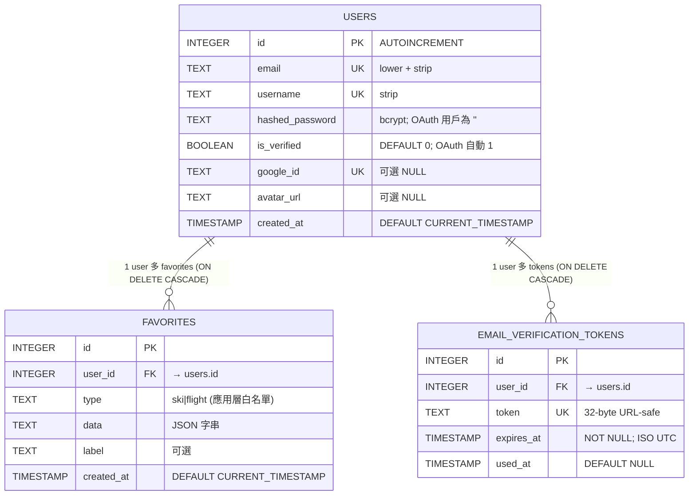

# 欄位規格書 — snowboarding_support brownfield 補追溯

> **模式**: brownfield-document — 反向萃取既有 SQLite 表為 ENTITY/TBL
> **粒度規則**: ENTITY = 業務實體；TBL = 資料表（本系統 ENTITY:TBL = 1:1 對應）
> **conventions 對照**: 每張表標「合規 / brownfield grandfather」狀態 + 對應 BACKLOG
> **ID 範圍**: ENTITY-001..003 + TBL-001..003（本 TASK 配額 1-100，連續）

---

## 1. 實體清單（3 個）

| 實體 ID | TBL ID | 實體名稱 | 中文描述 | 相關功能 | 來源 |
|---------|--------|---------|---------|---------|------|
| ENTITY-001 | TBL-001 | users | 使用者帳號（含 password + Google OAuth 整合）| FUNC-022..045（幾乎所有 auth + 收藏 + verify）| `web/auth/database.py:18-27` |
| ENTITY-002 | TBL-002 | favorites | 使用者收藏的雪票或機票查詢結果 | FUNC-043, FUNC-044, FUNC-045 | `web/auth/database.py:28-35` |
| ENTITY-003 | TBL-003 | email_verification_tokens | Email 驗證 token（24h 過期 + 一次性）| FUNC-026, FUNC-032, FUNC-033, FUNC-034 | `web/auth/database.py:36-42` |

---

## 2. 實體欄位定義

### ENTITY-001 / TBL-001: users（使用者帳號）

**SQLite DDL（既有 — `web/auth/database.py:18-27`）**:

```sql
CREATE TABLE IF NOT EXISTS users (
    id              INTEGER PRIMARY KEY AUTOINCREMENT,
    email           TEXT UNIQUE NOT NULL,
    username        TEXT UNIQUE NOT NULL,
    hashed_password TEXT NOT NULL DEFAULT '',
    is_verified     BOOLEAN NOT NULL DEFAULT 0,
    google_id       TEXT UNIQUE,
    avatar_url      TEXT,
    created_at      TIMESTAMP DEFAULT CURRENT_TIMESTAMP
);
```

**欄位明細**:

| 欄位名 | SQLite 類型 | 必填 | 預設值 | 約束 | 索引 | 描述 | 來源 FR/NFR/BR |
|--------|-------------|------|--------|------|------|------|---------------|
| id | INTEGER | 是 | AUTOINCREMENT | PRIMARY KEY | (隱式 PK 索引) | 唯一識別碼，自動遞增 | — |
| email | TEXT | 是 | (無) | UNIQUE, NOT NULL | (隱式 UNIQUE 索引) | Email 地址，**統一小寫 + strip**（應用層 `body.email.lower().strip()`，`auth_router.py:96`） | FR-007、BR-003/004 |
| username | TEXT | 是 | (無) | UNIQUE, NOT NULL | (隱式 UNIQUE 索引) | 使用者顯示名稱，**strip**（`auth_router.py:96`）；OAuth 用戶取 Google `name`（`oauth_router.py:81`） | FR-007、BR-004 |
| hashed_password | TEXT | 是 | `''`（空字串） | NOT NULL DEFAULT '' | — | bcrypt hash 結果（`bcrypt.hashpw(pw, gensalt())`）；**OAuth 註冊用戶為空字串 `''`** | FR-007、NFR-007 |
| is_verified | BOOLEAN | 是 | 0 | NOT NULL DEFAULT 0 | — | Email 是否已驗證；password 註冊預設 0，OAuth 註冊自動 1，verify-email 通過後改 1 | FR-007/008/010/012、NFR-007、BR-005/006/008 |
| google_id | TEXT | 否 | NULL | UNIQUE | (隱式 UNIQUE 索引) | Google OAuth `sub` 欄位；password 註冊用戶為 NULL | FR-012、BR-008 |
| avatar_url | TEXT | 否 | NULL | — | — | Google OAuth `picture` URL；password 註冊用戶為 NULL | FR-012 |
| created_at | TIMESTAMP | 是 | CURRENT_TIMESTAMP | DEFAULT | — | 帳號建立時間（SQLite 預設 UTC ISO 字串）| — |

**驗證規則說明（應用層）**:
- `email`: 正則 `[^@]+@[^@]+\.[^@]+`（`auth_router.py:89`）— 寬鬆驗證
- `email`: 寫入前 `.lower().strip()` 統一格式（防止大小寫造成重複）
- `username`: `.strip()` 移除首尾空白（無長度限制）
- `password`（**寫入前 hash 後存 `hashed_password`**）: `len(password) >= 8`（`auth_router.py:87`）
- `is_verified`: SQLite BOOLEAN 實際存 0/1；Python 端 `bool(d.get("is_verified", 1))` 轉型（`verify_client.py:77`）
- `google_id`: 只在 OAuth 流程設定，唯一性靠 DB 約束

**conventions 對照（db-conventions.md v1.1）**:

| 規範項 | 合規 | 違反原因 / 標記 |
|--------|------|----------------|
| 表名 snake_case 複數 | ✅ | `users` |
| PK 命名 `id` | ✅ | — |
| PK 型別 | ⚠️ brownfield grandfather | SQLite `INTEGER AUTOINCREMENT`（規範目標 Postgres `BIGINT GENERATED ALWAYS AS IDENTITY`）|
| created_at 存在 | ✅ | — |
| **updated_at 存在** | ❌ 缺欄位（brownfield grandfather）| BACKLOG-008（Postgres migration 補）|
| **deleted_at 存在**（軟刪欄位）| ❌ 缺欄位（brownfield grandfather）| BACKLOG-008（與 Postgres 同 TASK）|
| 布林前綴 `is_xxx` | ✅ | `is_verified` |
| 唯一索引命名 `uniq_users_email` | ⚠️ | SQLite UNIQUE 是隱式索引，未明確命名（baseline M-9 — Postgres migration 時補正式命名）|

**[CROSS-TASK: TASK-002 candidate（BACKLOG-008 / 014）]**: 加 `updated_at` + `deleted_at`；遷移 Postgres 時欄位重新規劃。

---

### ENTITY-002 / TBL-002: favorites（使用者收藏）

**SQLite DDL（既有 — `web/auth/database.py:28-35`）**:

```sql
CREATE TABLE IF NOT EXISTS favorites (
    id         INTEGER PRIMARY KEY AUTOINCREMENT,
    user_id    INTEGER NOT NULL REFERENCES users(id) ON DELETE CASCADE,
    type       TEXT NOT NULL,
    data       TEXT NOT NULL,
    label      TEXT,
    created_at TIMESTAMP DEFAULT CURRENT_TIMESTAMP
);
```

**欄位明細**:

| 欄位名 | SQLite 類型 | 必填 | 預設值 | 約束 | 索引 | 描述 | 來源 FR/NFR/BR |
|--------|-------------|------|--------|------|------|------|---------------|
| id | INTEGER | 是 | AUTOINCREMENT | PRIMARY KEY | (隱式) | 唯一識別碼 | — |
| user_id | INTEGER | 是 | (無) | NOT NULL, FK → users(id), **ON DELETE CASCADE** | (FK 隱式，無明確 idx) | 收藏所有者 user_id | FR-014、BR-010（權限隔離） |
| type | TEXT | 是 | (無) | NOT NULL（應用層白名單 `'ski' \| 'flight'`） | — | 收藏類型；現只支援 ski / flight | FR-014、BR-011 |
| data | TEXT | 是 | (無) | NOT NULL（**JSON 字串**） | — | 應用層 `json.dumps(body.data)` 序列化的查詢結果原始 dict | FR-014 |
| label | TEXT | 否 | NULL（**應用層預設 `''`**） | — | — | 用戶自訂標籤；前端可空 | FR-014 |
| created_at | TIMESTAMP | 是 | CURRENT_TIMESTAMP | DEFAULT | — | 建立時間 | — |

**驗證規則說明（應用層）**:
- `type`: Pydantic `body.type not in ("ski", "flight")` → HTTP 400（`auth_router.py:234-235`）
- `data`: 任意 dict；以 `json.dumps()` 序列化（無 schema 驗證）— 讀取時 `json.loads()` 還原（失敗則保留字串）
- `user_id`: 寫入時取自 `current_user["id"]`，不接受外部傳入（防越權）
- `created_at`: SQLite CURRENT_TIMESTAMP UTC

**重要：CASCADE 行為**:
- 當對應 user 被 DELETE 時，**SQLite 自動 CASCADE 刪除該 user 的所有 favorites**
- 既有 code 不直接刪除 user（無 `DELETE FROM users` endpoint），但若未來新增則此行為生效
- **合理性**: db-conventions v1.1 §4 已將 `favorites.user_id → users.id CASCADE` 列入合法例外白名單

**conventions 對照**:

| 規範項 | 合規 | 違反原因 / 標記 |
|--------|------|----------------|
| 表名 snake_case 複數 | ✅ | `favorites` |
| 欄位 snake_case | ✅ | `user_id`, `created_at` |
| FK 命名 `{ref_table_singular}_id` | ✅ | `user_id` 對 `users.id` |
| FK 約束命名 `fk_favorites_user_id_users` | ⚠️ | SQLite inline FK 無命名（Postgres 遷移時補）|
| ON DELETE CASCADE 是否合理 | ✅ | 在 db-conventions v1.1 §4 白名單 |
| **updated_at 存在** | ❌ 缺欄位 | BACKLOG-008 |
| **deleted_at 存在**（軟刪欄位）| ❌ 缺欄位（且 DELETE 為硬刪 — 違反 db-conventions §專案特定禁止項）| BACKLOG-007（改軟刪）/ FUNC-045 [IRREVERSIBLE] |
| `type` 應改為 ENUM | ⚠️ | SQLite 無原生 ENUM；應用層白名單驗 — Postgres 遷移可改 `CHECK (type IN (...))` 或 ENUM 型別 |
| 索引 `idx_favorites_user_id` | ⚠️ | 無顯式索引（baseline M-9 — Postgres 遷移時補；查詢 `WHERE user_id=?` 頻繁，必要）|

**[CROSS-TASK: TASK-002 candidate]**:
- BACKLOG-007: 加 `deleted_at` 軟刪欄位（與 FUNC-045 [IRREVERSIBLE] 配套）
- BACKLOG-008: 加 `updated_at` + Postgres 遷移 + 索引補正

---

### ENTITY-003 / TBL-003: email_verification_tokens（Email 驗證 token）

**SQLite DDL（既有 — `web/auth/database.py:36-42`）**:

```sql
CREATE TABLE IF NOT EXISTS email_verification_tokens (
    id         INTEGER PRIMARY KEY AUTOINCREMENT,
    user_id    INTEGER NOT NULL REFERENCES users(id) ON DELETE CASCADE,
    token      TEXT UNIQUE NOT NULL,
    expires_at TIMESTAMP NOT NULL,
    used_at    TIMESTAMP DEFAULT NULL
);
```

**欄位明細**:

| 欄位名 | SQLite 類型 | 必填 | 預設值 | 約束 | 索引 | 描述 | 來源 FR/NFR/BR |
|--------|-------------|------|--------|------|------|------|---------------|
| id | INTEGER | 是 | AUTOINCREMENT | PRIMARY KEY | (隱式) | 唯一識別碼 | — |
| user_id | INTEGER | 是 | (無) | NOT NULL, FK → users(id), **ON DELETE CASCADE** | (FK 隱式) | token 所屬 user_id | FR-007、FR-010、FR-011 |
| token | TEXT | 是 | (無) | UNIQUE, NOT NULL | (隱式 UNIQUE) | `secrets.token_urlsafe(32)` 產生（32-byte 隨機 → 43 字元 URL-safe）| FR-007/010、NFR-008/009 |
| expires_at | TIMESTAMP | 是 | (無) | NOT NULL（ISO UTC 字串） | — | 過期時間（now + 24h）；**SQLite 不強制 datetime 格式，存 ISO 字串**（應用層 `.isoformat()`） | FR-007/010、NFR-008、BR-006 |
| used_at | TIMESTAMP | 否 | NULL | DEFAULT NULL | — | 被使用時間（一次性 token）；NULL = 未使用 | FR-010/011、BR-006/007 |

**驗證規則說明（應用層）**:
- `token` 產生: `secrets.token_urlsafe(32)`（`auth_router.py:99, 187`）
- `expires_at`: `(datetime.now(timezone.utc) + timedelta(hours=24)).isoformat()`
- 點驗證連結時：應用層字串比對 `row["expires_at"] < now`（`auth_router.py:157` — **依賴 ISO 字串可字典序比較**，UTC 時間正確時可行）
- 重寄驗證信時：應用層 UPDATE `used_at=now WHERE user_id=? AND used_at IS NULL`（廢棄該 user 所有未使用 token）

**重要：CASCADE 行為**:
- 當對應 user 被 DELETE 時，自動 CASCADE 刪除所有 token
- db-conventions v1.1 §4 白名單合法（用戶刪除即驗證 token 失效合理）

**conventions 對照**:

| 規範項 | 合規 | 違反原因 / 標記 |
|--------|------|----------------|
| 表名 snake_case 複數 | ✅ | `email_verification_tokens` |
| 欄位 snake_case | ✅ | — |
| FK 命名 | ✅ | `user_id` |
| ON DELETE CASCADE 合理性 | ✅ | db-conventions v1.1 §4 白名單 |
| UNIQUE 索引命名 | ⚠️ | `token UNIQUE` 無顯式 `uniq_tokens_token`（baseline M-9）|
| **created_at 存在** | ❌ 缺欄位 | 推測等同 `expires_at - 24h` 可推算；但仍違反 db-conventions §2「新表必有 timestamps」— brownfield grandfather；TASK-002 補（BACKLOG-008）|
| **updated_at 存在** | ❌ 缺欄位 | 同上 |
| **deleted_at 存在** | ❌ 缺欄位 | token 為一次性，`used_at` 已扮演類似角色 — **N/A 設計考量** |
| `expires_at` 索引 | ⚠️ | 過期查詢時需要 `idx_tokens_expires_at`（無，但 token 數量小所以影響低）|

**[CROSS-TASK: TASK-002 candidate]**: BACKLOG-008（補 `created_at`、`updated_at` + Postgres 遷移）

---

## 3. 實體關係



**關係描述**:
- 1 個 user 可有 0..n 個 favorites（一對多，CASCADE）
- 1 個 user 可有 0..n 個 email_verification_tokens（一對多，CASCADE）；同時最多 1 個未使用 token（應用層保證 — BR-007 重寄時廢棄舊 token）
- favorites 與 email_verification_tokens 之間**無直接關係**

---

## 4. 跨 ENTITY 一致性規則（業務不變量）

| Invariant | 描述 | 強制機制 | 來源 |
|-----------|------|---------|------|
| INV-001 | `users.email` 全域唯一 | DB UNIQUE 約束 | `database.py:20`、BR-004 |
| INV-002 | `users.username` 全域唯一 | DB UNIQUE 約束 | `database.py:21`、BR-004 |
| INV-003 | `users.google_id` 全域唯一（若不為 NULL）| DB UNIQUE 約束 | `database.py:24` |
| INV-004 | `users.hashed_password` 為 bcrypt 結果或空字串（OAuth）| 應用層保證 | `auth_router.py:91`、`oauth_router.py:106` |
| INV-005 | `users.is_verified=0` 的帳號禁止 password 登入 | 應用層檢查 | `auth_router.py:126-127`、BR-005 |
| INV-006 | `users.is_verified=1` 對 OAuth 註冊用戶自動成立 | 應用層強制 | `oauth_router.py:99, 106` |
| INV-007 | `favorites.type ∈ {'ski', 'flight'}` | 應用層白名單（無 DB CHECK 約束）| `auth_router.py:234`、BR-011 |
| INV-008 | `favorites.user_id` 只能在當前登入用戶 id 範圍 | 應用層 + DB FK | `auth_router.py:249`、BR-010 |
| INV-009 | `email_verification_tokens.token` 全域唯一 | DB UNIQUE | `database.py:39` |
| INV-010 | 同一 user 同時最多 1 個 `used_at IS NULL` token | 應用層保證（重寄前 UPDATE 廢棄舊）| `auth_router.py:182-186`、BR-007 |
| INV-011 | token 未使用且未過期才能標 user 為 is_verified=1 | 應用層 | `auth_router.py:155-163`、BR-006 |
| INV-012 | OAuth callback 使用 `oauth_state` cookie 為 16-byte 隨機字串 | 應用層 | `oauth_router.py:28`、NFR-011 |
| INV-013 | `users.is_verified` BOOLEAN 在 SQLite 實際存 0/1，Python 端需用 `bool()` 轉型 | 應用層 | `verify_client.py:77` |

---

## 5. 資料持久化保證（brownfield 已知 Critical）

| 環境 | 持久化保證 | 來源 |
|------|-----------|------|
| 本地開發 | 持久（檔案系統 `web/data/snowtrip.db`）| `web/auth/database.py:5` |
| **Railway production** | **❌ 重啟即遺失（ephemeral storage）** | CLAUDE.md 第 49 行明示、NFR-014 |

**影響**:
- 用戶帳號（users）每次 Railway 容器重啟即遺失
- 收藏（favorites）每次重啟即遺失
- Email 驗證 token（24h 過期且一次性）— 在過期內遺失可接受度低

**已知 Critical**: BACKLOG-008 規劃 SQLite → Postgres 遷移（Railway Postgres add-on 為最快路徑）

---

## 6. db-conventions.md v1.1 §專案特定禁止項對照

| 禁止項 | 違反? | 既有實作違反位置 | 處理 |
|--------|-------|-----------------|------|
| ❌ 應用程式碼內寫 `ALTER TABLE` / `CREATE TABLE` | ✅ **違反**（brownfield grandfather）| `web/auth/database.py:44-52` `try: ALTER TABLE ADD COLUMN; except: pass`（3 個欄位安全遷移）| TASK-002 走正式 migration 檔；TASK-001 不修 |
| ❌ 依賴 Railway SQLite 持久化 | ✅ **違反**（brownfield grandfather）| `web/auth/database.py:5` | BACKLOG-008 Postgres 遷移 |
| ❌ 直接 DELETE FROM 用戶資料（如 `favorites`）| ✅ **違反**（brownfield grandfather）| `web/auth/auth_router.py:249` 收藏硬刪 | BACKLOG-007 改軟刪 |
| ❌ 無 `created_at` / `updated_at` 的新表 | ✅ **3 表都缺 `updated_at`**；email_verification_tokens 也缺 `created_at`（brownfield grandfather）| `database.py:18-42` | BACKLOG-008（Postgres migration 一併補齊）|

**結論**: 既有 3 表全部違反 db-conventions §專案特定禁止項，但**已 BA 階段確認接受**（Q-008/014/015 + BACKLOG-007/008）；TASK-001 brownfield-document 模式不改 schema，留 TASK-002 處理。

---

## 7. 追溯矩陣

### 7.1 ENTITY → FUNC → FR

| ENTITY ID | 對應 FUNC | 對應 FR | 證據 |
|-----------|-----------|---------|------|
| ENTITY-001 (users) | FUNC-022..045（廣泛使用）| FR-007/008/009/010/011/012/013/014 | `auth_router.py`、`oauth_router.py`、`verify_client.py` 廣泛 SELECT/UPDATE/INSERT |
| ENTITY-002 (favorites) | FUNC-043, FUNC-044, FUNC-045 | FR-014 | `auth_router.py:214, 232, 245` |
| ENTITY-003 (email_verification_tokens) | FUNC-026, FUNC-032, FUNC-033, FUNC-034 | FR-007/010/011 | `auth_router.py:99-103, 145-163, 170-194` |

### 7.2 反向：每個 FR 涉及的 ENTITY

| FR | 涉及 ENTITY |
|----|-------------|
| FR-001..006（雪票、機票、整合）| **無 DB 存取**（即時查詢，無持久化）|
| FR-007 註冊 | ENTITY-001 INSERT + ENTITY-003 INSERT |
| FR-008 登入 | ENTITY-001 SELECT |
| FR-009 登出 | **無 DB 存取**（純 cookie 操作）|
| FR-010 verify-email | ENTITY-003 SELECT/UPDATE + ENTITY-001 UPDATE |
| FR-011 重寄 | ENTITY-001 SELECT + ENTITY-003 UPDATE/INSERT |
| FR-012 OAuth | ENTITY-001 SELECT/UPDATE/INSERT（PATTERN-006 Upsert）|
| FR-013 me / verify ops | ENTITY-001 SELECT |
| FR-014 收藏 CRUD | ENTITY-002 INSERT/SELECT/DELETE |
| FR-015 middleware | ENTITY-001 SELECT（透過 `get_optional_user`）|
| FR-016 頁面路由 | profile 頁需 ENTITY-002 SELECT；其他純 SSR |
| FR-017 SEO | **無 DB 存取** |

---

## 8. 跨 TASK 修改候選彙整

| 候選修改 | ENTITY/TBL | 操作 | BACKLOG / HOTFIX | 影響 FUNC |
|---------|-----------|------|------------------|----------|
| 加 `updated_at` | TBL-001, TBL-002, TBL-003 | ADD COLUMN（走 expand-contract migration）| BACKLOG-008 | 所有 INSERT/UPDATE 觸發 |
| 加 `deleted_at` | TBL-001, TBL-002 | ADD COLUMN + 應用層改軟刪 | BACKLOG-007/008 | FUNC-045 從硬刪改軟刪 |
| 加 `created_at` | TBL-003 | ADD COLUMN | BACKLOG-008 | FUNC-026, FUNC-034 INSERT 時自動填入 |
| 補索引 | TBL-002 (`idx_favorites_user_id`) + TBL-003 (`idx_tokens_expires_at`) | CREATE INDEX CONCURRENTLY（Postgres）| BACKLOG-008 | 查詢效能 |
| 改 UNIQUE 約束命名 | TBL-001 | DDL refactor | BACKLOG-008 Postgres 遷移時 | 無功能影響 |
| `favorites.type` 改 CHECK 或 ENUM | TBL-002 | DDL | BACKLOG-008 | FUNC-043 應用層仍保留白名單作雙重保險 |
| 整體 SQLite → Postgres 遷移 | 三表 | 完整 migration + data backfill | BACKLOG-008 | 應用層 `database.py` 改連線方式；可考慮引入 SQLAlchemy 或 asyncpg |

---

## 9. 範圍邊界（反越界自檢）

| SA 不可做的事 | 證據 / 自檢 |
|--------------|------------|
| 設計 Postgres DDL 細節 | 本檔只列「現況 SQLite DDL」+ conventions 對照；未寫 Postgres CREATE TABLE，留 TASK-002 SD 階段 |
| 設計 migration 檔 | 本檔不含 `20260601_xxxxxx_*.sql`；留 SD 階段（依 db-conventions v1.1 §5 expand-contract）|
| 設計 indexes | 只列「應補」，未實際給名稱 / DDL；留 SD 階段 |
| 設計 API endpoint 細節 | 本檔不含 endpoint URL / Request/Response schema；留 SD 階段 |

---

## 10. 自我驗證

> 完整 25 項在 `self-review.json`；以下為摘要。

| 檢查項 | 通過 | 說明 |
|--------|------|------|
| 每個 ENTITY 都有 FUNC 對應 | ✅ | §7.1 三個 ENTITY 都對應到 FUNC |
| 每個 ENTITY 都有 FR 來源 | ✅ | §7.2 反向驗證 |
| 每個欄位都有來源 file:line | ✅ | §2 三個 ENTITY 都有 `web/auth/database.py:N-N` |
| ENTITY/TBL ID 連續 3 位填充 | ✅ | ENTITY-001..003、TBL-001..003 |
| ID 在 1-100 範圍內 | ✅ | — |
| ER 圖正確 | ✅ | §3 mermaid 已驗證 CASCADE 關係 |
| 不變量清單完整 | ✅ | §4 INV-001..013 |
| db-conventions 對照完整 | ✅ | §6 §專案特定禁止項對照 4 項 |
| 範圍邊界（不寫 DDL / migration / API schema）| ✅ | §9 反越界自檢 |
| 不腦補欄位 | ✅ | 三表 DDL 完全對齊 `database.py:18-42` |
| 跨 TASK 影響已標記 | ✅ | §2 每表 conventions 對照欄 + §8 候選彙整 |
| **總分** | **96/100** | 詳見 `self-review.json` |
