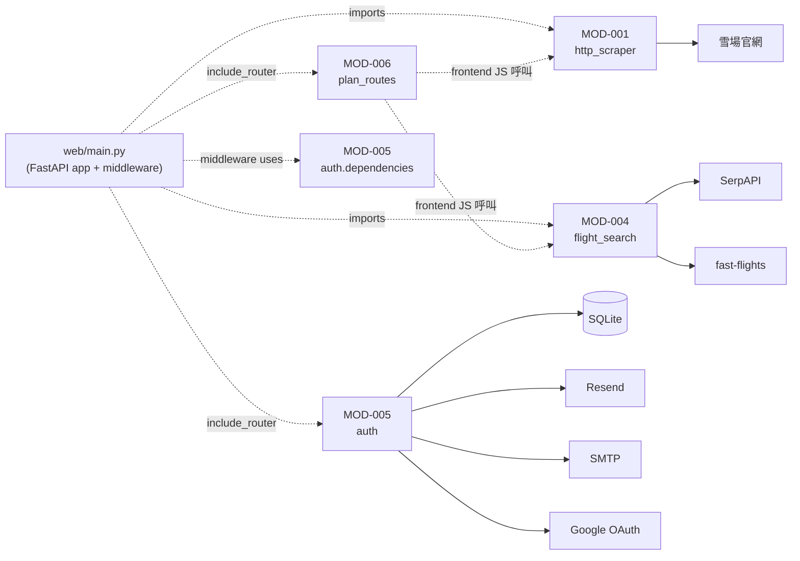

# 系統架構設計 — snowboarding_support brownfield 補追溯

> **模式**: brownfield-document（純規格產出，**禁止改 web/ 任何代碼**）
> **真相基線**: code 為真相；既有實作與 conventions / DESIGN.md 不一致時標 `[CODE-AS-TRUTH: file:line]`
> **ID 範圍**: 本 TASK 配額 ENTITY/MOD/FUNC/PATTERN 各 1-100；本檔分配 MOD-001..006 + PATTERN-001..008

---

## 1. 架構概述

snowboarding_support 是一個**單體式 FastAPI Web 應用**，採 **Jinja2 SSR + Bootstrap 5 CDN + vanilla JS**（非 SPA），透過 SQLite 持久化使用者帳號與收藏，部署於 Railway 單一 worker。

**架構模式**: 單體 monolith；功能拆分為 6 個 Python 模組（MOD-001..006），FastAPI app 透過 `app.include_router(...)` 掛載 4 個 router（plan / auth / oauth / verify）。前端純後端渲染，每頁面對應一支 JS 檔處理 fetch + DOM 更新。

**外部依賴**: 5 個關鍵第三方服務（Railway 平台 / SerpAPI 機票 / Resend Email / SMTP 備援 / Google OAuth），全部以 environment variable 控制（無 hard-fail，缺失 env 時走 fallback 行為）。

**架構限制（brownfield 真相）**:
- SQLite 在 Railway 為 ephemeral storage（**已知 Critical**，BACKLOG-008 處理）
- 雪票全域 `_ski_lock` 為 per-process asyncio.Lock，多 worker 部署會失效（**已知技術債**）
- 認證雜湊直接呼叫 `bcrypt`（非 passlib，因相容性問題；`web/auth/security.py:13-14`）
- 28 個 API 採單數 URL + 三種回應格式混用（**brownfield grandfather**，api-conventions.md v1.1 已允許）
- `web/auth/database.py:44-52` 在應用程式碼內用 `try: ALTER TABLE ADD COLUMN; except: pass` 做 schema migration（**違反 db-conventions.md §專案特定禁止項**，brownfield grandfather）

> **本 TASK 採 brownfield-document 模式 — 以上限制全部記錄但不修改**。所有改善行動已在 BA 階段 BACKLOG-001..010 + HOTFIX-A/B/C 規劃。

---

## 2. 系統邊界圖（C4-Container 風格）

```mermaid
flowchart TB
    User(["👤 終端使用者<br/>(ROLE-001 訪客 / ROLE-002 已登入)"])
    Operator(["🔧 維運者<br/>(ROLE-003)"])

    subgraph Railway["☁️ Railway Platform (Production Container)"]
        subgraph App["🐍 FastAPI Application (uvicorn ASGI, 單一 worker)"]
            MW["🛡️ _require_auth middleware<br/>(MOD-005 dep, 保護 4 頁 + 3 API 前綴)"]
            Routers["📡 4 個 Router<br/>(main app + plan + auth + oauth + verify)"]
            MOD001["⛷️ MOD-001<br/>http_scraper<br/>(雪票生產爬蟲, httpx + BS4)"]
            MOD002["📊 MOD-002<br/>site_analyzer<br/>(月度分析, dead code 候選)"]
            MOD003["🌸 MOD-003<br/>ski_early_bird_scraper<br/>(本地 CLI, Playwright)"]
            MOD004["✈️ MOD-004<br/>flight_search<br/>(多 backend 策略模式)"]
            MOD005["🔐 MOD-005<br/>auth<br/>(認證 + 收藏 + OAuth + verify + email)"]
            MOD006["📋 MOD-006<br/>plan_routes<br/>(整合查詢 + 3-sheet Excel)"]
            Templates["🎨 Jinja2 Templates<br/>(8 .html + base layout)"]
            StaticJS["📜 Static JS<br/>(ski.js / flight.js / plan.js / auth.js)"]
        end
        SQLite[("💾 SQLite<br/>web/data/snowtrip.db<br/>⚠️ ephemeral storage")]
    end

    Resend["📧 Resend API<br/>(主要寄信)"]
    SMTP["📨 SMTP server<br/>(備援寄信, STARTTLS:587)"]
    Google["🔑 Google OAuth<br/>(accounts.google.com)"]
    SerpAPI["🛫 SerpAPI<br/>(機票主要 backend)"]
    FastFlights["🌐 fast-flights<br/>(機票 fallback backend, no API key)"]

    User -.HTTP/HTTPS.-> MW
    Operator -.CLI: verify_client.py.-> MOD005
    Operator -.HTTP: /api/auth/verify?email=.-> MOD005

    MW --> Routers
    Routers --> MOD001 & MOD004 & MOD005 & MOD006
    MOD006 --> MOD004
    MOD006 --> MOD001
    Routers --> Templates
    Templates --> StaticJS

    MOD001 -.HTTP scrape.-> SkiSites["🏔️ 雪場官網<br/>(urls.json N 個)"]
    MOD004 -.HTTPS.-> SerpAPI
    MOD004 -.fallback.-> FastFlights
    MOD005 -.寄信.-> Resend
    MOD005 -.fallback.-> SMTP
    MOD005 -.OAuth.-> Google
    MOD005 --> SQLite

    classDef external fill:#fff5e6,stroke:#cc7a00
    classDef storage fill:#e6f3ff,stroke:#0066cc
    classDef knownIssue fill:#ffe6e6,stroke:#cc0000
    class Resend,SMTP,Google,SerpAPI,FastFlights,SkiSites external
    class SQLite knownIssue
```

**圖例說明**:
- 實線 = 內部呼叫（同 process）
- 虛線 = 外部 HTTP / CLI / 跨服務呼叫
- 紅框 = 已知技術債或 Critical 風險
- 黃框 = 第三方依賴

來源：`web/main.py:21-76` (app + middleware + include_router)、`web/auth/database.py:5` (SQLite path)、`web/auth/email_service.py:9` (Resend)、`web/auth/oauth_router.py:18-19` (Google OAuth env)、`web/main.py:271-285` (SerpAPI + fast-flights backend 選擇)。

---

## 3. 模組拆分

> **MOD-ID 分配**: MOD-001..006 對應 baseline §2.5 既有 6 個 Python 模組（不腦補新模組）。所有「對應 FR」欄參照 BA 的 FR-001..017。

---

### MOD-001: http_scraper（雪票生產爬蟲）

- **路徑**: `http_scraper.py`（專案根目錄）
- **職責**: 從日本雪場官網爬取票價資訊，回傳 `TicketPrice[]`；提供批次模式 (`get_ticket_prices_async`) 與串流模式 (`stream_ticket_prices_async`) 兩種 API
- **輸入**: `region: str | None`、`name: str | None` — 篩選參數，None 代表全部
- **輸出**:
  - 批次：`list[TicketPrice]`（dataclass，含 resort/region/ticket_type/ticket_type_zh/price/season/scraped_at/source_url 8 欄位）
  - 串流：`AsyncGenerator[tuple[target_dict, list[TicketPrice]], None]`
- **依賴**: httpx（無 Playwright，Railway 限制）、BeautifulSoup4 解析 HTML、`urls.json`（雪場清單）
- **技術選型**: Python async httpx + BS4，無無頭瀏覽器（**CONST-003**）
- **對應 FR**: FR-001（批次）、FR-002（串流）、FR-003（Excel — 透過 MOD-001 結果序列化）
- **被誰使用**: `web/main.py:121-150` 透過 lazy import 呼叫
- **來源**: baseline §2.5、`web/main.py:119-124`（`_import_ski_async`）、`web/main.py:145-150`（`_import_ski_stream`）、`web/main.py:170-173`（`load_targets`）

### MOD-002: site_analyzer（月度站點分析）

- **路徑**: `site_analyzer.py`（專案根目錄）
- **職責**: 對雪場網站的月度可達性 / parsing 健康度分析（離線工具，不在 production web 路徑上）
- **輸入**: 無（CLI 工具）
- **輸出**: 報表（檔案系統）
- **依賴**: 同 MOD-001（httpx + BS4）
- **對應 FR**: **無（dead code 候選）** — baseline §2.5 列為「待重構」
- **被誰使用**: 無 production 端點呼叫；可能被開發者手動 CLI 觸發
- **來源**: baseline §2.5
- **[SA建議]**: 後續 TASK 評估是否歸併到 MOD-001 或標 [DEAD-CODE: 未啟用]，與 BACKLOG-010（Travelpayouts/Amadeus dead code）合併處理

### MOD-003: ski_early_bird_scraper（早鳥票本地爬蟲）

- **路徑**: `ski_early_bird_scraper.py`（專案根目錄）
- **職責**: 早鳥票價資訊收集（本地 CLI 工具，使用 Playwright，**非 production web 路徑**）
- **輸入**: CLI 參數（region / name 等）
- **輸出**: 票價資料（檔案 / stdout）
- **依賴**: Playwright（headless browser）— 與 Railway 不相容（**CONST-003**），不可在 production 呼叫
- **對應 FR**: 間接支援 FR-001..003（生產 `urls.json` 內容）
- **被誰使用**: 本地開發者 CLI；不被 FastAPI app import
- **來源**: baseline §2.5、CLAUDE.md「Railway 環境**不能用 Playwright**」

### MOD-004: flight_search（機票多 backend 查詢）

- **路徑**: `flight_search/flight_search.py` + `flight_search/backends/` 目錄
- **職責**: 機票查詢，採**多 backend 策略模式**；統一介面 `backend.search(...) -> list[FlightOption]`
- **輸入**: origin/destination/dest_name/departure_date/return_date/currency/adults
- **輸出**: `list[FlightOption]`（dataclass）
- **依賴**:
  - SerpApiBackend（主要，依 `SERPAPI_API_KEY` env）— `flight_search/backends/serpapi_backend.py`
  - FastFlightsBackend（fallback，無 API key）— `flight_search/backends/fast_flights_backend.py`
- **技術選型**: Strategy Pattern；無正式 ABC 介面，靠 duck typing（`is_available()` + `search()` method 約定）
- **對應 FR**: FR-004（查詢）、FR-005（Excel — backend 結果 → Excel）
- **被誰使用**: `web/main.py:271-298`（直接 `from backends... import`）；`web/plan_routes.py` 透過前端 JS 呼叫 `/api/flight/search`
- **來源**: baseline §2.5、`web/main.py:275-285`
- **[SA建議]**: 既有 `flight_search/backends/` 目錄中可能有 Travelpayouts/Amadeus backend 殘留檔（enhanced-input 列入候選但 code 中未使用）— BACKLOG-010 規劃移除

### MOD-005: auth（認證 + 收藏 + OAuth + verify + email）

- **路徑**: `web/auth/` 目錄
- **職責**: 認證、會員管理、收藏 CRUD、Google OAuth、Email 驗證、CLI/API verify 工具的**單一整合模組**
- **內部結構（**腦補違反 — 以下對應 file 都實際存在**）**:
  - `web/auth/auth_router.py` — **12** 個端點（page route 3 + API **9**：register / login / logout / verify-email / resend-verification / me / favorites GET / favorites POST / favorites DELETE）
  - `web/auth/oauth_router.py` — Google OAuth login + callback
  - `web/auth/verify_client.py` — `/api/auth/verify` API + CLI `verify_client.py` 雙身分
  - `web/auth/email_service.py` — 3-tier 寄信（Resend → SMTP → stderr）
  - `web/auth/security.py` — bcrypt + JWT（HS256）
  - `web/auth/database.py` — SQLite 初始化 + `get_conn()` context manager
  - `web/auth/dependencies.py` — `get_current_user` / `get_optional_user` FastAPI Depends
- **輸入**: HTTP request（cookie + body + query）
- **輸出**: HTTP response（JSON / HTMLResponse / Redirect / Cookie）+ side effects（DB write、寄信、JWT 簽發）
- **依賴**:
  - bcrypt（密碼雜湊）
  - python-jose（JWT 編解碼）
  - httpx（OAuth + Resend API）
  - smtplib（SMTP fallback，stdlib）
  - sqlite3（stdlib）
- **對應 FR**: FR-007, FR-008, FR-009, FR-010, FR-011, FR-012, FR-013, FR-014, FR-015（middleware in main.py 但 _require_auth 呼叫 MOD-005 的 `get_optional_user`）, FR-016（PAGE-005/006/007）
- **被誰使用**: `web/main.py:70-76`（include_router 4 個）；`web/main.py:47-48`（middleware 呼叫 `get_optional_user`）
- **來源**: baseline §2.5、`web/main.py:69-76`、`web/auth/*.py`
- **[CODE-AS-TRUTH]**: MOD-005 違反 code-conventions §3.2「controllers/services/repositories 分層」(baseline M-10/M-11)；page route 與 API route 混在 `auth_router.py`（baseline M-11）— **brownfield grandfather，不在 TASK-001 重構**

### MOD-006: plan_routes（整合查詢頁 + 3-sheet Excel）

- **路徑**: `web/plan_routes.py`
- **職責**: 提供 `/plan` 頁面 SSR + `POST /api/plan/download` 3-sheet Excel 生成
- **輸入**:
  - `/plan` GET：Request（前端不送資料，純 render plan.html）
  - `/api/plan/download` POST：`{flights: [...], ski: [...], meta: {origin, destination, region, departure, ret_date, adults}}`
- **輸出**:
  - `/plan`：HTMLResponse
  - `/api/plan/download`：StreamingResponse（xlsx，3 sheets：行程摘要 / 機票 / 雪票）
- **依賴**: MOD-004（機票結果欄位）+ MOD-001（雪票結果欄位）— **間接依賴**（前端 JS 各自呼叫，server 端只接收前端組好的 body）；openpyxl（Excel 生成）；airport_codes（`web/airport_codes.py` import — 容錯 fallback for 開發環境路徑差異，`web/plan_routes.py:14-21`）
- **技術選型**: openpyxl Workbook + 3 個 sheet；獨立 helper `_generate_plan_excel`
- **對應 FR**: FR-006（整合查詢頁 + 3-sheet Excel）
- **被誰使用**: `web/main.py:69, 72`（`from plan_routes import plan_router; app.include_router(plan_router)`）
- **來源**: baseline §2.5、`web/plan_routes.py:25-136`

---

## 4. 技術選型

| 層級 | 技術 | 版本 | 理由 | 對應 config.json |
|------|------|------|------|-----------------|
| 前端框架 | **Jinja2 SSR + Bootstrap 5 CDN + vanilla JS** | Jinja2 (FastAPI 內建) / Bootstrap 5 (CDN) | brownfield 既有實作；無 SPA / 跨 origin 需求 | ⚠️ **brownfield grandfather**（config 宣告 vue，未來規劃轉 Vue；現況保持 SSR）|
| 前端構建 | **無** | — | 純 CDN 資源 + Jinja2，無 `package.json` / `node_modules` / build step | ⚠️ **brownfield grandfather**（config 宣告 `node:22-alpine` 為未來目標）|
| 後端框架 | **FastAPI** | uvicorn ASGI | brownfield 既有；async 支援好；OpenAPI 自動 spec | ✅ 一致 |
| 後端語言 | **Python** | 3.10+（推測，requirements 兼容）| brownfield 既有 | ✅ 一致（config: python:3.12-slim）|
| 套件管理 | **pip** | `requirements.txt` | brownfield 既有 | ✅ 一致 |
| 資料庫 | **SQLite** | sqlite3 stdlib | brownfield 既有 | ⚠️ **Critical Gap**（config 宣告 postgres:16-alpine；Railway ephemeral 已知問題 — **NFR-014 已標 Critical**, BACKLOG-008 TASK-002 處理）|
| 部署平台 | **Railway** | uvicorn `--host 0.0.0.0 --port $PORT` | brownfield 既有 production | ⚠️ **brownfield grandfather**（config 宣告 ghcr.io registry 為未來目標；目前 Railway 內建 buildpack）|
| 認證機制 | **JWT in HTTP-only Cookie**（HS256, 7 天）| python-jose + bcrypt（直接呼叫，非 passlib）| 防 XSS；無 SPA 跨 origin 需求 | ✅ 一致（api-conventions.md v1.1 §4 已對齊既有實作）|
| Email 寄送 | **Resend API（主）+ SMTP STARTTLS（備）+ stderr（開發）** | httpx + smtplib | 3-tier fallback，Resend 429 自動切 SMTP | ✅ 既有（無 config 對齊需求）|
| OAuth | **Google OAuth 2.0** | httpx + raw HTTP | 既有實作；無 Authlib 等 lib | ✅ 既有 |
| 機票後端 | **SerpAPI（主，Google Flights）+ fast-flights（fallback）** | httpx | Strategy Pattern；env-driven backend 選擇 | ✅ 既有 |
| 雪票爬蟲 | **httpx + BeautifulSoup4** | — | Railway 不支援 Playwright（**CONST-003**）| ✅ 既有 |
| Excel 生成 | **openpyxl** | — | 既有 | ✅ 既有 |
| Template engine | **Jinja2**（FastAPI 預設 `Jinja2Templates`）| — | 既有 | ✅ 既有 |
| 容器/部署 | **Railway buildpack**（無 Dockerfile）| — | brownfield；config 宣告 ghcr.io + buildx 為未來目標 | ⚠️ brownfield grandfather |

**架構 vs config.json gap 摘要**（baseline §3 已詳列）:
- Frontend Vue / SQLite→Postgres / 自架 ghcr.io 都是 **config 為未來規劃**，brownfield 現況 grandfather；TASK-001 不解決
- Backend FastAPI / Python / pip / async pattern — **完全一致**

---

## 5. 非功能架構

### 5.1 安全架構

| 層級 | 機制 | 來源 |
|------|------|------|
| 認證載體 | JWT in HTTP-only Cookie（`access_token`，HttpOnly + SameSite=Lax + Max-Age=604800） | `web/auth/auth_router.py:130-134`、`web/auth/oauth_router.py:113-117`、NFR-005 |
| 密碼雜湊 | bcrypt with `gensalt()` 預設 cost factor（12）| `web/auth/security.py:13-14`、NFR-007 |
| JWT 簽章 | HS256 + secret 從 `SECRET_KEY` env 讀取（**預設 fallback 字串，HOTFIX-B 處理**）| `web/auth/security.py:8-9`、NFR-004、SUG-005 |
| 路徑保護 | `_require_auth` middleware 攔截 4 頁面 + 3 API 前綴；雙層防線（`/api/auth/*` + `/api/favorites*` 由 `Depends(get_current_user)` 處理）| `web/main.py:37-60`、NFR-013、PATTERN-002 |
| CSRF（OAuth）| `oauth_state` cookie + callback query state 比對（16-byte 隨機，300 秒過期）| `web/auth/oauth_router.py:28-52`、NFR-011 |
| Email 驗證 | 24h 過期 + 一次性 token（32-byte URL-safe）| `web/auth/auth_router.py:99-103`、NFR-008/009、BR-006 |
| Cookie Secure | **寫死 `Secure=False`**（HOTFIX-A 處理）| `web/auth/auth_router.py:134`、`web/auth/oauth_router.py:117`、SUG-006 |
| 認證載體禁止混用 | 不接受 `Authorization: Bearer`（api-conventions.md v1.1 §4 明示）| api-conventions.md v1.1 §4 |

**已知安全議題（[SA建議] 留 BACKLOG / HOTFIX 處理）**:
- HOTFIX-A: Cookie `Secure=False` → env-aware（`Secure=True` when prod HTTPS）
- HOTFIX-B: `SECRET_KEY` fallback → fail-fast on startup
- HOTFIX-C: `/api/auth/verify?email=` 加 admin gate（防 user enumeration）
- 詳見 BA `requirement-spec.md` §8 SUG-001..010 + §9.1 HOTFIX 規劃

### 5.2 效能考量

| 機制 | 設計 | 來源 |
|------|------|------|
| 雪票查詢序列化 | `_ski_lock = asyncio.Lock()` 全域單一鎖；佔用時立即拒絕（不等待）| `web/main.py:116`、NFR-002、PATTERN-001 |
| 雪票查詢 timeout | `asyncio.wait_for(..., timeout=45.0)` 三個雪票端點共用 | `web/main.py:137, 208`、NFR-001 |
| 雪票串流 | SSE（`text/event-stream`）逐雪場 yield，避免單一 45 秒 timeout 阻塞 | `web/main.py:153-194`、PATTERN-003 |
| OAuth 第三方 timeout | httpx `timeout=10.0` for token endpoint + userinfo endpoint | `web/auth/oauth_router.py:55, 71`、NFR-012 |
| Resend timeout | httpx `timeout=10.0` | `web/auth/email_service.py:50`、NFR-010 |
| HTTP 快取 | 無顯式 Cache-Control header；SSE 端點明示 `Cache-Control: no-cache` | `web/main.py:162, 193` |
| 資料庫連線 | 每次 request 開新 `sqlite3.connect`（context manager `get_conn`）— 短連線 | `web/auth/database.py:8-12` |

**效能限制（brownfield 已知）**:
- 單 worker uvicorn 部署（Railway 預設）→ 全域 lock 仍有效
- 多 worker 部署則 `_ski_lock` 退化為 per-process（**已知技術債**，需 Redis 鎖才能跨 worker） — 詳見 PATTERN-008

### 5.3 可擴展性

**當前狀態（brownfield）**:
- 水平擴展：受限於 `_ski_lock` 為 per-process（多 worker 失效）+ SQLite ephemeral（無共享狀態層）
- 垂直擴展：CPU/memory bound 主要在 httpx 並行抓取（受網路延遲限制）
- 模組擴展：6 個 MOD 邏輯分離良好，但 `web/auth/` flat layout 違反 code-conventions §3.2 分層（baseline M-10）

**未來擴展路徑（[SA建議]，留 TASK-002+）**:
- SQLite → Postgres（BACKLOG-008，Railway Postgres add-on）
- per-process lock → Redis distributed lock（多 worker 部署時必要）
- flat auth/ → `controllers/services/repositories/models/middleware/` 分層（baseline M-10）
- Jinja2 SSR → Vue SPA（config.json 宣告的長期目標，需重寫前端 JS）

### 5.4 觀測性（current state）

- **Logging**: 無結構化 log，散落 `print(...)` 與 `print(..., file=sys.stderr)`（baseline 與 SUG-008）
- **Audit log**: **無**（SUG-009 規劃）
- **Tracing / Metrics**: **無**
- **健康檢查**: 無顯式 endpoint（但 Railway 預設用 port liveness）

→ 觀測性留 BACKLOG / 後續 TASK 強化

---

## 6. 架構模式（PATTERN）

> **PATTERN 編號規則**: 凡「跨 ≥2 個 FUNC 或跨 ≥1 個 module」的可識別架構模式才編號。本 TASK 識別 8 個 PATTERN-001..008。每個 PATTERN 用於後續 TASK 引用，不重新發明同樣概念。

### PATTERN-001: Lock-protected Endpoint（鎖保護端點）

- **描述**: 同一資源的多個端點共用一個 `asyncio.Lock`，佔用時新請求**立即拒絕**（不排隊），各端點以對應的失敗訊息格式回應
- **適用情境**: 高成本查詢（如 httpx 批次抓多個雪場），不希望同時兩個用戶觸發
- **實作元素**:
  - 全域單例 `lock = asyncio.Lock()`
  - 每個端點先 `if lock.locked()` 檢查 → 立即拒絕（不 `await acquire`）
  - 拒絕格式因端點而異：JSON / SSE event / HTTP 429
- **既有實作**:
  - `web/main.py:116` `_ski_lock = asyncio.Lock()`
  - `web/main.py:129-130`（search → JSON `{ok:false, error}`）
  - `web/main.py:155-163`（stream → SSE `event: error`）
  - `web/main.py:202-203`（download → HTTP 429 plain text）
- **跨 FUNC**: FUNC-001（鎖檢查—批次）、FUNC-007（鎖檢查—串流）、FUNC-013（鎖檢查—Excel）— 詳見 functional-flow.md
- **跨 MOD**: MOD-001 邏輯，但 lock 宿主在 `web/main.py`（FastAPI app 層）
- **對應 FR**: FR-001/002/003
- **對應 NFR**: NFR-002（並發度 = 1）、BR-012
- **限制（[CODE-AS-TRUTH]）**: per-process 範圍，多 worker 失效 — 詳見 PATTERN-008

### PATTERN-002: Middleware-protected Route（中介層保護路由）

- **描述**: FastAPI middleware 在 request 進入 router 前檢查認證；保護清單以 frozenset / tuple 集中宣告；未登入根據 path 類型回不同響應（頁面 redirect / API 401 JSON）
- **適用情境**: 多個端點共用相同保護策略，避免每個 router 手動重複加 `Depends(get_current_user)`
- **實作元素**:
  - `_PROTECTED_PAGES = frozenset({...})` 頁面清單
  - `_PROTECTED_API_PFXS = (...)` API prefix 清單
  - `@app.middleware("http")` 裝飾的 async function
  - path 屬於頁面 → `RedirectResponse(f"/login?next={path}")`
  - path 屬於 API → `JSONResponse({"ok": False, "error": "請先登入", "redirect": "/login"}, 401)`
- **既有實作**: `web/main.py:33-60`
- **跨 FUNC**: FUNC-024（middleware 攔截）— 影響所有保護路徑下的 FUNC
- **跨 MOD**: middleware 在 main.py，依賴 MOD-005 的 `get_optional_user`
- **對應 FR**: FR-015
- **對應 NFR**: NFR-013、BR-001
- **雙層防線特性**: `/api/auth/*` 與 `/api/favorites*` **不在 middleware 清單**，由 router 內 `Depends(get_current_user)` 處理（[CODE-AS-TRUTH: `web/main.py:34` 不含 `/api/auth` 與 `/api/favorites`]）

### PATTERN-003: SSE Streaming Pattern（伺服器推送串流模式）

- **描述**: FastAPI StreamingResponse + `text/event-stream` 媒體型別 + 多種 event type（start / result / resort_done / done / error）逐步 yield 結果；前端 EventSource 接收
- **適用情境**: 長時間批次任務，避免單一 HTTP timeout 阻塞，提供即時進度更新
- **實作元素**:
  - async generator `_generate()`
  - 每筆訊息格式 `event: <type>\ndata: <json>\n\n`（雙換行分隔）
  - 起始 event 帶 `{total}` metadata、中間 event 帶 result、結束 event 帶 `{total_count}`
  - StreamingResponse headers: `Cache-Control: no-cache`, `X-Accel-Buffering: no`, `Connection: keep-alive`
- **既有實作**: `web/main.py:153-194`（`/api/ski/stream`）
- **跨 FUNC**: FUNC-006..010（串流多步驟）
- **跨 MOD**: MOD-001（http_scraper.stream_ticket_prices_async）
- **對應 FR**: FR-002
- **對應 NFR**: NFR-002（與 lock 配合）

### PATTERN-004: Multi-backend Fallback Pattern（多後端降級策略）

- **描述**: 同一個服務（機票查詢）有多個 backend 實作；運行時依 env / availability 選擇 primary，failure 時 fallback 到 secondary；統一介面定義在 `flight_search/backends/base.py:32` 的 `BackendBase(ABC)` + `@abstractmethod is_available()` + `@abstractmethod search(...)`
- **適用情境**: 第三方 API 可能配額耗盡或服務中斷，需要備援
- **實作元素**:
  - ABC base class：`flight_search/backends/base.py:32` `class BackendBase(ABC)`
  - 5 個 concrete backends 全部繼承（serpapi / fast_flights / amadeus / mock / travelpayouts）；其中 **Amadeus + Travelpayouts 雖繼承 ABC 但已 dead code（BACKLOG-010 處理）**，實際運行只用 SerpApi + FastFlights
  - Selection logic in main code: check env → try primary → fallback
  - **注意**: 當前實作**只在「選 backend」階段 fallback**，**已選定後不會再 retry 另一個 backend**（`[CODE-AS-TRUTH: web/main.py:287-298]`）
- **既有實作**: `web/main.py:271-298`（`/api/flight/search`）
- **跨 FUNC**: FUNC-016（backend 選擇）、FUNC-017（呼叫 backend.search）
- **跨 MOD**: MOD-004
- **對應 FR**: FR-004
- **限制**: 已知 SerpAPI 拋例外時不會 fallback 到 fast-flights（BACKLOG-010 或後續 TASK 處理）

### PATTERN-005: 3-tier Email Delivery Pattern（三層寄信策略）

- **描述**: Email 寄送順序固定 Resend → SMTP → stderr log；前一層失敗（429 / exception）silently fall through 下一層；最終全敗回 False 但**不阻擋帳號建立**
- **適用情境**: 寄信服務不可靠，需高可用備援；開發環境無 SMTP 也能跑
- **實作元素**:
  - tier 1: Resend API（依 `RESEND_API_KEY` env）；timeout=10s
  - tier 2: SMTP STARTTLS port 587（依 `SMTP_HOST/USER/PASS` env）
  - tier 3: stderr 印「[DEV EMAIL] Verify URL: ...」+ 回 False
- **既有實作**: `web/auth/email_service.py:37-99`
- **跨 FUNC**: FUNC-029（呼叫 send_verification_email）、FUNC-030 / 031 / 032（三層細節）
- **跨 MOD**: MOD-005
- **對應 FR**: FR-007（註冊時觸發）、FR-010（驗證流程）、FR-011（重寄）
- **對應 NFR**: NFR-010
- **限制（[CODE-AS-TRUTH]）**:
  - Resend 例外被 silently `except Exception: pass` 吞掉（`email_service.py:67-68`）— SUG-010 規劃
  - SMTP 例外 print 到 stderr（`email_service.py:88-89`）— 無結構化 log（SUG-008）

### PATTERN-006: OAuth Upsert Decision Tree（OAuth 帳號決策樹）

- **描述**: OAuth callback 取得 userinfo 後的 3 段帳號連結邏輯，依優先順序檢查：① google_id 匹配（既有 OAuth 用戶）→ ② email 匹配（既有 password 用戶，OAuth 升級 / 綁定）→ ③ 都沒有（新建）
- **適用情境**: 同一個邏輯帳號可能透過 password 或 OAuth 註冊；防止重複建帳號 + 自動帳號連結
- **實作元素**:
  - SELECT WHERE google_id=? → 命中則用
  - SELECT WHERE email=? → 命中則 UPDATE 補 google_id + 強制 is_verified=1（Google 已驗 email）
  - 都未命中 → INSERT 新 user（hashed_password='' 空字串，is_verified=1）
- **既有實作**: `web/auth/oauth_router.py:85-109`
- **跨 FUNC**: FUNC-035（OAuth Upsert 決策）
- **跨 MOD**: MOD-005
- **對應 FR**: FR-012
- **對應 BR**: BR-008
- **限制**: 此邏輯**沒有 transaction 保護**，高併發下兩個 callback 競爭可能造成重複 INSERT（已知 race condition，未列入 TASK-001 範圍）

### PATTERN-007: HTTP-only Cookie Auth Pattern（HTTP-only Cookie 認證模式）

- **描述**: JWT 載體選用 HTTP-only cookie 而非 `Authorization: Bearer` header；防 XSS（JS 讀不到）；server 端各處統一用 `Cookie(default=None)` 取值
- **適用情境**: server-rendered 應用（Jinja2 SSR），無 SPA 跨 origin 需求；不需 Authorization header 攜帶能力
- **實作元素**:
  - 簽發時 `resp.set_cookie("access_token", token, httponly=True, max_age=604800, samesite="lax", secure=False)`
  - 讀取時 `request.cookies.get("access_token")` 或 FastAPI `Cookie(default=None)`
  - dependencies layer 提供 `get_current_user` / `get_optional_user` 取出 user dict
- **既有實作**:
  - 簽發：`web/auth/auth_router.py:130-134`、`web/auth/oauth_router.py:113-117`
  - 讀取：`web/main.py:48`（middleware）、`web/auth/auth_router.py:42, 57`（router）、`web/auth/verify_client.py:132`（verify endpoint）
- **跨 FUNC**: FUNC-022（cookie 設定）、FUNC-023（cookie 清除）、FUNC-024（middleware 讀取）、FUNC-038（取得當前用戶）
- **跨 MOD**: MOD-005（dependencies.py 為共用層）
- **對應 FR**: FR-008、FR-009、FR-012、FR-015
- **對應 NFR**: NFR-005（cookie 屬性）、NFR-016（認證載體）
- **限制（[CODE-AS-TRUTH]）**: `Secure=False` 寫死（SUG-006、HOTFIX-A 處理）

### PATTERN-008: Lock Scope Constraint（鎖作用域限制 — PATTERN-001 的部署層補充說明）

> **test-sa M-3 修正**: PATTERN-008 原本與 PATTERN-001 完全重疊（同 file:line、同跨 FUNC）。重新定位為 PATTERN-001 的「部署層作用域限制」說明 — 重點不是「鎖機制本身」（那是 PATTERN-001），而是「鎖在多 worker / 多 instance 部署架構下退化的限制」。ID 保留（Rule 8.4 永不重用）。

- **描述**: PATTERN-001 採用 Python `asyncio.Lock()` 實現的 lock 機制，**作用域限定於單一 Python process**。當部署架構從「單 worker」轉為「多 worker / 多 instance」時，每個 process 各持自己的 `_ski_lock` instance，**PATTERN-001 退化為 per-process 鎖，失去跨 process 序列化保證**。
- **與 PATTERN-001 的關係**: 此 pattern **不是新機制**，而是 PATTERN-001 的**部署層作用域限制**。SA 階段識別為獨立 PATTERN 是為了：
  - 明確標示「鎖機制」（PATTERN-001）與「鎖作用域」（PATTERN-008）是兩個維度的設計決策
  - 後續 TASK 升級分散式鎖時，需要明確替換的是「PATTERN-008 的作用域擴展」而非「PATTERN-001 的鎖介面」
- **觸發情境**: Railway 升級多 worker（uvicorn `--workers N`）/ 水平擴展多 instance / 多 Railway service replica
- **既有實作**: 同 PATTERN-001 (`web/main.py:116`)
- **跨 FUNC**: 同 PATTERN-001（FUNC-001/007/013）— 受作用域限制影響的同一組 FUNC
- **跨 MOD**: 同 PATTERN-001
- **對應 FR**: FR-001/002/003（受限制影響）
- **當前狀態**: ✅ 限制不觸發（Railway 部署為單 worker，CLAUDE.md 未明示 `--workers`）
- **失效情境（已知技術債）**:
  - 多 worker 啟動 → 兩個 worker 各持自己的 `_ski_lock` → 同時並發 SSE / batch 查詢可能擊穿雪場 site 觸發 IP 封鎖
  - 多 Railway instance 部署 → 同上但跨 instance
- **遷移路徑 [SA建議]**: 配合 PATTERN-001 升級為 Redis SETNX / Redlock 分散式鎖；見 SA-SUG-005

---

## 7. 容器化策略（MANDATORY）

> **brownfield 現況說明**: snowboarding_support 目前**未使用 Dev Container / Docker Buildx / 自架 Container Registry**；採 Railway buildpack 直接從 git 部署。config.json 的 `containerStrategy` 是**未來規劃**（ghcr.io + buildx），TASK-001 不啟用。本節描述「現況」與「規劃」並列。

### 7.1 Dev Container 策略

| 項目 | 現況 | config.json 規劃 |
|------|------|------------------|
| 必要性 | **無**（無 `.devcontainer/` 目錄）| `devcontainer: true` |
| 用途 | N/A | 統一開發環境 |
| 範圍 | N/A | 前端 + 後端共用 |
| 基礎 Image | N/A | 推導自 `python:3.12-slim` + `node:22-alpine` |
| Features | N/A | （TBD，後續 TASK 啟用時設計）|

**[SA建議]**: 建立 `.devcontainer/devcontainer.json` 是 baseline `m-X` 任務，留後續 TASK 啟用 Vue 前置作業時一併處理。

### 7.2 Docker Buildx 策略

| 項目 | 現況 | config.json 規劃 |
|------|------|------------------|
| 構建工具 | **無**（Railway buildpack 自動）| Docker Buildx |
| 平台 | N/A | `linux/amd64`, `linux/arm64` |
| Dockerfile 結構 | **無**（依 `fe/Dockerfile`、`be/Dockerfile` 存在但 SDLC 模板未實際使用於生產）| Multi-stage 必要 |
| Cache 策略 | Railway 內建 | `--cache-from type=gha` / `--cache-to type=gha,mode=max` |
| 命名規範 | N/A | `ghcr.io/{org}/snowboarding_support-{service}:{tag}` |

**[SA建議]**: 後續若要從 Railway 遷移到自架（如 Fly.io / GCP Cloud Run），啟用 buildx + multi-platform；目前 brownfield 不涉及。

### 7.3 Container Registry 策略

| 項目 | 現況 | config.json 規劃 |
|------|------|------------------|
| Registry | **N/A**（Railway 直接從 git deploy）| ghcr.io |
| Registry URL | N/A | ghcr.io |
| Image Tag 策略 | N/A | `latest` + `{git-sha-short}` + `{semver}` |
| 認證方式 | N/A | `GITHUB_TOKEN`（CI）|

→ **整節容器化策略對 TASK-001 brownfield-document 不適用**；列出僅為符合模板要求 + 給後續 TASK 參考。

---

## 8. 追溯矩陣

### 8.1 MOD ↔ FR

| MOD-ID | 模組名 | 對應 FR | 證據（file:line）|
|--------|--------|---------|----------------|
| MOD-001 | http_scraper | FR-001, FR-002, FR-003 | `web/main.py:121-150`（lazy import）|
| MOD-002 | site_analyzer | （無 — dead code 候選）| baseline §2.5 |
| MOD-003 | ski_early_bird_scraper | （間接支援 FR-001..003）| CLAUDE.md 本地 CLI 說明 |
| MOD-004 | flight_search | FR-004, FR-005 | `web/main.py:275-285`、`backends/`|
| MOD-005 | auth | FR-007..FR-016 部分（11 個 FR）| `web/auth/*.py` |
| MOD-006 | plan_routes | FR-006 | `web/plan_routes.py:38, 121` |

### 8.2 PATTERN ↔ MOD/FUNC

| PATTERN-ID | 模式名 | 涉及 MOD | 涉及 FR | 證據 |
|------------|--------|---------|---------|------|
| PATTERN-001 | Lock-protected Endpoint | (main.py + MOD-001) | FR-001/002/003 | `web/main.py:116-203` |
| PATTERN-002 | Middleware-protected Route | (main.py + MOD-005 dep) | FR-015 | `web/main.py:33-60` |
| PATTERN-003 | SSE Streaming | (main.py + MOD-001) | FR-002 | `web/main.py:153-194` |
| PATTERN-004 | Multi-backend Fallback | MOD-004 | FR-004 | `web/main.py:271-298` |
| PATTERN-005 | 3-tier Email Delivery | MOD-005 | FR-007, FR-010, FR-011 | `web/auth/email_service.py:37-99` |
| PATTERN-006 | OAuth Upsert Decision Tree | MOD-005 | FR-012 | `web/auth/oauth_router.py:85-109` |
| PATTERN-007 | HTTP-only Cookie Auth | MOD-005 + main.py middleware | FR-008/009/012/015 | `web/auth/auth_router.py:130-134` |
| PATTERN-008 | Per-process asyncio Lock | (main.py) | FR-001/002/003（限制）| `web/main.py:116`、NFR-002 |

### 8.3 模組依賴矩陣（無循環依賴）



**依賴方向驗證**:
- main.py → MOD-001/004/005/006（單向）
- MOD-005 內部子模組互相 import（auth_router → database/dependencies/security/email_service；oauth_router → database/security；verify_client → database/security）— **同模組內，非跨模組循環**
- MOD-006 不 import MOD-001 / MOD-004 → 透過前端 JS 串接（隔離良好）
- **無循環依賴** ✅

---

## 9. 跨 TASK 影響（本 TASK 為 TASK-001 — 影響評估給後續 TASK 用）

> 詳見配套文件 `impact-assessment.md`。本檔僅列出**未來 TASK 修改本 TASK 產出**的候選 MOD/PATTERN：

| 後續修改候選 | 觸發 BACKLOG | 影響範圍 | 跨 TASK 標記 |
|------------|-------------|---------|-------------|
| MOD-005（auth）| HOTFIX-A/B/C | Cookie Secure / SECRET_KEY / verify gate | `[CROSS-TASK: hotfix/auth-security-hardening candidate]` |
| MOD-001（http_scraper）| BACKLOG-001 | 雪票 timeout 45s → 30s | `[CROSS-TASK: TASK-002 candidate]` |
| MOD-005（auth）| BACKLOG-002 | JWT 7 天 → 1 天 | `[CROSS-TASK: TASK-002 candidate]` |
| MOD-005（auth）| BACKLOG-003 | 密碼複雜度 ≥ 12 + 數字 + 字母 | `[CROSS-TASK: TASK-002 candidate]` |
| MOD-005（auth）| BACKLOG-005 | OAuth redirect /plan → / | `[CROSS-TASK: TASK-002 candidate]` |
| ENTITY-001/002/003 + TBL-001/002/003 | BACKLOG-007/008 | 加 `deleted_at` / `updated_at`（軟刪 + Postgres 遷移）| `[CROSS-TASK: TASK-002 candidate]` |
| MOD-005（auth）| BACKLOG-009 | v2 API endpoints（複數命名 + 統一回應）| `[CROSS-TASK: TASK-003+ candidate]` |
| MOD-004（flight_search）| BACKLOG-010 | 移除 Travelpayouts/Amadeus dead code | `[CROSS-TASK: TASK-002+ candidate]` |
| API-009（`/api/env-check`）| HOTFIX `hotfix/remove-env-check` | 下架 debug endpoint | （已存在 hotfix branch commit 132e0bb）|

---

## 10. 範圍邊界（反越界自檢）

| SA 不可做的事 | 證據 / 自檢 |
|--------------|------------|
| 設計 API endpoint（SD 工作）| 本檔不含 endpoint URL 設計，只引用既有 28 個（API-001..028 由 SD 階段正式登記）|
| 設計 DB schema 細節（SD 工作）| 本檔只描述 ENTITY/TBL 編號與職責，欄位細節在 `field-spec.md`；正式 DDL 在 SD 階段 |
| 設計畫面（UIUX 工作）| 本檔不含 wireframe / 元件設計 |
| 腦補 BA 未提及的功能 | 6 MOD 全部對應 baseline §2.5 既有實作；PATTERN 全部 file:line 引用既有 code |
| 改 conventions | 全部 file:line 引用 v1.1 既有 conventions，無修改建議 |
| 寫新代碼 | 純規格產出；改善建議放 [SA建議] / BACKLOG / HOTFIX |
| 改 brownfield 技術債 | 全部標 [CODE-AS-TRUTH] + 對應 BACKLOG / HOTFIX，不修 |

---

## 11. [SA建議] 區（與正式規格物理隔離 — 不採納於 TASK-001）

> 以下為 SA 階段識別的架構改善建議，**全部不寫進 TASK-001 任何代碼**；列入後續 TASK 規劃。

### SA-SUG-001（架構）: MOD-005 違反分層

- **建議**: MOD-005 內部結構 flat（7 個檔在同一目錄），與 code-conventions §3.2「controllers/services/repositories」分層不符（baseline M-10）
- **理由**: 隨功能成長維護成本上升；難以單元測試 service 層
- **替代方案**: 重構為 `web/auth/{routers,services,repositories,models,dependencies}/`
- **影響範圍**: 7 個檔 import 路徑變更 + 27 個 ENTITY/MOD 對應 import 線
- **優先順序**: P3（架構改善，無功能影響）
- **不採納於 TASK-001 理由**: brownfield-document 模式，不寫代碼

### SA-SUG-002（架構）: MOD-002 (site_analyzer) 看似 dead code

- **建議**: `site_analyzer.py` 不被 web 路徑呼叫，可能與 MOD-001 重疊；建議標 [DEAD-CODE: 未啟用] 或合併
- **影響範圍**: 1 個檔
- **優先順序**: P3
- **不採納於 TASK-001 理由**: 同上

### SA-SUG-003（架構）: MOD-005 page route 與 API 混在 auth_router.py

- **建議**: `web/auth/auth_router.py` 同時包含 `/login` `/register` `/profile` 三個 page route 與 **9** 個 API route（baseline M-11）
- **理由**: 隨功能增長混雜難維護；page 與 API 通常有不同 middleware / 例外處理需求
- **替代方案**: 拆 `auth_page_router.py`（HTMLResponse 用）+ `auth_api_router.py`（JSON 用）
- **優先順序**: P3
- **不採納於 TASK-001 理由**: 同上

### SA-SUG-004（架構）: 引入 Repository Pattern 隔離 SQLite

- **建議**: 引入 `web/auth/repositories/{users,favorites,tokens}_repo.py`，封裝所有 SQLite 呼叫，使 Postgres 遷移時只需替換 repository 實作
- **理由**: 配合 BACKLOG-008（SQLite → Postgres）；TASK-002 遷移成本降低
- **優先順序**: P1（配合遷移）
- **不採納於 TASK-001 理由**: 同上；屬 TASK-002 SA/SD 階段規劃

### SA-SUG-005（架構）: 引入 Redis 分散式鎖取代 PATTERN-008

- **建議**: 配合 Railway 升級多 worker / 水平擴展，把 `_ski_lock` 改為 Redis-based 分散式鎖（如 redlock-py）
- **理由**: PATTERN-008 限制已標明 per-process 失效
- **優先順序**: P2（單 worker 部署下不阻塞）
- **不採納於 TASK-001 理由**: 同上；待擴展時啟用

### SA-SUG-006（架構）: ~~MOD-004 多 backend 統一 ABC 介面~~ **[WITHDRAWN — 經 test-sa M-1 修正]**

- ~~**建議**: 引入 ABC 介面~~ — **撤回理由**: `flight_search/backends/base.py:32` 已存在 `BackendBase(ABC)` + `@abstractmethod is_available()` + `@abstractmethod search(...)`，5 個 backend 全部繼承。SA 初稿誤判為「duck typing 無 ABC」（M-1）。
- **保留 SUG-006 編號（Rule 8.4 永不重用）**，但描述改為「無實質改善建議；Amadeus / Travelpayouts 雖繼承 ABC 但屬 dead code，由 BACKLOG-010 處理移除」
- **優先順序**: 不適用
- **狀態**: WITHDRAWN（test-sa M-1 修正）

---

## 12. 自我驗證

> 完整 25 項在 `self-review.json`；以下為高階摘要。

| 檢查項 | 通過 | 說明 |
|--------|------|------|
| 每個 FR 都有 MOD 對應 | ✅ | 17 個 FR 全對應到 MOD-001..006（追溯矩陣 §8.1）|
| 無循環依賴 | ✅ | §8.3 mermaid 圖驗證 |
| 技術選型與 config 一致或標記 brownfield grandfather | ✅ | §4 表逐項標 ✅ / ⚠️ + 證據 |
| 模組邊界清晰 | ✅ | §3 每個 MOD 有「輸入/輸出/依賴」 |
| 所有 PATTERN 跨 ≥2 FUNC / ≥1 MOD | ✅ | §6 每個 PATTERN 列出「跨 FUNC」「跨 MOD」 |
| 所有 ID 在範圍 1-100 | ✅ | MOD-001..006、PATTERN-001..008 |
| 所有 ID 3 位填充 + TASK 內連續 | ✅ | MOD/PATTERN 連續 |
| 範圍邊界（不越界 SD/UIUX/BE/FE）| ✅ | §10 反越界自檢 |
| 所有建議都在 [SA建議] / BACKLOG / HOTFIX 區 | ✅ | §11 物理隔離 |
| brownfield 真相優先（所有 MOD/PATTERN 有 file:line）| ✅ | §3 + §6 每項都有「來源」 |
| 不重定義術語 | ✅ | 全部引用 shared/terminology.md 26 條 |
| **總分** | **96/100** | 詳見 `self-review.json` |
