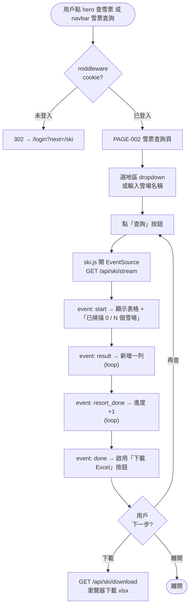
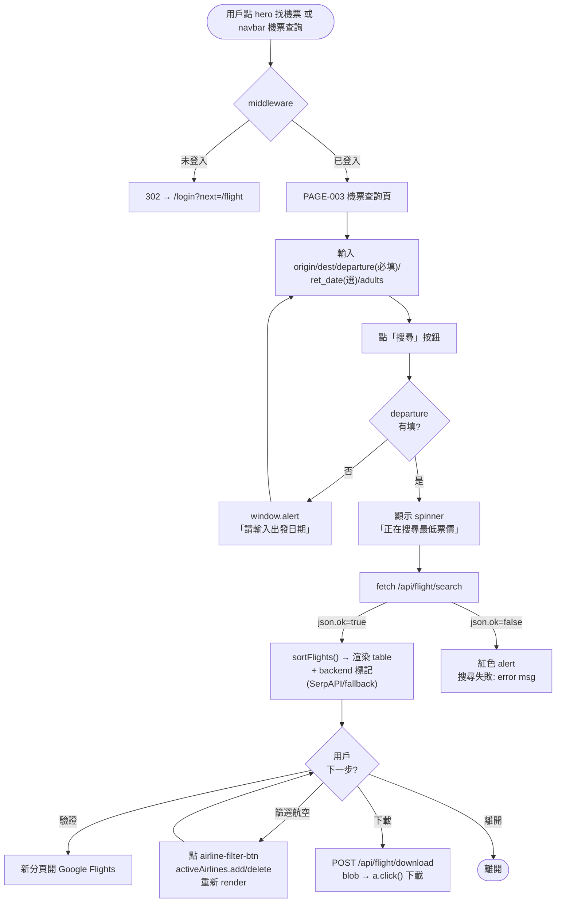
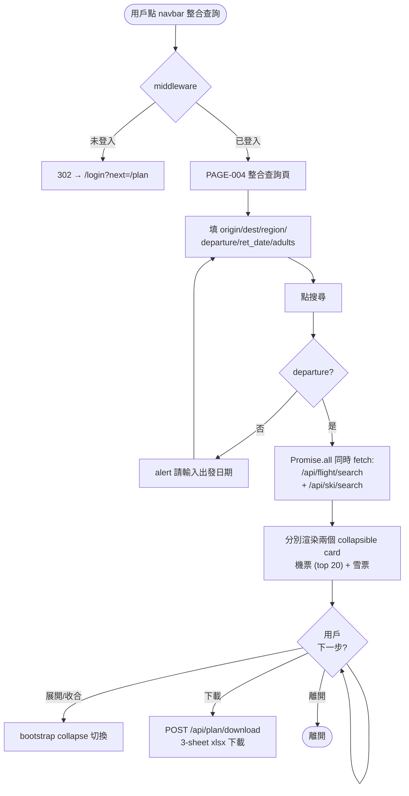
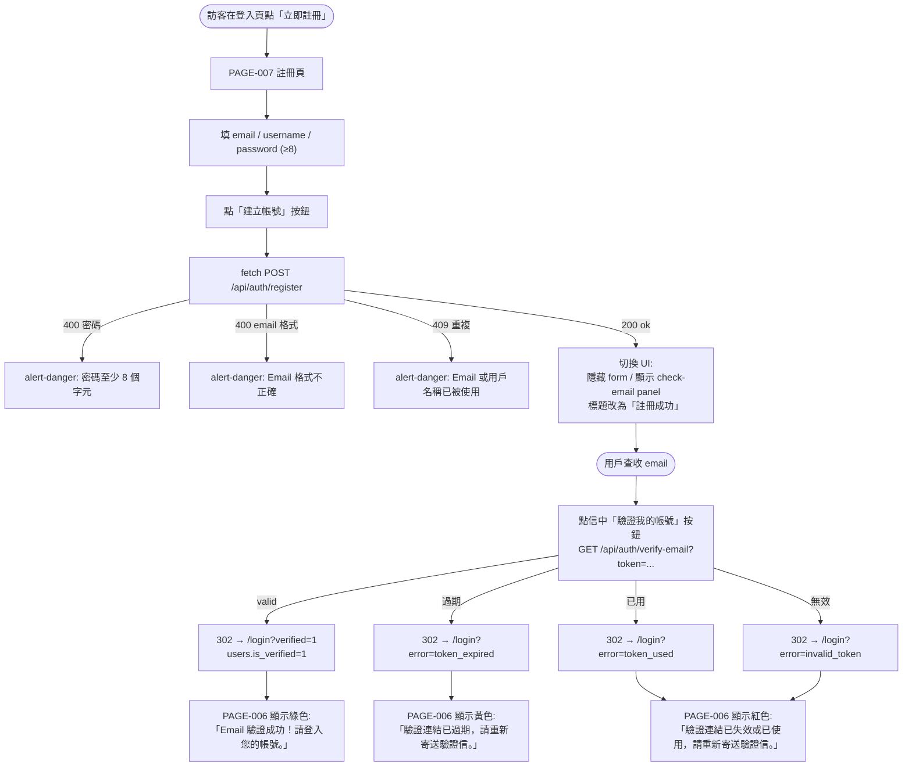
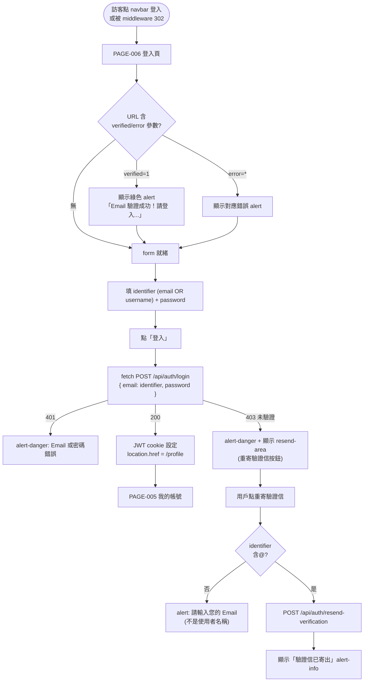
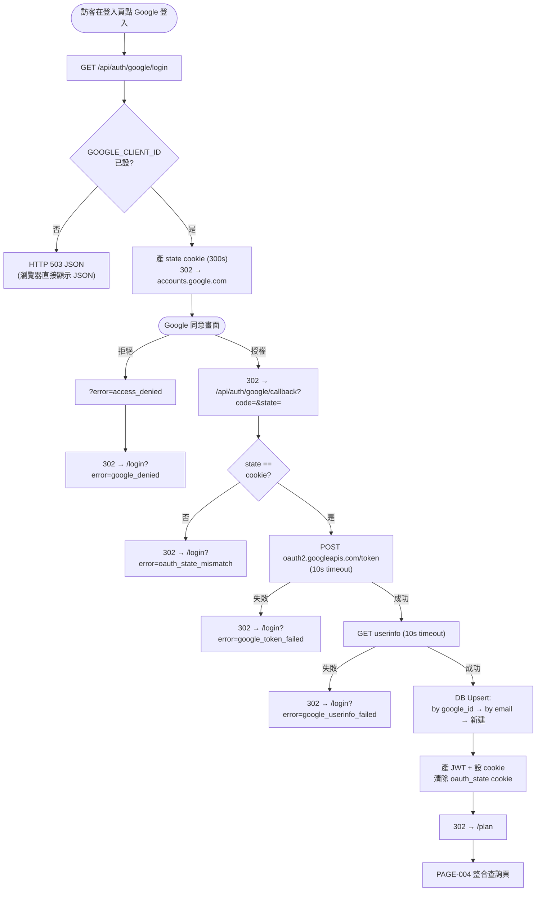
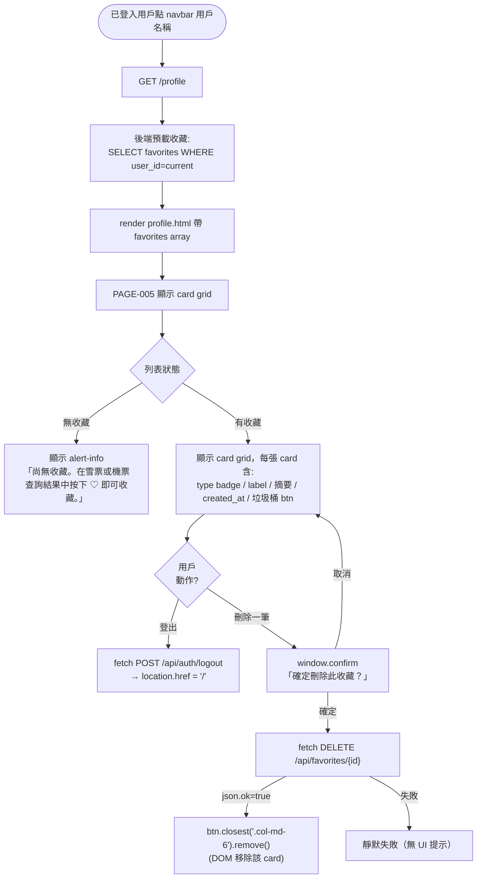

# 使用者流程 — snowboarding_support brownfield 反向追溯

> **模式**: brownfield-document — 從既有 templates + JS + 後端路由反向追溯，不設計新流程
> **對應**: 7 個 FLOW ↔ BA 階段 7 個 BF（業務流程）↔ SA 階段 45 個 FUNC
> **簡化原則**: 業務流程已在 `ba/business-flow.md` 詳述；本檔聚焦**用戶在 UI 上的點擊路徑**與**頁面間轉場**

---

## 1. FLOW 清單

| FLOW-ID | 名稱 | 對應 BF | 對應 FUNC | 經過 PAGE（有序）| 入口 |
|---------|------|---------|-----------|-----------------|------|
| FLOW-001 | 雪票查詢（SSE 串流為預設）| BF-001 | FUNC-001..014 | PAGE-001 → PAGE-006 → PAGE-002 | 首頁 hero「查雪票」按鈕 / navbar |
| FLOW-002 | 機票查詢（多 backend）| BF-002 | FUNC-015..019 | PAGE-001 → PAGE-006 → PAGE-003 | 首頁 hero「找機票」按鈕 / navbar |
| FLOW-003 | 整合查詢（機票+雪票）| BF-003 | FUNC-020..021 | PAGE-006 → PAGE-004 | navbar「整合查詢」 |
| FLOW-004 | 註冊 + Email 驗證 | BF-004 | FUNC-022..027, 032..033 | PAGE-007 → check-email panel → email → PAGE-006 | navbar「登入」→「立即註冊」 |
| FLOW-005 | 登入（Email/Username + 密碼）| BF-005 | FUNC-028..030 | PAGE-006 → PAGE-005 | navbar「登入」 |
| FLOW-006 | Google OAuth 登入 | BF-006 | FUNC-035..040 | PAGE-006 → Google → PAGE-004 | PAGE-006「使用 Google 帳號登入」 |
| FLOW-007 | 收藏管理（檢視 + 刪除）| BF-007 | FUNC-043..045 | PAGE-002/003 → PAGE-005 | navbar 用戶名稱（已登入） |

**註**:
- 「PAGE-006」=（未登入時的）登入頁；受保護頁面（PAGE-002/003/004/005）未登入時 middleware 自動 302 到 PAGE-006
- 「收藏新增」（FUNC-043）目前**僅透過 `window.addFavorite(type, data, label)` JS API 觸發**（`auth.js:90`），但**搜尋結果 UI 上並無顯式收藏按鈕** — 屬於既有 brownfield 設計缺口（`[CODE-AS-TRUTH: ski.js / flight.js 未呼叫 window.addFavorite]`）

---

## 2. FLOW-001: 雪票查詢（SSE 串流為預設）

- **觸發**: 已登入用戶想查日本雪場票價
- **入口**: 首頁 hero CTA「查雪票」/ navbar「雪票查詢」
- **對應**: BF-001, FR-001/002/003, FUNC-001..014

### 正常路徑（Happy Path）

### 異常路徑

| 異常 | 觸發 | UI 行為 | 來源 |
|------|------|---------|------|
| 未登入存取 | cookie 失效 | 自動 302 到 PAGE-006，URL 帶 `?next=/ski` | `web/main.py:54` |
| 全域鎖被佔用 | 另一查詢進行中 | SSE 立即 `event: error` → 紅色 alert「查詢失敗：查詢進行中，請稍後再試」| `ski.js:160-167`, `web/main.py:156` |
| 查詢逾時（>45s）| 雪場群組過大 | SSE `event: error` → 紅色 alert「查詢失敗：查詢逾時...」| `ski.js:160-167`, `web/main.py:185` |
| 連線中斷（無 data） | network drop | onerror → 紅色 alert「連線中斷，請重試」| `ski.js:169-175` |
| 無符合結果 | event: done 時 resultCount=0 | 黃色 alert「沒有找到符合條件的資料」| `ski.js:97-103, 157` |
| Excel 下載鎖佔用 | 同時查詢中 | HTTP 429 plain text（瀏覽器顯示伺服器訊息）| `web/main.py:203` |

### 邊界情況

| 情境 | 行為 | 來源 |
|------|------|------|
| 全部地區（region=""）| 查詢所有雪場（無篩選）| `ski.js:115` 條件性 append region |
| 同時填地區 + 雪場名 | 兩者皆作為篩選條件 | `ski.js:114-117` |
| EventSource 已開啟時再次提交 | 先 `eventSource.close()` 再開新連線 | `ski.js:107-110` |
| 用戶離開頁面 | EventSource 隨 page unload 自動 close | 瀏覽器原生行為 |

---

## 3. FLOW-002: 機票查詢

- **觸發**: 已登入用戶想找台灣→日本機票
- **入口**: 首頁 hero CTA「找機票」/ navbar「機票查詢」
- **對應**: BF-002, FR-004/005, FUNC-015..019

### 正常路徑

### 異常路徑

| 異常 | 觸發 | UI 行為 | 來源 |
|------|------|---------|------|
| 缺 departure | submit 時為空 | `alert('請輸入出發日期')` JS native dialog | `flight.js:35` |
| backend 全部失敗 | SerpAPI + fast-flights 都拋例外 | 紅色 alert「搜尋失敗: {error msg}」| `flight.js:53` |
| 結果為空 | data=[] | 黃色 alert「沒有找到符合條件的航班」| `flight.js:91-97` |
| Excel 下載失敗 | POST 非 2xx | `alert('下載失敗：伺服器錯誤')` | `flight.js:225` |

### 邊界情況

| 情境 | 行為 | 來源 |
|------|------|------|
| 去回程 vs 單程 | `isRoundtrip = !!retDate`；顯示藍色 info「票價為去回程合計」| `flight.js:37, 134-138` |
| departure 最小值 = 今天 | `min` 屬性 + onchange 同步 ret-date min | `flight.js:20-23` |
| backend = SerpAPI | 綠色 ✓ badge；backend = fast-flights | 黃色 badge | `flight.js:145-149` |
| 多航空公司篩選 | activeAirlines Set 多選 toggle | `flight.js:192-204` |

---

## 4. FLOW-003: 整合查詢（機票+雪票）

- **觸發**: 已登入用戶想一次看機票 + 雪票
- **入口**: navbar「整合查詢」
- **對應**: BF-003, FR-006, FUNC-020..021

### 正常路徑

### 異常路徑

| 異常 | 觸發 | UI 行為 | 來源 |
|------|------|---------|------|
| 機票 ok=false 但雪票 ok=true | 部分失敗 | 機票 card 顯示黃色 alert(error)，雪票 card 正常顯示 | `plan.js:72-75, 154` |
| 兩者都失敗 | both error | 兩個 card 都顯示黃色 alert + 「下載」按鈕**不出現** | `plan.js:99-108` |
| 雪票無 ticket_url 雪場 | 部分雪場過濾 | 後端跳過；前端「無雪票結果」訊息 | `plan.js:189` |
| 雪場全域鎖 | 鎖佔用 | skiRes.ok=false → 黃色 alert 「查詢進行中...」| `plan.js:154` |

---

## 5. FLOW-004: 註冊 + Email 驗證

- **觸發**: 訪客建立新帳號
- **入口**: PAGE-006「立即註冊」連結
- **對應**: BF-004, FR-007/010, FUNC-022..027 + FUNC-032..033

### 正常路徑

### 異常路徑

| 異常 | 觸發 | UI 行為 | 來源 |
|------|------|---------|------|
| 寄信全部失敗 | Resend 失敗 + SMTP 失敗 | 帳號仍建立（is_verified=0），但用戶看到 message 略調為「驗證信寄送失敗」| `auth_router.py:111-113` + `email_service.py:97-99` |
| 用戶 24h 後才點連結 | expires_at 超過 | 同上「過期」流程 | `auth_router.py:157-159` |
| 用戶從未驗證 → 嘗試登入 | login 端 is_verified=0 | HTTP 403 → `auth.js:30-33` 自動顯示 resend-area 按鈕 | `auth.js:29-33` + `login.html:46-48` |

### 邊界情況

| 情境 | 行為 | 來源 |
|------|------|------|
| 密碼少於 8 字元 | HTML5 `minlength="8"` + 後端二次驗證 | `register.html:27` + `auth_router.py:87` |
| 已驗證後重寄 | 後端回 `message="此帳號已完成驗證"`，不發新 token | `auth_router.py:179-181` |
| 重寄驗證信無 rate limit | 既知技術債（BACKLOG-006） | `[INFERRED: 無 rate limit, 留 TASK-002+]` |

> **[INFERRED-FROM-MAIN]**: TASK-002 已將 register 流程修正為「點建立帳號 → 顯示 verify-email 確認面板」（不再自動跳轉登入頁）— 反映在 `register.html:33-49` + `auth.js:67-79`。BA TASK-001 規格原僅紀錄 `message="帳號建立成功"`；此 UI 微調為 supplementary，列入 brownfield 補追溯範圍。

---

## 6. FLOW-005: 登入

- **觸發**: 訪客或登出狀態用戶要登入
- **入口**: navbar「登入」/ 受保護頁 302 重導
- **對應**: BF-005, FR-008, FUNC-028..030

### 正常路徑

### 異常路徑

| 異常 | 觸發 | UI 行為 | 來源 |
|------|------|---------|------|
| identifier 為空 | required attr 阻擋 | HTML5 native 提示 | `login.html:39` |
| password 為空 | 同上 | HTML5 native 提示 | `login.html:43` |
| 後端例外 500 | network error / DB error | catch 區塊 alert-danger: err.message | `auth.js:37-39` |

### 邊界情況

| 情境 | 行為 | 來源 |
|------|------|------|
| **Email OR Username 雙模式登入** | 前端 input id=`login-identifier`、value 塞進 `email` 欄；後端判斷哪個欄位匹配（TASK-002 引入）| `[INFERRED-FROM-MAIN: auth.js:14, login.html:38-39 — TASK-002 修改]` |
| 重寄驗證信需 Email（非 username）| identifier 不含 @ → alert 提醒 | `login.html:83-86` |
| 已登入用戶造訪 /login | 後端 302 redirect /profile | `auth_router.py:46-47` |

> **[INFERRED-FROM-MAIN]**: BA TASK-001 原規格 FR-008 描述「POST /api/auth/login body = {email, password}」；TASK-002 已擴充為「email 欄位接受 email 或 username」，前端 input label 改為「Email 或使用者名稱」。本 brownfield 補追溯**反映 main 上的最新狀態**。

---

## 7. FLOW-006: Google OAuth 登入

- **觸發**: 訪客想用 Google 一鍵登入
- **入口**: PAGE-006「使用 Google 帳號登入」按鈕
- **對應**: BF-006, FR-012, FUNC-035..040

### 正常路徑

### 異常路徑（已在流程圖中標示）

### 邊界情況

| 情境 | 行為 | 來源 |
|------|------|------|
| 既有 email 用戶（password 註冊）OAuth 登入 | DB UPDATE google_id + is_verified=1，**不新建** | `oauth_router.py:91-99` |
| OAuth 註冊用戶 password 為空字串 | hashed_password='' — 無法用密碼登入 | `oauth_router.py:106` |
| callback redirect 寫死 `/plan` | 不支援 `next` 參數 | `oauth_router.py:112` [BR-009] |

---

## 8. FLOW-007: 收藏管理（檢視 + 刪除）

- **觸發**: 已登入用戶想看自己的收藏並刪除
- **入口**: navbar 用戶名稱（已登入時 nav-login-btn href 改為 /profile）
- **對應**: BF-007, FR-014, FUNC-043..045

### 正常路徑

### 異常路徑

| 異常 | 觸發 | UI 行為 | 來源 |
|------|------|---------|------|
| 試圖刪除他人 favorite | DELETE WHERE user_id=? 過濾 | 後端回 ok:true 但 DB 不變；前端 DOM 仍移除 | `auth_router.py:248-251` + `profile.html:65` |
| 收藏新增 401 | 未登入呼叫 window.addFavorite | `confirm('請先登入才能收藏...')` → 跳轉 /login | `auth.js:98-101` |
| 收藏新增其他錯誤 | type 非合法 / DB error | `alert('收藏失敗：'+ err.message)` | `auth.js:104-106` |

### 邊界情況（既有設計缺口）

| 情境 | 現況 | 標記 |
|------|------|------|
| **收藏 UI 入口缺失** | `window.addFavorite` 已定義但 `ski.js` / `flight.js` **未呼叫** | `[BROWNFIELD-GAP: 收藏功能 UI 入口缺失 — 留後續 TASK]` |
| 刪除失敗無提示 | catch 無 alert，DOM 不更新 | `[BROWNFIELD-GAP: 錯誤提示缺失]` |
| 收藏 label 為空時顯示「未命名」| `fav.label or '未命名'` | `profile.html:31` |

---

## 9. 全域導航 / 頁面轉場矩陣

| 來源 PAGE | 目標 PAGE | 觸發 | 來源檔案 |
|----------|-----------|------|---------|
| PAGE-001 | PAGE-002 | hero「查雪票」/ navbar 雪票 | `index.html:34, base.html:96` |
| PAGE-001 | PAGE-003 | hero「找機票」/ navbar 機票 | `index.html:37, base.html:103` |
| PAGE-001 | PAGE-002 (filter) | 熱門地區卡片點擊（帶 ?region=）| `index.html:163` |
| PAGE-001 | PAGE-002/003 | footer 連結 | `base.html:149-159` |
| (任) | PAGE-006 | navbar「登入」（未登入時）| `base.html:117` |
| (任) | PAGE-005 | navbar 用戶名稱（已登入後 JS 改 href）| `base.html:181` |
| PAGE-002/003/004/005 | PAGE-006 | 未登入時 middleware 302（帶 ?next=）| `web/main.py:54` |
| PAGE-006 | PAGE-007 | 「立即註冊」連結 | `login.html:54` |
| PAGE-007 | PAGE-006 | 「立即登入」連結 / 註冊成功後「回登入頁」按鈕 | `register.html:48, 52` |
| PAGE-006 | PAGE-005 | 登入成功 `location.href='/profile'` | `auth.js:36` |
| PAGE-006 | Google OAuth | 「使用 Google 帳號登入」 | `login.html:22` |
| OAuth callback | PAGE-004 | 寫死 redirect to /plan | `oauth_router.py:112` |
| PAGE-005 | PAGE-001 | 登出後 `location.href='/'` | `profile.html:58` |
| (任) | external | navbar.brand「SnowTrip Japan」/ footer 區域連結 | `base.html:82, 156-159` |

---

## 10. 存取權限矩陣（基於 middleware + 後端依賴）

| PAGE | 路由 | 公開 | 已登入需求 | 未登入時行為 |
|------|------|------|-----------|-------------|
| PAGE-001 首頁 | `/` | ✅ | — | 正常顯示 |
| PAGE-002 雪票 | `/ski` | ❌ | 必須 | 302 `/login?next=/ski` |
| PAGE-003 機票 | `/flight` | ❌ | 必須 | 302 `/login?next=/flight` |
| PAGE-004 整合 | `/plan` | ❌ | 必須 | 302 `/login?next=/plan` |
| PAGE-005 個人 | `/profile` | ❌ | 必須（+ `Depends(get_current_user)`）| 302 |
| PAGE-006 登入 | `/login` | ✅ | — | 正常；已登入時 302 `/profile` |
| PAGE-007 註冊 | `/register` | ✅ | — | 正常 |

> **註**: SDLC `sdlc-uiux.md Rule 4`（檢視=disabled 不隱藏）**不適用於本專案** — snowboarding_support 採二級權限（未登入=隱藏整頁；已登入=全部可用）；無三級「檢視=disabled」需求。Brownfield 接受。

---

## 11. 追溯矩陣（FLOW → FUNC → FR）

| FLOW | FUNC（主要）| FR | BF | PAGE |
|------|------------|-----|-----|------|
| FLOW-001 | FUNC-001..010, 011..014 | FR-001, FR-002, FR-003 | BF-001 | PAGE-002 |
| FLOW-002 | FUNC-015..019 | FR-004, FR-005 | BF-002 | PAGE-003 |
| FLOW-003 | FUNC-020..021 (+ FUNC-002, 017) | FR-006 | BF-003 | PAGE-004 |
| FLOW-004 | FUNC-022..027, FUNC-032..033 | FR-007, FR-010 | BF-004 | PAGE-007, PAGE-006 |
| FLOW-005 | FUNC-028..030, FUNC-034 | FR-008, FR-011 | BF-005 | PAGE-006, PAGE-005 |
| FLOW-006 | FUNC-035..040 | FR-012 | BF-006 | PAGE-006, PAGE-004 |
| FLOW-007 | FUNC-041, FUNC-043..045 | FR-013, FR-014 | BF-007 | PAGE-005 |

---

## 12. 自我驗證

- [x] 每個 BA BF 都有對應 FLOW（7:7）
- [x] 每個 FLOW 都標 PAGE-ID（已存在 sitemap 中）
- [x] 異常路徑完整（middleware / 鎖 / 逾時 / 驗證失敗 / 寄信失敗 / OAuth state mismatch）
- [x] 邊界情況以 `[INFERRED-FROM-MAIN]` 或 `[BROWNFIELD-GAP]` 標註
- [x] 全域導航轉場矩陣含所有 PAGE 間連結
- [x] 存取權限矩陣與 BA FR-015 一致
- [x] Mermaid 語法正確
- [x] 來源追溯到 file:line（每個 FLOW 有對應 source 引用）
