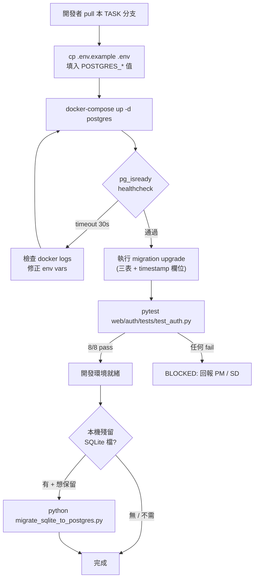
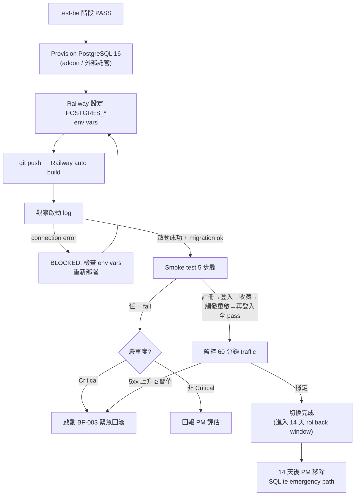
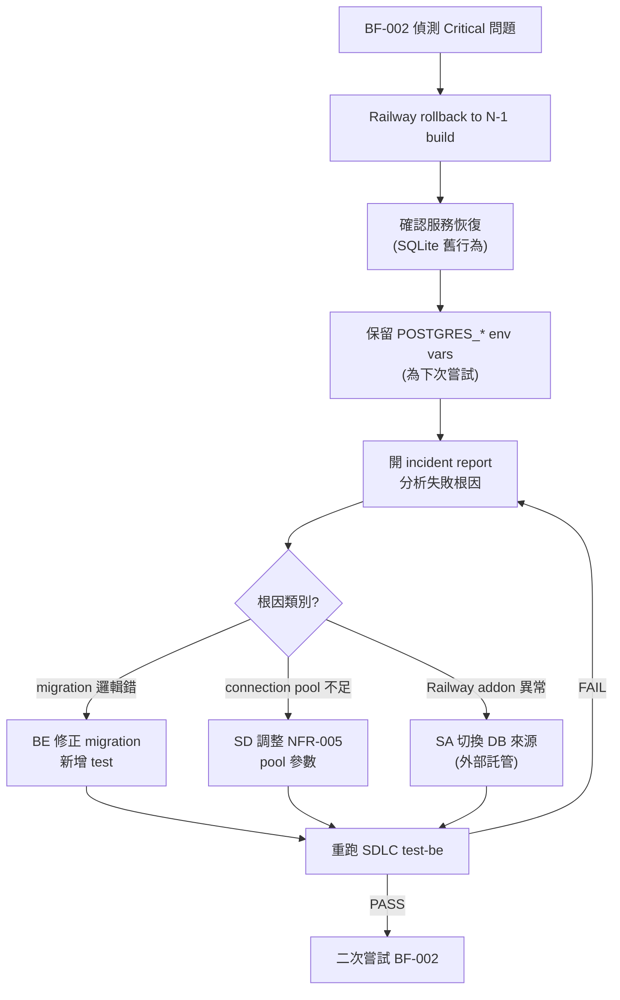
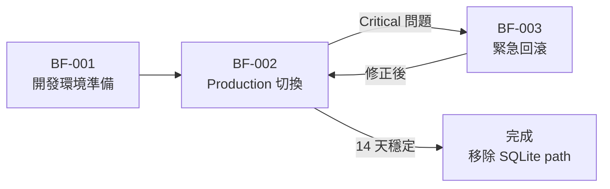

# 業務流程圖 — SQLite → PostgreSQL 遷移

## 1. 流程概述

本 TASK 為**後端基礎設施重構**，對終端用戶端（訪客 ROLE-001 / 已登入用戶 ROLE-002）無可見業務流程變更 — 用戶照常註冊 / 登入 / 收藏 / Google OAuth。本流程圖描述**部署視角**的三個關鍵流程：

1. **BF-001 — 開發環境準備流程**：開發者本機從 SQLite 切換到 docker-compose PostgreSQL
2. **BF-002 — Production 部署切換流程**：Railway 環境從 SQLite ephemeral 切到 PostgreSQL 持久化
3. **BF-003 — 緊急回滾流程**：production 切換後若發現嚴重問題的回退路徑（CONST-009 + SUG-006）

> **註**: 本 TASK 無「終端用戶業務流程」變更（NFR-002 既有 22 個 AC 行為不變），故本檔案聚焦於部署 / 維運層業務流程。

---

## 2. 角色定義（業務角色，非系統角色）

> 引用 TASK-001 既有 ROLE + 新增 ROLE-004

| 角色ID | 角色名稱 | 描述 | 來源 |
|--------|---------|------|------|
| ROLE-001 [REUSE] | 訪客（Guest） | 一般註冊 / OAuth 登入用戶 | TASK-001 |
| ROLE-002 [REUSE] | 已登入用戶 | 收藏 / 個人頁存取者 | TASK-001 |
| ROLE-003 [REUSE] | 系統維運者（Operator） | psql / Railway dashboard 查詢用戶狀態 | TASK-001 |
| ROLE-004 | 部署者（Deployer） | 觸發本 TASK 切換流程；設定 Railway env vars；操作 Postgres addon；執行 migration；負責 rollback 決策 | 本 TASK 新增（FR-006/007 + CONST-009） |

---

## 3. 業務流程

### BF-001: 開發環境準備流程

- **觸發條件**: 開發者第一次 pull 本 TASK 分支或執行 pytest 前
- **參與角色**: ROLE-004（部署者，此處兼任本機開發者）
- **前置條件**:
  - 本機已安裝 Docker（或 PostgreSQL 16 本機實例）
  - `.env.example` 已含 `POSTGRES_*` 範例值（AC-052）
  - `docker-compose.yml` 已含 postgres:16-alpine 服務（baseline §1.1）
- **對應需求**: FR-001, FR-002, FR-008, NFR-009

#### 流程步驟

| 步驟 | 角色 | 動作 | 產出 |
|------|------|------|------|
| 1 | ROLE-004 | 複製 `.env.example` 為 `.env`；填入本機 `POSTGRES_*` 值 | 本機 `.env` |
| 2 | ROLE-004 | 執行 `docker-compose up -d postgres`；等待 healthcheck `pg_isready` 通過 | 本機 PostgreSQL 16 容器啟動 |
| 3 | ROLE-004 | 執行 migration 工具的 upgrade 指令（如 `alembic upgrade head`） | 三表建立於 PostgreSQL，含 updated_at / deleted_at |
| 4 | ROLE-004 | 執行 `pytest web/auth/tests/test_auth.py` | 8 個 pytest 全部 pass（AC-045） |
| 5 | ROLE-004 | （可選）執行 `python scripts/migrate_sqlite_to_postgres.py --sqlite-path web/data/snowtrip.db` 若本機殘留 SQLite | 三表資料匯入（AC-056） |

#### 流程圖

#### 異常流程

| 異常 | 觸發條件 | 處理方式 |
|------|---------|---------|
| pg_isready 超時 | docker-compose postgres 服務啟動失敗 / port 衝突 | 檢查 `docker logs <postgres-container>`；確認 port 5432 未被佔用；修正 `.env` 中 `POSTGRES_PORT` |
| migration upgrade 失敗 | migration 檔語法錯 / 欄位型別不相容 | 不可手動修補 PostgreSQL — 回報 SD/BE 修正 migration 檔（reversible 故可回到 base state） |
| pytest 部分失敗 | fixture 連線 string 未更新 / 既有測試假設 SQLite 特定行為 | 回報 PM；BE 階段須更新 pytest fixture 但**不改測試斷言**（CONST-008） |
| 本機殘留 SQLite 匯入後資料量不符 | SQLite schema 與本 TASK PostgreSQL schema 欄位數差異（updated_at / deleted_at 新欄）導致 | 腳本須對舊欄位 backfill 預設值（updated_at = created_at, deleted_at = NULL） |

---

### BF-002: Production 部署切換流程

- **觸發條件**: 本 TASK 通過所有 SDLC 階段（test-be 後）；PM 發出 `/sdlc:next` 進入 deploy 階段
- **參與角色**: ROLE-004（部署者）+ ROLE-003（維運者協助監控）
- **前置條件**:
  - test-be 階段 PASS（NFR-002 既有 22 AC 全部通過）
  - Railway PostgreSQL addon 已選定方案（addon / 外部 Supabase / Neon — deploy 階段決策）
  - rollback plan 已於 deploy/service-contract.yaml 寫明（CONST-009）
- **對應需求**: FR-005, FR-006, FR-007, NFR-001, NFR-005

#### 流程步驟

| 步驟 | 角色 | 動作 | 產出 |
|------|------|------|------|
| 1 | ROLE-004 | Railway 平台 provision PostgreSQL 16 addon（或設定外部 PostgreSQL 連線資訊） | DATABASE_URL 可用 |
| 2 | ROLE-004 | Railway dashboard 設定 `POSTGRES_*` env vars（或 `DATABASE_URL`） | env vars 就緒 |
| 3 | ROLE-004 | Railway dashboard 觸發部署本 TASK 分支（git push 後自動 build） | 新 build image |
| 4 | ROLE-004 | 觀察啟動 log；確認 migration 自動執行成功 / 連線成功 | log 無 connection error（AC-054） |
| 5 | ROLE-004 + ROLE-003 | 執行 smoke test（5 步驟 — 註冊 / 登入 / 收藏 / 觸發重啟 / 再登入） | 5 步驟全通過（AC-055） |
| 6 | ROLE-004 | 觀察 production traffic 60 分鐘；確認無 5xx 異常上升 | 監控 pass |
| 7 | ROLE-004 | （前 14 天）保留 git 中 `database_sqlite.py` 路徑作 emergency rollback（SUG-006） | 文件記錄 rollback window |

#### 流程圖

#### 異常流程

| 異常 | 觸發條件 | 處理方式 |
|------|---------|---------|
| Railway PostgreSQL addon 不可用 | Railway 平台變更 / 配額限制 | 切換至外部託管（Supabase / Neon），重新設定 DATABASE_URL；deploy 階段須提供此 fallback |
| 啟動時 migration 失敗 | 生產 DB 已存在不相容 schema（不太可能 — 第一次切換為空 DB） | 啟動失敗即觸發 Railway healthcheck fail；自動 rollback 到舊 build；ROLE-004 檢視 migration 修正 |
| Smoke test 「重啟後資料消失」失敗 | env vars 指向錯誤 DB（如 ephemeral SQLite 仍生效）或 connection 沒持久化 | 立即 rollback；檢查 `database.py` 實際讀取的 env vars 是否正確；確認 `web/data/snowtrip.db` 不再被讀取 |
| 監控期 5xx 異常上升 | connection pool 耗盡 / 慢查詢 / migration 殘留問題 | 觸發 BF-003；同步調整 NFR-005 pool 參數 |

---

### BF-003: 緊急回滾流程

- **觸發條件**: BF-002 step 5 或 step 6 發現 Critical 問題（資料寫入失敗 / 大量 5xx / 認證流程全壞）
- **參與角色**: ROLE-004（部署者）+ ROLE-003（維運者）
- **前置條件**:
  - 切換後 ≤ 14 天（rollback window — SUG-006）
  - git 中保留 `database_sqlite.py` 路徑或對應 commit hash
- **對應需求**: CONST-009, FR-007 [IRREVERSIBLE] 緩解

#### 流程步驟

| 步驟 | 角色 | 動作 | 產出 |
|------|------|------|------|
| 1 | ROLE-004 | 立即在 Railway dashboard 觸發 deploy 上一個成功的 build（rollback to N-1） | 服務恢復 SQLite 行為 |
| 2 | ROLE-003 | 確認 SQLite ephemeral 仍生效（舊行為），用戶可註冊 / 登入（雖然下次重啟仍會失） | 服務 functional |
| 3 | ROLE-004 | 在 Railway 環境變數**保留**已設定的 `POSTGRES_*`（為下次 try 做準備） | env 保留 |
| 4 | ROLE-004 | 開 incident report；分析 BF-002 失敗原因（log + smoke test 細節 + DB state） | incident 文件 |
| 5 | ROLE-004 + SD/BE | 修正根因；新增 test case；走 SDLC test-be 重跑 | 修正版 build |
| 6 | ROLE-004 | 二次嘗試 BF-002 切換 | 期望 pass |

#### 流程圖

#### 異常流程

| 異常 | 觸發條件 | 處理方式 |
|------|---------|---------|
| Rollback 後 SQLite 路徑也失效（容器層被 PostgreSQL 切換破壞） | 切換過程修改了 `database.py` 但 rollback build 仍是新檔 | 確認 git revert 完整 — 必要時手動 cherry-pick 舊 `database.py`；強調 SUG-006 的 `database_sqlite.py` 保留意義 |
| 14 天 rollback window 後發現問題 | 已移除 SQLite emergency path | 走完整 SDLC 開新 TASK 修正；無快速 rollback 路徑 — 屬於 [IRREVERSIBLE] 後果（FR-007） |
| 用戶在 rollback 後丟失新註冊資料 | PostgreSQL 切換期間註冊的用戶在 rollback 後在 SQLite 中不存在 | 接受 trade-off — 屬於切換期已知風險（FR-007 業務影響說明）；通知受影響用戶重新註冊 |

---

## 4. 流程間關係

---

## 5. 追溯矩陣

| 流程ID | 對應需求 | 參與角色 | 觸發階段 |
|--------|---------|---------|---------|
| BF-001 | FR-001, FR-002, FR-008, NFR-009 | ROLE-004 | dev / test-be |
| BF-002 | FR-005, FR-006, FR-007, NFR-001, NFR-005 | ROLE-004 + ROLE-003 | deploy |
| BF-003 | CONST-009, FR-007 [IRREVERSIBLE] 緩解 | ROLE-004 + ROLE-003 | post-deploy (14 天 window) |

---

## 6. 終端用戶流程說明（無變更聲明）

> **重要**: TASK-001 已定義之終端用戶業務流程（註冊 / 登入 / Email 驗證 / Google OAuth / 收藏 CRUD）在本 TASK 部署後**完全不變**（NFR-002）。本檔案不重述既有 BF。

引用既有 TASK-001/BF-001 ~ TASK-001/BF-N（若 TASK-001 BA 有定義），本 TASK 保留行為。
