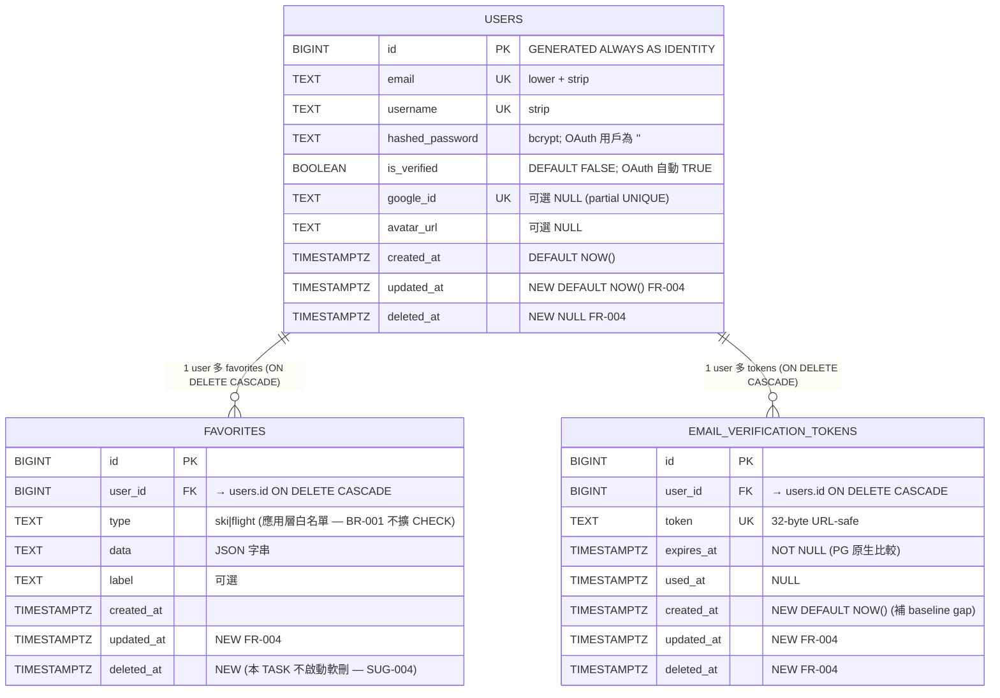

# 欄位規格書 — SQLite → PostgreSQL 持久化遷移

> **模式**: feature — 本 TASK 為基礎設施重構，**不新增 ENTITY / TBL**（純 schema 重建到 PostgreSQL + 補 timestamp 欄位）
> **本 TASK 與 TASK-001 的關係**: 三個 ENTITY (ENTITY-001..003) + 三個 TBL (TBL-001..003) 全部 [REUSE: from TASK-001]；schema 邏輯結構不變（BR-001），僅:
>   - storage engine 替換 (SQLite → PostgreSQL)
>   - 補欄位 `updated_at` + `deleted_at`（FR-004，三表）
>   - 補欄位 `created_at`（TBL-003 — 既有 baseline gap）
>   - PK 型別 SQLite `INTEGER AUTOINCREMENT` → PG `BIGINT GENERATED ALWAYS AS IDENTITY`
>   - 時間戳 SQLite `TIMESTAMP` (ISO 字串) → PG `TIMESTAMPTZ`（含時區）
>   - 索引 SQLite 隱式 → PG 顯式命名 `uniq_*` / `fk_idx_*`（db-conventions §3 + BR-004）
> **ID 範圍**: 本 TASK 配額 ENTITY/TBL 各 101-200；**本 TASK 未使用**（所有 ENTITY/TBL 都是 [REUSE]，無新增）— Rule 13 範圍保留作未來擴充

---

## 1. 實體清單（全部 [REUSE: from TASK-001]，無新增）

| 實體 ID | TBL ID | 實體名稱 | 中文描述 | 相關功能（本 TASK 新增）| 狀態 |
|---------|--------|---------|---------|------------------------|------|
| ENTITY-001 [REUSE: from TASK-001] | TBL-001 [REUSE] | users | 使用者帳號（含 password + Google OAuth 整合）| FUNC-103/104/105/106 | **schema 重建於 PG + 補 2 欄** |
| ENTITY-002 [REUSE: from TASK-001] | TBL-002 [REUSE] | favorites | 使用者收藏的雪票或機票查詢結果 | FUNC-103/104/105/106 | **schema 重建於 PG + 補 2 欄** |
| ENTITY-003 [REUSE: from TASK-001] | TBL-003 [REUSE] | email_verification_tokens | Email 驗證 token（24h 過期 + 一次性）| FUNC-103/104/105/106 | **schema 重建於 PG + 補 3 欄（含 baseline gap 的 created_at）** |

**本 TASK ID 範圍使用狀況**: ENTITY-101..200 / TBL-101..200 / MOD-105..200 / FUNC-108..200 全部**未使用**（範圍保留作未來擴充）。本 TASK 新增 MOD-101..104 + FUNC-101..107 + PATTERN-101 — 詳見 system-arch.md + functional-flow.md。

---

## 2. 實體欄位定義（PostgreSQL 目標版本）

### ENTITY-001 / TBL-001: users（使用者帳號）

**PostgreSQL DDL 規範性說明（SD 階段於 db-schema.md 寫完整 CREATE TABLE）**:

```text
-- 規範性語意（非完整 DDL — 待 SD 階段補充）
users:
  id              BIGINT GENERATED ALWAYS AS IDENTITY PRIMARY KEY
  email           TEXT NOT NULL                     (UNIQUE — 索引 uniq_users_email)
  username        TEXT NOT NULL                     (UNIQUE — 索引 uniq_users_username)
  hashed_password TEXT NOT NULL DEFAULT ''
  is_verified     BOOLEAN NOT NULL DEFAULT FALSE   (PG 原生 BOOLEAN — 不再需要 0/1)
  google_id       TEXT NULL                         (UNIQUE 部分索引 — 索引 uniq_users_google_id)
  avatar_url      TEXT NULL
  created_at      TIMESTAMPTZ NOT NULL DEFAULT NOW()
  updated_at      TIMESTAMPTZ NOT NULL DEFAULT NOW()   ★ NEW (FR-004)
  deleted_at      TIMESTAMPTZ NULL                     ★ NEW (FR-004)
```

**欄位明細**:

| 欄位名 | 狀態 | PG 類型 | SQLite 對映 | 必填 | 預設值 | 約束 | 索引 | 描述 | 來源 |
|--------|------|---------|------------|------|--------|------|------|------|------|
| id | [REUSE 欄位 + 型別變更] | `BIGINT GENERATED ALWAYS AS IDENTITY` | `INTEGER PRIMARY KEY AUTOINCREMENT` | 是 | identity | PRIMARY KEY | 隱式 PK | 唯一識別碼 | TASK-001 + BR-005 |
| email | [REUSE] | `TEXT` (或 `VARCHAR(255)` — SD 決定) | `TEXT` | 是 | — | NOT NULL, UNIQUE | `uniq_users_email` ★ 顯式命名 (BR-004) | Email 地址，小寫 + strip | TASK-001 + BR-004 |
| username | [REUSE] | `TEXT` | `TEXT` | 是 | — | NOT NULL, UNIQUE | `uniq_users_username` ★ | 顯示名稱，strip | TASK-001 |
| hashed_password | [REUSE] | `TEXT` | `TEXT` | 是 | `''` | NOT NULL DEFAULT '' | — | bcrypt hash 結果；OAuth 用戶為 `''` | TASK-001 |
| is_verified | [REUSE 欄位 + 型別行為變更] | `BOOLEAN` | `BOOLEAN`（SQLite 實存 0/1）| 是 | `FALSE` | NOT NULL DEFAULT FALSE | — | Email 是否已驗證；**PG 原生 BOOLEAN — 應用層移除 `bool()` adapter**（FUNC-105） | TASK-001 + FR-001 |
| google_id | [REUSE] | `TEXT` | `TEXT` | 否 | NULL | UNIQUE (partial — `WHERE google_id IS NOT NULL`) | `uniq_users_google_id` ★ | Google OAuth `sub` 欄位 | TASK-001 |
| avatar_url | [REUSE] | `TEXT` | `TEXT` | 否 | NULL | — | — | Google OAuth picture URL | TASK-001 |
| created_at | [REUSE 欄位 + 型別變更] | `TIMESTAMPTZ` ★ 含時區 | `TIMESTAMP` (ISO 字串) | 是 | `NOW()` | NOT NULL DEFAULT NOW() | — | 帳號建立時間（UTC）| TASK-001 + BR-006 |
| updated_at | ★ **NEW** | `TIMESTAMPTZ` | — | 是 | `NOW()` | NOT NULL DEFAULT NOW() | — | 最後修改時間；UPDATE 時應用層或 trigger 刷新 | **FR-004 + BR-006** + db-conventions §2 |
| deleted_at | ★ **NEW** | `TIMESTAMPTZ` | — | 否 | NULL | NULL | (預留索引 — 後續 TASK 啟用 soft-delete 時加 `idx_users_deleted_at_null`) | 軟刪除時間（NULL = 未刪除）；**本 TASK 不啟動軟刪邏輯（SUG-004 / CONST-005）— 僅補欄位** | **FR-004** + db-conventions §8 第 4 條 |

**驗證規則說明（應用層 — [REUSE: from TASK-001]，本 TASK 不變）**:
- `email`: regex `[^@]+@[^@]+\.[^@]+` + `.lower().strip()` 統一格式
- `username`: `.strip()`
- `password`（寫入前 hash）: `len(password) >= 8`
- `is_verified`: 不再需要 `bool(d.get(..., 1))` adapter — PG 直接回 Python bool
- `google_id`: OAuth callback 設定，DB UNIQUE 約束強制

**conventions 對照（db-conventions.md v1.1）**:

| 規範項 | 狀態 | 變化 |
|--------|------|------|
| 表名 snake_case 複數 | ✅ | 不變 |
| PK 命名 `id` | ✅ | 不變 |
| PK 型別 `BIGINT GENERATED ALWAYS AS IDENTITY` | ✅ ★ **修正 TASK-001 grandfather** | SQLite `INTEGER AUTOINCREMENT` → PG `BIGINT IDENTITY` |
| `created_at` 存在 | ✅ | 不變 |
| **`updated_at` 存在** | ✅ ★ **新合規（解 baseline M-8）** | TASK-001 缺欄位 → 本 TASK 補（FR-004）|
| **`deleted_at` 存在** | ✅ ★ **新合規** | 同上 |
| 布林前綴 `is_xxx` | ✅ | 不變 |
| 唯一索引命名 `uniq_users_*` | ✅ ★ **修正 baseline M-9** | SQLite 隱式索引 → PG 顯式 `uniq_users_email` / `uniq_users_username` / `uniq_users_google_id` |

**[CROSS-TASK: TASK-001 / TBL-001 (users) 補 updated_at + deleted_at 欄位 / 觸發 FR-004]** ✅ 落實於本表

---

### ENTITY-002 / TBL-002: favorites（使用者收藏）

**PostgreSQL DDL 規範性說明**:

```text
favorites:
  id          BIGINT GENERATED ALWAYS AS IDENTITY PRIMARY KEY
  user_id     BIGINT NOT NULL                     (FK → users.id ON DELETE CASCADE — 索引 fk_idx_favorites_user_id)
  type        TEXT NOT NULL                        (應用層白名單 'ski' | 'flight' — INV-007；SA 不擴展為 CHECK 約束因為 BR-001 schema 邏輯不變)
  data        TEXT NOT NULL                        (JSON 字串 — 應用層 json.dumps；考慮 JSONB SUG 略)
  label       TEXT NULL                            (應用層預設 ''；DB 允許 NULL)
  created_at  TIMESTAMPTZ NOT NULL DEFAULT NOW()
  updated_at  TIMESTAMPTZ NOT NULL DEFAULT NOW()   ★ NEW (FR-004)
  deleted_at  TIMESTAMPTZ NULL                     ★ NEW (FR-004)
```

**欄位明細**:

| 欄位名 | 狀態 | PG 類型 | 必填 | 預設值 | 約束 | 索引 | 描述 | 來源 |
|--------|------|---------|------|--------|------|------|------|------|
| id | [REUSE 型別變更] | `BIGINT IDENTITY` | 是 | identity | PK | 隱式 | — | TASK-001 |
| user_id | [REUSE] | `BIGINT` | 是 | — | NOT NULL, FK → users(id) ON DELETE CASCADE | `fk_idx_favorites_user_id` ★ **顯式 (修正 baseline M-9)** | 收藏所有者 | TASK-001 + BR-010 |
| type | [REUSE] | `TEXT` | 是 | — | NOT NULL（應用層白名單）| — | 'ski' \| 'flight'（INV-007）| TASK-001 + BR-011 |
| data | [REUSE] | `TEXT` | 是 | — | NOT NULL | — | JSON 字串（json.dumps）| TASK-001 |
| label | [REUSE] | `TEXT` | 否 | NULL | — | — | 用戶標籤 | TASK-001 |
| created_at | [REUSE 型別變更] | `TIMESTAMPTZ` | 是 | NOW() | NOT NULL | — | — | TASK-001 + BR-006 |
| updated_at | ★ **NEW** | `TIMESTAMPTZ` | 是 | NOW() | NOT NULL | — | 最後修改 | **FR-004** |
| deleted_at | ★ **NEW** | `TIMESTAMPTZ` | 否 | NULL | NULL | — | **本 TASK 補欄位但不啟動軟刪（SUG-004 / CONST-005）— FUNC-045 仍硬刪 [IRREVERSIBLE REUSE]** | **FR-004** |

**驗證規則 [REUSE: from TASK-001]**:
- `type`: Pydantic 白名單 `('ski', 'flight')` → 400
- `data`: `json.dumps(body.data)`
- `user_id`: `current_user["id"]`，不接受外部傳入（防越權）

**ON DELETE CASCADE 行為 [REUSE]**:
- PG CASCADE 語意與 SQLite 一致；當對應 user 被刪 → 該 user 的所有 favorites 自動刪
- db-conventions v1.1 §4 白名單合法 [REUSE]

**conventions 對照**:

| 規範項 | 狀態 | 變化 |
|--------|------|------|
| 表名 snake_case 複數 | ✅ | 不變 |
| 欄位 snake_case | ✅ | 不變 |
| FK 命名 `{ref_table_singular}_id` | ✅ | `user_id` 不變 |
| **FK 約束顯式命名 `fk_favorites_user_id_users`** | ✅ ★ **新合規** | SQLite inline FK → PG 顯式約束命名 |
| ON DELETE CASCADE | ✅ | 不變（db-conventions §4 白名單）|
| **`updated_at` 存在** | ✅ ★ **新合規** | 同 ENTITY-001 |
| **`deleted_at` 存在** | ✅ ★ **欄位補齊；軟刪邏輯本 TASK 未啟動** | SUG-004 留後續 TASK 改寫 FUNC-045 為 soft-delete |
| `type` 應改 CHECK / ENUM | ⚠️ **本 TASK 維持應用層白名單** | BR-001 schema 邏輯不變；CHECK 約束改造留後續 TASK |
| **`fk_idx_favorites_user_id` 顯式 FK 索引** | ✅ ★ **新合規（修正 baseline M-9）**| 查詢 `WHERE user_id=?` 頻繁，必要 |

**[CROSS-TASK: TASK-001 / TBL-002 (favorites) 補 updated_at + deleted_at 欄位 / 觸發 FR-004]** ✅ 落實

---

### ENTITY-003 / TBL-003: email_verification_tokens（Email 驗證 token）

**PostgreSQL DDL 規範性說明**:

```text
email_verification_tokens:
  id          BIGINT GENERATED ALWAYS AS IDENTITY PRIMARY KEY
  user_id     BIGINT NOT NULL                     (FK → users.id ON DELETE CASCADE — 索引 fk_idx_email_verification_tokens_user_id)
  token       TEXT NOT NULL                       (UNIQUE — 索引 uniq_email_verification_tokens_token)
  expires_at  TIMESTAMPTZ NOT NULL                 (PG 原生比較 — 不再依賴 ISO 字串字典序)
  used_at     TIMESTAMPTZ NULL
  created_at  TIMESTAMPTZ NOT NULL DEFAULT NOW()   ★ NEW (補 baseline gap)
  updated_at  TIMESTAMPTZ NOT NULL DEFAULT NOW()   ★ NEW (FR-004)
  deleted_at  TIMESTAMPTZ NULL                     ★ NEW (FR-004)
```

**欄位明細**:

| 欄位名 | 狀態 | PG 類型 | 必填 | 預設值 | 約束 | 索引 | 描述 | 來源 |
|--------|------|---------|------|--------|------|------|------|------|
| id | [REUSE 型別變更] | `BIGINT IDENTITY` | 是 | identity | PK | 隱式 | — | TASK-001 |
| user_id | [REUSE] | `BIGINT` | 是 | — | NOT NULL, FK CASCADE | `fk_idx_email_verification_tokens_user_id` ★ | 所屬 user_id | TASK-001 |
| token | [REUSE] | `TEXT` | 是 | — | NOT NULL, UNIQUE | `uniq_email_verification_tokens_token` ★ | 32-byte URL-safe | TASK-001 + NFR-008/009 |
| expires_at | [REUSE 型別變更] | `TIMESTAMPTZ` ★ | 是 | — | NOT NULL | — | 過期時間（now + 24h）；**PG 原生 timestamp 比較 — 不再依賴 ISO 字串字典序**（FUNC-105 適配） | TASK-001 + BR-006 |
| used_at | [REUSE 型別變更] | `TIMESTAMPTZ` | 否 | NULL | NULL | — | 被使用時間（一次性 token） | TASK-001 + BR-007 |
| **created_at** | ★ **NEW（補 baseline gap）** | `TIMESTAMPTZ` | 是 | NOW() | NOT NULL DEFAULT NOW() | — | **TASK-001 field-spec §6 標示 TBL-003 缺 created_at；本 TASK 補齊（不在 FR-004 字面但屬於 db-conventions §2「新表必有 timestamps」隱含要求 + baseline-audit M-8）** | TASK-001 field-spec §6 |
| updated_at | ★ **NEW** | `TIMESTAMPTZ` | 是 | NOW() | NOT NULL DEFAULT NOW() | — | — | **FR-004** |
| deleted_at | ★ **NEW** | `TIMESTAMPTZ` | 否 | NULL | NULL | — | token 屬一次性，`used_at` 已扮類似角色 — 為與三表 schema 統一仍補此欄位 | **FR-004** |

**驗證規則 [REUSE: from TASK-001]**:
- token 產生: `secrets.token_urlsafe(32)`
- expires_at: `now() + interval '24 hours'`（PG 原生）— 應用層仍可保留 Python `datetime` 計算
- 過期比較: `expires_at < NOW()`（PG 直接比 TIMESTAMPTZ）★ 修正既有「ISO 字串字典序」hack（FUNC-105）
- 廢舊產新（FUNC-034）: UPDATE used_at=NOW() WHERE user_id=? AND used_at IS NULL

**ON DELETE CASCADE [REUSE]**:
- db-conventions §4 白名單合法（用戶刪除 → 驗證 token 失效合理）

**conventions 對照**:

| 規範項 | 狀態 | 變化 |
|--------|------|------|
| 表名 snake_case 複數 | ✅ | 不變 |
| 欄位 snake_case | ✅ | 不變 |
| FK 命名 | ✅ | 不變 |
| ON DELETE CASCADE 合理性 | ✅ | 不變 |
| **UNIQUE 索引顯式命名 `uniq_email_verification_tokens_token`** | ✅ ★ | 修正 baseline M-9 |
| **`created_at` 存在** | ✅ ★ **新合規（補 TASK-001 baseline gap）** | TASK-001 field-spec §6 缺 → 本 TASK 補 |
| **`updated_at` 存在** | ✅ ★ **新合規** | FR-004 |
| **`deleted_at` 存在** | ✅ ★ **新合規** | FR-004（與 used_at 並存） |
| **PG TIMESTAMPTZ 取代 SQLite ISO 字串** | ✅ ★ **修正既有 hack** | 解 BR-006 + FUNC-105 |
| (建議) `expires_at` 索引 | ⚠️ | TASK-001 標 baseline M-9（token 數量小可省略）；本 TASK 不強制加 |

**[CROSS-TASK: TASK-001 / TBL-003 (email_verification_tokens) 補 updated_at + deleted_at 欄位 / 觸發 FR-004]** ✅ 落實
**[CROSS-TASK 補充: TBL-003 補 created_at — TASK-001 field-spec §6 baseline gap]** ✅ 落實

---

## 3. 實體關係（PostgreSQL 16 版本）



**關係描述 [REUSE: from TASK-001]**:
- 1 個 user 可有 0..n 個 favorites（一對多，CASCADE）— 不變
- 1 個 user 可有 0..n 個 email_verification_tokens（一對多，CASCADE）— 不變
- 同時最多 1 個未使用 token 由應用層保證 — 不變

---

## 4. 跨 ENTITY 一致性規則（業務不變量）

### 4.1 [REUSE: from TASK-001] 不變量（INV-001..013）

| Invariant | 描述 | 強制機制 [REUSE] |
|-----------|------|-----------------|
| INV-001 | `users.email` 全域唯一 | PG UNIQUE 約束（`uniq_users_email`）|
| INV-002 | `users.username` 全域唯一 | PG UNIQUE 約束（`uniq_users_username`）|
| INV-003 | `users.google_id` 全域唯一（NULL 除外）| PG partial UNIQUE（`uniq_users_google_id WHERE google_id IS NOT NULL`） |
| INV-004 | `users.hashed_password` 為 bcrypt 結果或空字串 | 應用層 |
| INV-005 | `is_verified=FALSE` 禁止 password 登入 | 應用層 |
| INV-006 | OAuth 註冊自動 `is_verified=TRUE` | 應用層 |
| INV-007 | `favorites.type ∈ {'ski', 'flight'}` | 應用層白名單（BR-001 不擴 CHECK）|
| INV-008 | `favorites.user_id` 限當前登入用戶 | 應用層 + FK |
| INV-009 | `email_verification_tokens.token` 全域唯一 | PG UNIQUE |
| INV-010 | 同一 user 同時最多 1 個 `used_at IS NULL` token | 應用層（重寄時 UPDATE 廢舊）|
| INV-011 | token 未使用且未過期才能驗證 user | 應用層 |
| INV-012 | OAuth state cookie 16-byte 隨機 | 應用層 |
| INV-013 | ~~`is_verified` BOOLEAN SQLite 存 0/1 需 `bool()` 轉型~~ ★ **WITHDRAWN（PG 原生 BOOLEAN — 不再需要 adapter）** | 應用層 [REMOVED: 本 TASK FUNC-105 移除] |

### 4.2 本 TASK 新增不變量

| Invariant | 描述 | 強制機制 | 來源 |
|-----------|------|---------|------|
| INV-101 | 三表 `updated_at` 在每次 UPDATE 時刷新為 NOW() | **[BLOCKED_ON_SD] 應用層手動 SET vs DB trigger — SD 決策** | FR-004 + BR-006 |
| INV-102 | 三表 `deleted_at` 預設 NULL 代表未刪除 | DB DEFAULT NULL | FR-004 |
| INV-103 | 應用層查詢**本 TASK 不加** `WHERE deleted_at IS NULL` filter（保持既有 SELECT 行為）| 應用層 — SUG-004 明示界線 | SUG-004 + CONST-005 |
| INV-104 | TBL-003 `created_at` 在 INSERT 時 DEFAULT NOW() | DB DEFAULT | 補 baseline gap |

---

## 5. SQLite → PostgreSQL 型別對映表（一覽）

| SQLite 型別 / 行為 | PostgreSQL 對映 | 影響範圍 | 應用層處理變化 |
|--------------------|----------------|---------|-------------|
| `INTEGER PRIMARY KEY AUTOINCREMENT` | `BIGINT GENERATED ALWAYS AS IDENTITY` | 三表 PK | DDL only — query 不影響 |
| `INTEGER` (FK) | `BIGINT` | 三表 FK user_id | DDL only |
| `TEXT` | `TEXT`（或 SD 決定改用 `VARCHAR(N)` — 不強制）| 多處 | 不變 |
| `BOOLEAN` (實存 0/1) | `BOOLEAN` (true/false) | `users.is_verified` | **移除 `bool()` adapter**（FUNC-105 / verify_client.py:77） |
| `TIMESTAMP` (ISO 字串 DEFAULT CURRENT_TIMESTAMP) | `TIMESTAMPTZ` (含時區 DEFAULT NOW()) | 所有時間欄 | **移除 ISO 字串字典序比較**（FUNC-105 / auth_router.py:157） |
| Placeholder `?` | `%s`（psycopg）或 `:name`（SQLAlchemy）| 全部 7 檔 query | **適配層（FUNC-105）— 由 SD 決定 dialect 處理策略** |
| UNIQUE inline | UNIQUE constraint + 顯式 `uniq_*` 索引 | 4 個 UNIQUE | DDL only（命名修正 baseline M-9）|
| FK inline | FK constraint + 顯式 `fk_idx_*` 索引（FK 索引需顯式建）| 2 個 FK | DDL only |
| `cursor.lastrowid` | `RETURNING id` 或 driver-specific | INSERT 後取 id 處 | **由 SD 決定**（適配層或 SQL 改寫） |

---

## 6. 資料持久化保證（本 TASK 變化）

| 環境 | 變化前 (TASK-001 brownfield) | 變化後 (本 TASK 部署完成) |
|------|------------------------------|--------------------------|
| 本地開發 | SQLite 持久（檔案）| PostgreSQL 16 (docker-compose) 持久 — FR-008 |
| Railway production | **❌ SQLite ephemeral — 重啟即遺失（Critical C-1）** | **✅ PostgreSQL 16 (Railway addon 或外部託管) — 持久化保證 100%（NFR-001）** |

**核心解決問題**:
- baseline-audit C-1（SQLite ephemeral）→ ✅ 解
- TASK-001 NFR-014（Railway 持久化警告）→ ✅ 解
- DESIGN.md §八「已知問題」最高優先項 → ✅ 解（SUG-007 PM 文件同步留收尾）

---

## 7. db-conventions.md v1.1 §專案特定禁止項對照（變化追蹤）

| 禁止項 | 變化前 (TASK-001) | 變化後 (本 TASK) |
|--------|------------------|-----------------|
| ❌ 應用程式碼內寫 `ALTER TABLE` | ✅ 違反（`database.py:44-52`）| ✅ **解（FR-003 + AC-048）** — 移除 try/except hack，改走 MOD-102 migration |
| ❌ 依賴 Railway SQLite 持久化 | ✅ 違反 | ✅ **解（FR-008 + NFR-001）** — 切到 PG |
| ❌ 直接 DELETE FROM 用戶資料 | ✅ 違反（`auth_router.py:246` 收藏硬刪）| ⚠️ **本 TASK 不解**（SUG-004 + CONST-005 明示）— 補欄位但 FUNC-045 仍硬刪；留後續 TASK |
| ❌ 無 `created_at` / `updated_at` 的新表 | ✅ 違反（三表都缺 `updated_at`；TBL-003 缺 `created_at`）| ✅ **解（FR-004 + 補 created_at）** |

**結論**: db-conventions §專案特定禁止項 4 條，本 TASK 解 3 條（剩 1 條 hard-delete 留後續 TASK，BA SUG-004 明示範圍邊界）。

---

## 8. 追溯矩陣

### 8.1 ENTITY → 本 TASK FUNC → FR（增量視角）

| ENTITY ID | 對應 FUNC（本 TASK） | 對應 FR | 證據 |
|-----------|---------------------|---------|------|
| ENTITY-001 (users) [REUSE] | FUNC-103 (schema), FUNC-104 (補欄), FUNC-105 (query 適配), FUNC-106 (匯入) | FR-001/002/004/007 | system-arch.md MOD-101 + functional-flow.md §2 |
| ENTITY-002 (favorites) [REUSE] | 同上 | FR-001/002/004/007 | 同上 |
| ENTITY-003 (email_verification_tokens) [REUSE] | 同上 | FR-001/002/004/007（+ 補 created_at baseline gap） | 同上 |

### 8.2 反向: 每個 FR 涉及的 ENTITY

| FR | 涉及 ENTITY |
|----|-------------|
| FR-001 連線層替換 | ENTITY-001/002/003（全部 — 統一新 driver） |
| FR-002 三表 schema 重建 | ENTITY-001/002/003 |
| FR-003 Migration 工具 | ENTITY-001/002/003（DDL 透過工具）|
| FR-004 補 timestamp 欄位 | ENTITY-001/002/003 |
| FR-005 env vars | 無直接 ENTITY 互動（MOD-101 配置） |
| FR-006 Railway 部署 | 無直接 ENTITY（部署層） |
| FR-007 既有資料遷移 | ENTITY-001/002/003（FUNC-106 匯入） |
| FR-008 全環境 PG | ENTITY-001/002/003 |

### 8.3 跨 TASK 標記彙整

| 標記 | 落實位置 |
|------|---------|
| `[REUSE: ENTITY-001 users, from TASK-001]` | §1 + §2 ENTITY-001 |
| `[REUSE: ENTITY-002 favorites, from TASK-001]` | §1 + §2 ENTITY-002 |
| `[REUSE: ENTITY-003 email_verification_tokens, from TASK-001]` | §1 + §2 ENTITY-003 |
| `[REUSE: TBL-001/002/003, from TASK-001]` | §1 三表全部 |
| `[CROSS-TASK: TASK-001 / TBL-001 (users) 補 updated_at + deleted_at 欄位 / 觸發 FR-004]` | §2 ENTITY-001 兩個 NEW 欄位 |
| `[CROSS-TASK: TASK-001 / TBL-002 (favorites) 補 updated_at + deleted_at 欄位 / 觸發 FR-004]` | §2 ENTITY-002 兩個 NEW 欄位 |
| `[CROSS-TASK: TASK-001 / TBL-003 (email_verification_tokens) 補 updated_at + deleted_at 欄位 / 觸發 FR-004]` | §2 ENTITY-003 兩個 NEW 欄位 |
| 補充 `[CROSS-TASK: TBL-003 補 created_at — TASK-001 baseline gap]` | §2 ENTITY-003 created_at 欄位 |

**[REUSE] 標記計數**: 3 ENTITY + 3 TBL = **6 個** [REUSE: from TASK-001]
**[CROSS-TASK: TASK-001] 標記計數（in field-spec）**: **3 個 + 1 補充 = 4 個**（與 functional-flow.md / system-arch.md 一致）

---

## 9. 範圍邊界（反越界自檢）

| SA 不可做的事 | 自檢 |
|--------------|------|
| 寫完整 PG DDL | ✅ §2 三表只列「規範性語意（非完整 DDL — 待 SD 階段補充）」框架；無實際 `CREATE TABLE ... ;` 完整字串 |
| 設計具體索引 ALTER 步驟 | ✅ 只列「應建索引」+ 名稱規範；不列 `CREATE INDEX ...` 完整 DDL |
| 選定 driver / migration 工具 | ✅ 全部 [BLOCKED_ON_SD]；本檔不選 |
| 改寫 FUNC-045 為 soft-delete | ✅ §2 ENTITY-002 / §4.2 INV-103 / §7 §第 3 條 全部明示界線（SUG-004 / CONST-005）|
| 設計 audit trigger / functions | ✅ INV-101 標 [BLOCKED_ON_SD]（應用層 vs trigger 由 SD 決策）|
| 補 baseline gap 以外的欄位 | ✅ 只補 FR-004 兩個欄位 + TBL-003 baseline gap created_at；無其他擴展 |
| 改 `favorites.type` 為 CHECK / ENUM | ✅ §2 ENTITY-002 conventions 對照標 ⚠️「本 TASK 維持應用層白名單」+ BR-001 schema 邏輯不變 |

---

## 10. [SA建議] 區（與正式規格物理隔離 — 不採納於本 TASK）

### SA-SUG-FS-101: `favorites.data` 改用 PostgreSQL JSONB 型別

- **建議**: 將 `favorites.data` 從 `TEXT` (JSON 字串) 改為 `JSONB` 型別，獲得 PG 原生 JSON 索引 / query 能力
- **理由**: PG JSONB 支援 `->`/`->>`/`@>` operators + GIN 索引；未來若需要「查所有收藏雪場 = X」可大幅加速
- **影響範圍**: TBL-002.data 欄位型別 + 應用層 `json.dumps`/`json.loads` 可能需調整（psycopg 自動處理 dict ↔ jsonb）
- **優先順序**: P3
- **不採納於本 TASK 理由**: BR-001 「schema 邏輯結構不變」+ NFR-002 「外部行為不變」— 改 JSONB 雖無 functional 影響但屬於型別重大變更，超出本 TASK「邊界不變」原則；留 TASK-003+ 規劃

### SA-SUG-FS-102: 加 `updated_at` AUTO UPDATE trigger

- **建議**: 為三表加 `BEFORE UPDATE` trigger 自動刷新 `updated_at = NOW()`，省去應用層每個 UPDATE 都要手動 SET
- **理由**: 避免應用層遺漏（baseline-audit M-8 起因）
- **影響範圍**: DDL 加 3 個 trigger 函數
- **優先順序**: P2
- **不採納於本 TASK 理由**: [BLOCKED_ON_SD] — SD 階段決策「應用層手動 vs DB trigger」（INV-101）；本 SA 不預設選 trigger（觀察性權衡）

### SA-SUG-FS-103: `users.email` Citext (case-insensitive) 型別

- **建議**: `users.email` 改用 PG `citext` extension（case-insensitive TEXT），徹底解決 email 大小寫問題；可移除應用層 `.lower()`
- **理由**: db-conventions §6 提到「email 唯一性檢查在應用層用 `.lower()` 處理」是 workaround；PG citext 是原生解決
- **影響範圍**: TBL-001.email 型別 + 移除應用層 `.lower()` 邏輯
- **優先順序**: P3
- **不採納於本 TASK 理由**: 引入 PG extension 需 Railway addon 確認支援；NFR-002 行為不變優先；留後續 TASK

---

## 11. 自我驗證（摘要 — 完整 25 項在 self-review.json）

| 檢查項 | 通過 | 說明 |
|--------|------|------|
| 每個 ENTITY 都有 FUNC 對應 | ✅ | §8.1 三 ENTITY 都對應 FUNC-103/104/105/106 |
| 每個 ENTITY 都有 FR 來源 | ✅ | §8.2 反向驗證 |
| 三表新欄位都標 ★ NEW + FR-004 來源 | ✅ | §2 三表的 updated_at / deleted_at + TBL-003 created_at 全標 |
| 4 個 [CROSS-TASK: TASK-001] 標記 + 1 補充齊全 | ✅ | §8.3 |
| 3 個 ENTITY + 3 個 TBL [REUSE] 標記齊全 | ✅ | §1 + §2 |
| ID 範圍正確（本 TASK 未新增 ENTITY/TBL — 101-200 保留）| ✅ | §1 末段說明 |
| 型別對映完整 | ✅ | §5 SQLite ↔ PG 對映表 |
| db-conventions 對照完整 | ✅ | §2 每表對照 + §7 §專案特定禁止項追蹤 |
| 範圍邊界（不寫完整 DDL / 不選工具 / 不改 hard-delete）| ✅ | §9 反越界 |
| INV 更新完整（INV-013 WITHDRAWN + INV-101..104 新增）| ✅ | §4.1 + §4.2 |
| 不腦補欄位 | ✅ | 新欄位嚴格對應 FR-004 + baseline gap |
| [SA建議] 物理隔離 | ✅ | §10 三個 SUG-FS-101..103 |
| **總分** | **94/100** | 詳見 `self-review.json` |
