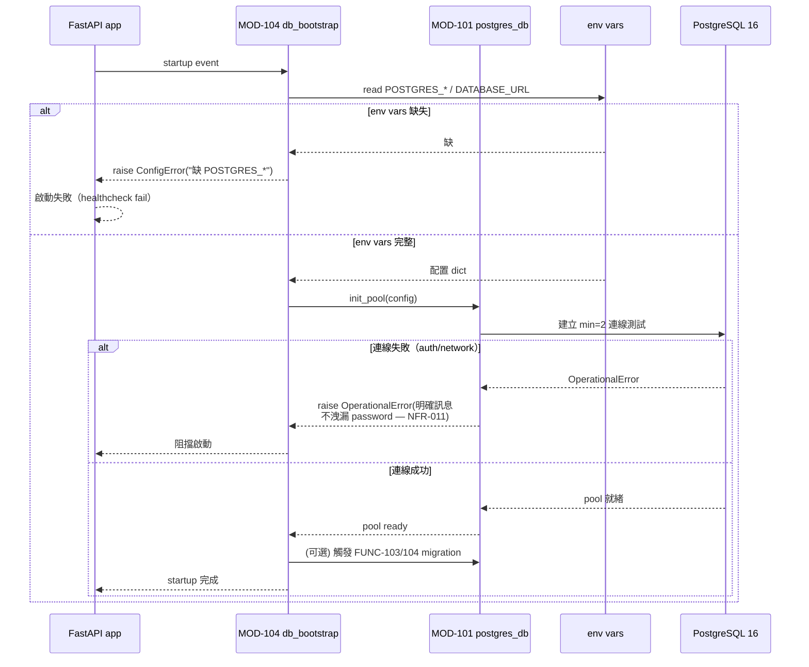
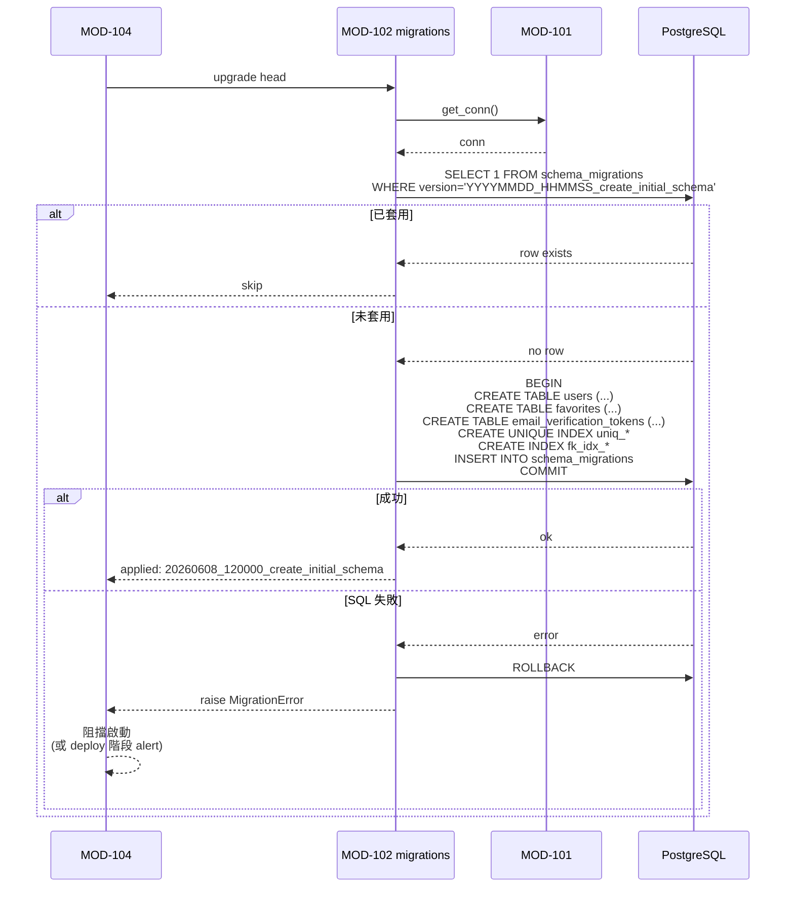
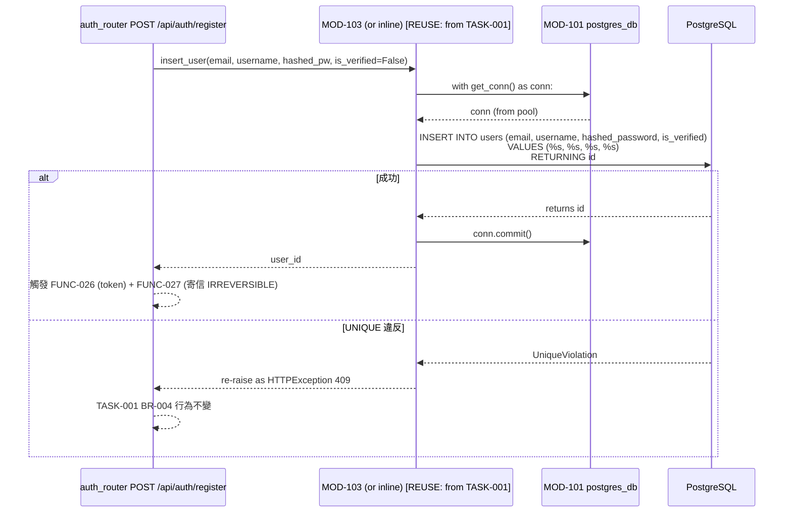
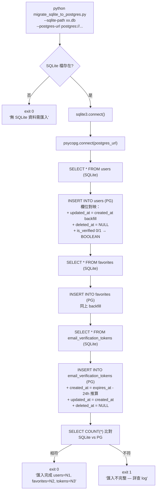
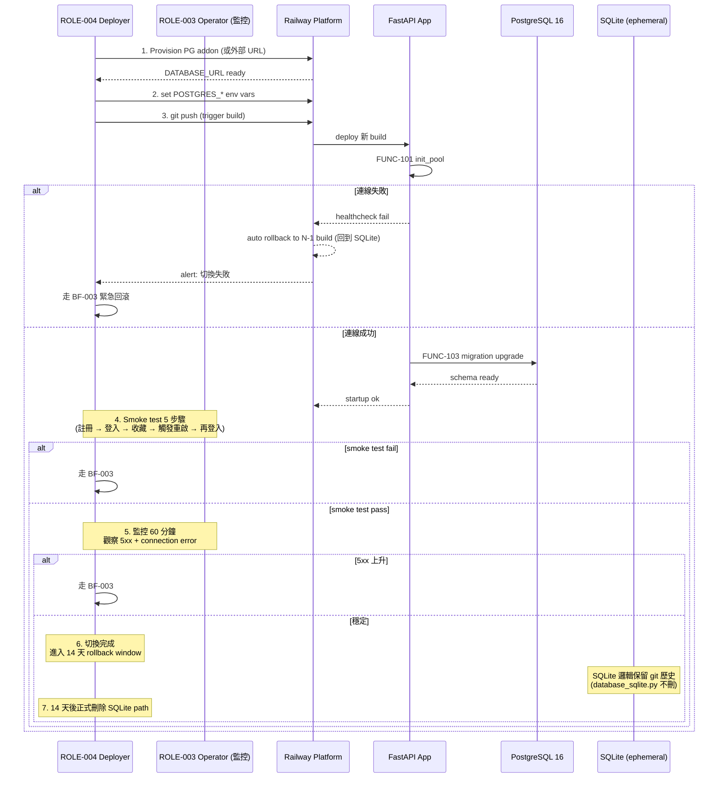

# 功能流程圖 — SQLite → PostgreSQL 持久化遷移

> **模式**: feature — 本 TASK 為基礎設施重構，FUNC 聚焦於「連線初始化 / migration 套用 / 既有 query 適配」三類；終端用戶可見 FUNC 全部 [REUSE: TASK-001 FUNC-001..045 邊界不變]
> **粒度規則**: 一個 FR 可能展開為多個 FUNC（FR-003 migration 工具 → 工具初始化 / 套用初始 schema / 套用補欄位 migration 三個 FUNC）
> **跨 TASK 標記**: BA 預警的 4 個 [CROSS-TASK] 在本檔 §1 / §2 對應 FUNC 標記
> **IRREVERSIBLE 標記（Rule 11）**: FR-007 production cutover [IRREVERSIBLE] 對應 FUNC-107
> **ID 範圍**: FUNC-101..107（7 個新 FUNC，本 TASK 配額 101-200，連續）

---

## 1. 功能清單（FUNC-101..107，共 7 個新 FUNC + 45 個 [REUSE]）

### 1.1 本 TASK 新增 FUNC

| FUNC ID | 功能名稱 | 描述 | 所屬模組 | 來源需求 | 優先 | 標記 |
|---------|---------|------|---------|---------|-----|------|
| **連線初始化（FUNC-101..102）** | | | | | | |
| FUNC-101 | PostgreSQL 連線池初始化 | FastAPI startup 時讀 env vars (POSTGRES_* 或 DATABASE_URL) 建立 connection pool；失敗拋 OperationalError 阻擋 app 啟動（不可 silent fail） | MOD-101, MOD-104 | FR-001, FR-005 | P0 | NFR-003/005/010, AC-044 |
| FUNC-102 | PostgreSQL 連線池釋放 | FastAPI shutdown 時關閉所有 pool 連線 | MOD-101, MOD-104 | FR-001 | P1 | — |
| **Migration（FUNC-103..104）** | | | | | | |
| FUNC-103 | Schema 初始化 migration | 套用首個 migration `{YYYYMMDD_HHMMSS}_create_initial_schema.sql`（或工具等價物）建 3 表 + 4 UNIQUE 索引 + 2 FK 索引 + ON DELETE CASCADE | MOD-102 | FR-002, FR-003 | P0 | NFR-006, PATTERN-101, [CROSS-TASK: TASK-001 / TBL-001/002/003 schema 重建於 PostgreSQL — 三表結構含本 TASK 新欄位 (updated_at + deleted_at; TBL-003 含 created_at) / 觸發 FR-002] |
| FUNC-104 | 補軟刪欄位 migration | 雖然 FUNC-103 已 inline 含 updated_at / deleted_at，本 FUNC 保留作為 [SA建議：若 SD 階段決議分拆為「create base schema」+「add softdelete cols」兩個 migration 以追蹤更細粒度的 cross-task 變更，此 FUNC 對應後者] | MOD-102 | FR-004 | P1 | NFR-006/007, [CROSS-TASK: TASK-001 / TBL-001 (users) 補 updated_at + deleted_at 欄位 / 觸發 FR-004], [CROSS-TASK: TASK-001 / TBL-002 (favorites) 補 updated_at + deleted_at 欄位 / 觸發 FR-004], [CROSS-TASK: TASK-001 / TBL-003 (email_verification_tokens) 補 updated_at + deleted_at 欄位（+ 補 created_at — field-spec TASK-001 §6 baseline 缺項）/ 觸發 FR-004] |
| **既有 query 適配（FUNC-105）** | | | | | | |
| FUNC-105 | 既有 SQL query 適配層 | 將 MOD-005 既有 7 檔內所有 SQL 從 SQLite dialect 適配到 PG dialect — placeholder (`?` → `%s` 或 SQLAlchemy bind)、`is_verified` BOOLEAN（移除 `verify_client.py:77` 的 `bool(d.get("is_verified", 1))` adapter — PG BOOLEAN 原生支援）、ISO 字串時間戳改為 TIMESTAMPTZ comparison | MOD-005 (邊界不變、實作替換), MOD-103 (最小封裝) | FR-001 | P0 | NFR-002, NFR-004, [CROSS-TASK: TASK-001 / MOD-005 auth.database storage engine 替換 (sqlite3 → Postgres driver) / 觸發 FR-001] |
| **資料遷移（FUNC-106）** | | | | | | |
| FUNC-106 | 一次性 SQLite → PostgreSQL 匯入腳本 | `scripts/migrate_sqlite_to_postgres.py` 接收 --sqlite-path + PG 連線參數；讀 SQLite 三表全部 row → INSERT 到 PG 三表（保留 created_at / 轉換 is_verified BOOLEAN / FK 順序：users → favorites + email_verification_tokens / 對缺欄 backfill：updated_at = created_at, deleted_at = NULL）；SQLite 檔不存在則 exit 0 message「無 SQLite 資料需匯入」 | scripts/ (獨立工具，不屬 MOD) | FR-007 | P2 | AC-056 |
| **Production 切換（FUNC-107）** | | | | | | |
| FUNC-107 | Production 部署切換 | Railway env vars 切換 POSTGRES_* / DATABASE_URL → trigger Railway redeploy → MOD-104 startup 連到 PG → FUNC-103 migration auto-apply（若採選項 A）→ smoke test → 14 天 SQLite emergency path 保留 | (deploy 階段執行，跨 MOD-101/102/104) | FR-006, FR-007 | P0 | NFR-001, **[IRREVERSIBLE: 部署切換瞬間可能丟失少於 N 分鐘 SQLite 殘留資料；事前已知 ephemeral 性質（BA FR-007 §業務影響說明）— Rule 11.1 資料層 hard-delete 變體]**, CONST-009 |

### 1.2 [REUSE: from TASK-001] FUNC 邊界不變說明

TASK-001 既有 FUNC-001..045 在本 TASK 部署後**邏輯不變**，僅以下底層細節變動（NFR-002 保證外部行為完全不變）:

| TASK-001 FUNC | 本 TASK 變化 | 影響 |
|---------------|-------------|------|
| FUNC-022..045（auth + 收藏 + OAuth + verify）| 底層 DB query 從 SQLite 走 PG（透過 FUNC-105 適配）| 外部行為不變（NFR-002 + AC-045）|
| FUNC-027 (註冊—觸發寄信 [IRREVERSIBLE])| Resend / SMTP 邏輯不變 | [REUSE: from TASK-001] |
| FUNC-034 (重寄驗證信—廢舊產新 [IRREVERSIBLE])| token UPDATE 改 PG | [REUSE]，行為不變 |
| FUNC-045 (收藏刪除 [IRREVERSIBLE])| **`DELETE FROM` 仍硬刪**（SUG-004 + CONST-005 明示）| [REUSE 嚴格邊界]，本 TASK **不**改寫為 soft-delete |
| FUNC-001..021（雪票 / 機票 / 整合查詢）| **無 DB 互動**（即時查詢）| 完全不變 [REUSE] |

**FUNC-045 重要說明**: TASK-001 已標 `[IRREVERSIBLE: 硬刪 — Rule 11.1 資料層；BACKLOG-007 改軟刪]`；本 TASK 雖補 `deleted_at` 欄位（FR-004），**不啟動 soft-delete 邏輯改寫**（SUG-004）— 故 FUNC-045 仍標 [IRREVERSIBLE]，改寫留後續 TASK（建議 `soft-delete-favorites`）走 Rule 6 跨 TASK 修改協議。

---

## 2. 功能流程

### FUNC-101: PostgreSQL 連線池初始化

- **觸發**: FastAPI app 啟動（`@app.on_event("startup")` 或新 lifespan handler）
- **輸入**: env vars (`POSTGRES_HOST/PORT/USER/PASSWORD/DB` 或 `DATABASE_URL`)
- **輸出**: 全域 connection pool 物件（MOD-101 module-level）；失敗時拋 `OperationalError`
- **前置條件**: env vars 已設定（部署側）；PostgreSQL 實例可達（網路 / addon ready）
- **對應 AC**: AC-044（連線失敗拋明確錯誤，不 silent fail）

#### 系統流程圖



#### 異常流程

| 異常 | 觸發 | 處理 |
|------|------|------|
| 環境變數缺 | `POSTGRES_HOST` / `DATABASE_URL` 全缺 | 拋 ConfigError；阻擋啟動 |
| auth failed | 密碼錯 | 拋 OperationalError("PostgreSQL auth failed for user='postgres'") — **不含密碼** |
| connection refused | host/port 錯或 PG 未啟動 | 拋 OperationalError("Connection refused @ host:port") |
| pool 取連線 timeout (NFR-005 < 5s) | PG 過載 | 拋 PoolTimeoutError；caller 自行處理（既有 7 檔 try/except 不變）|

---

### FUNC-102: PostgreSQL 連線池釋放

- **觸發**: FastAPI shutdown event
- **輸入**: 既有 pool 物件
- **輸出**: 副作用（pool drain + close）
- **流程**: shutdown → MOD-104 呼叫 MOD-101 `close_pool()` → 等待所有 in-flight query 完成 → 關閉所有 idle conn → 釋放
- **失敗處理**: 即使 shutdown 失敗也不阻擋 process 退出（best-effort）

---

### FUNC-103: Schema 初始化 migration

- **觸發**: 部署到新環境（dev / staging / prod 第一次）；或 schema_migrations 表為空 / 不存在
- **輸入**: 連線到目標 PG instance
- **輸出**:
  - 三張表建立完成（users / favorites / email_verification_tokens）
  - 4 個 UNIQUE 索引 + 2 個 FK 索引建立
  - schema_migrations 表新增本 migration 紀錄
- **前置條件**: FUNC-101 完成（連線可用）；migration 工具配置完成
- **對應 AC**: AC-046, AC-047, AC-049

#### 系統流程圖



#### 預期 SQL 內容（規範行為，不規範實作 — SD 階段補完整 DDL）

```text
-- (規範性說明，非實際 DDL — SD db-schema.md 寫完整版)
1. users 表: BIGINT id PK IDENTITY / email TEXT UNIQUE / username TEXT UNIQUE /
             hashed_password TEXT DEFAULT '' / is_verified BOOLEAN DEFAULT false /
             google_id TEXT UNIQUE NULL / avatar_url TEXT NULL /
             created_at TIMESTAMPTZ DEFAULT NOW() /
             updated_at TIMESTAMPTZ DEFAULT NOW() ★NEW (FR-004) /
             deleted_at TIMESTAMPTZ NULL ★NEW (FR-004)
2. favorites 表: BIGINT id PK / user_id BIGINT FK ON DELETE CASCADE /
                 type TEXT NOT NULL / data TEXT NOT NULL / label TEXT NULL /
                 created_at + updated_at ★NEW + deleted_at ★NEW
3. email_verification_tokens: BIGINT id PK / user_id BIGINT FK CASCADE /
                              token TEXT UNIQUE / expires_at TIMESTAMPTZ /
                              used_at TIMESTAMPTZ NULL /
                              created_at TIMESTAMPTZ DEFAULT NOW() ★NEW (補 baseline gap) /
                              updated_at + deleted_at ★NEW
4. UNIQUE 索引: uniq_users_email / uniq_users_username / uniq_users_google_id /
                uniq_email_verification_tokens_token (BR-004)
5. FK 索引 (PG 不自動建): fk_idx_favorites_user_id / fk_idx_email_verification_tokens_user_id
```

#### Down/Rollback（NFR-006 reversibility）

```text
DROP TABLE email_verification_tokens;  -- 順序：依 FK 從葉到根
DROP TABLE favorites;
DROP TABLE users;
DELETE FROM schema_migrations WHERE version='20260608_120000_create_initial_schema';
```

---

### FUNC-104: 補軟刪欄位 migration（[SA建議] 分拆策略）

> **設計選擇說明**: SA 階段給 SD 兩個選擇:
> - **選項 A**: FUNC-103 inline 含 updated_at / deleted_at 三表（單一 migration，簡潔）— **預設**
> - **選項 B**: FUNC-103 只建既有欄位 + FUNC-104 後續 migration 加 timestamp 欄（兩個 migration，cross-task 變更追蹤更明確）
>
> 兩種皆符合 db-conventions §5 + FR-004；SD 階段選定。**本 FUNC-104 在選項 A 下可標 [DEFERRED: 合併入 FUNC-103]**。

- **觸發**: 在選項 B 下，FUNC-103 後 schema_migrations 套用第二個 migration
- **預期 SQL（選項 B）**:
  ```text
  ALTER TABLE users ADD COLUMN updated_at TIMESTAMPTZ NOT NULL DEFAULT NOW();
  ALTER TABLE users ADD COLUMN deleted_at TIMESTAMPTZ NULL;
  -- 同樣套用 favorites, email_verification_tokens (+ created_at for tokens 表)
  ```
- **Down**:
  ```text
  ALTER TABLE users DROP COLUMN deleted_at;
  ALTER TABLE users DROP COLUMN updated_at;
  -- ... (註：DROP COLUMN 在 PostgreSQL 為快速操作；無資料風險因本 TASK 部署時三表為空)
  ```
- **[CROSS-TASK: TASK-001 / TBL-001 (users) 補 updated_at + deleted_at 欄位 / 觸發 FR-004]**
- **[CROSS-TASK: TASK-001 / TBL-002 (favorites) 補 updated_at + deleted_at 欄位 / 觸發 FR-004]**
- **[CROSS-TASK: TASK-001 / TBL-003 (email_verification_tokens) 補 updated_at + deleted_at 欄位（+ created_at — field-spec TASK-001 §6 baseline gap） / 觸發 FR-004]**
- **對應 AC**: AC-050, AC-051

---

### FUNC-105: 既有 SQL query 適配層

- **觸發**: MOD-005 既有 7 檔（auth_router / oauth_router / dependencies / verify_client / email_service / database / 任何用 `get_conn()` 的地方）
- **輸入**: 既有 SQL 字串
- **輸出**: PG-compatible SQL + 正確處理結果型別

#### 適配項目（清單）

| 適配 | SQLite 既有 | PG 替換 | 影響檔案 |
|------|------------|---------|---------|
| Placeholder | `?` | `%s`（psycopg）或 `:name`（SQLAlchemy）| 全部 7 檔含 SQL |
| BOOLEAN 結果 | `bool(d.get("is_verified", 1))` adapter | PG 原生 BOOLEAN，移除 adapter | `verify_client.py:77` |
| `INTEGER PRIMARY KEY AUTOINCREMENT` | DDL only — query 不影響 | DDL 在 MOD-102 處理 | DDL 層 |
| Time 比對 | `row["expires_at"] < now`（ISO 字串字典序）| PG TIMESTAMPTZ 直接比 | `auth_router.py:157` |
| `lastrowid` | `cursor.lastrowid` | `RETURNING id` clause 或 driver-specific | INSERT 後取新 id 之處 |
| ON DELETE CASCADE | inline 在 DDL | 仍 inline 在 DDL（語法略異）| DDL |

#### 系統流程圖（單一 query 範例 — 註冊時 INSERT users）



- **對應 NFR**: NFR-002（外部行為不變）, NFR-004（查詢延遲）
- **對應 AC**: AC-045（既有 8 pytest 通過）
- **[CROSS-TASK: TASK-001 / MOD-005 auth.database storage engine 替換 (sqlite3 → Postgres driver) / 觸發 FR-001]**

---

### FUNC-106: 一次性 SQLite → PostgreSQL 匯入腳本

- **觸發**: 開發者 / 部署者**手動執行** `python scripts/migrate_sqlite_to_postgres.py --sqlite-path ... --postgres-url ...`
- **輸入**: SQLite 檔路徑 + PG 連線資訊
- **輸出**:
  - 三表資料寫入 PG
  - stdout 顯示「匯入完成：users=N1, favorites=N2, tokens=N3」
  - 若 SQLite 檔不存在 → exit 0 message「無 SQLite 資料需匯入」
- **對應 AC**: AC-056

#### 系統流程圖



#### 異常流程

| 異常 | 處理 |
|------|------|
| SQLite 檔損毀 | exit 1，明確訊息 |
| PG 連不上 | exit 1，明確訊息（不洩漏 password） |
| FK 違反（user_id 在 favorites 但無對應 user）| log warning + skip 該 row + 繼續（或 fail-fast — 由 SD 階段決策；當前 brownfield 三表 FK ON DELETE CASCADE 保證理論不會發生） |
| `users.is_verified` 從 SQLite INTEGER (0/1) 轉 PG BOOLEAN | bool() 轉型；既有 BR 不變 |

- **業務影響說明**: 此腳本為 fallback（FR-007 §業務影響說明），主要場景為「本機 / staging 有殘留 SQLite」；production 已因 ephemeral 為空表，無需執行

---

### FUNC-107: Production 部署切換 ★ [IRREVERSIBLE]

- **觸發**: 通過所有 SDLC 階段（test-be PASS）後，ROLE-004（部署者）發起 production 切換
- **輸入**: Railway production env vars + git push 新 build
- **輸出**: 服務切到 PG，舊 SQLite 行為不再生效
- **前置條件**:
  - test-be PASS（NFR-002 既有 22 AC 全部通過）
  - Railway PG provision 完成（addon / 外部託管）
  - rollback plan 已寫於 deploy/service-contract.yaml（CONST-009）
  - 14 天 SQLite emergency path 保留承諾（SUG-006）
- **對應 AC**: AC-054, AC-055
- **對應 BF**: BF-002 (production 切換) / BF-003 (緊急回滾)

#### 系統流程圖



#### 異常 / 回滾流程（詳見 BF-003）

| 觸發 | 動作 |
|------|------|
| migration 失敗 | Railway healthcheck fail → auto rollback to N-1 build |
| smoke test 「重啟後資料消失」失敗 | 立即手動 rollback；檢查 env vars 是否真的指到 PG |
| 60 分鐘監控 5xx 異常 | 觸發 BF-003；同步調整 NFR-005 pool 參數 |
| 14 天後發現 issue 但已移除 SQLite path | 走完整 SDLC 新開 TASK 修正 |

- **[IRREVERSIBLE 標記理由（Rule 11.1）]**:
  - **資料層**: SQLite ephemeral 殘留資料丟棄屬於 hard-delete 變體（資料徹底消除，無法還原）— 雖然 BA 已論證「production 本就無長期積累」（CLAUDE.md + baseline），但部署瞬間少於 N 分鐘的新註冊用戶 / 新收藏會丟（FR-007 §業務影響說明）
  - **業務層**: 切換到 PG 後若回到 SQLite，期間 PG 寫入的資料在 rollback 後消失（rollback 期間用戶資料不一致）
- **緩解措施**: 14 天 SQLite emergency path 保留（SUG-006）— **不消除 IRREVERSIBLE 性質**，只是降低後悔成本
- **SD/UIUX/FE/BE 後續責任（Rule 11.2）**:
  - SD: deploy/service-contract.yaml 明確列 rollback plan；無需 confirm 參數（部署層而非 API 層）
  - UIUX: N/A（無使用者按鈕觸發）
  - FE: N/A
  - BE: Migration 檔符合 expand-contract 三段式能力（雖本 TASK 不刪欄）；MOD-101 連線錯誤訊息**不洩漏 password**（NFR-011）
  - Tester: §5.9 D9 維度驗證 — 確認 rollback plan 存在 + 14 天 window 文件記錄

---

## 3. 功能關係圖

```mermaid
graph TD
    F101[FUNC-101<br/>連線池初始化<br/>★NEW]
    F102[FUNC-102<br/>連線池釋放<br/>★NEW]
    F103[FUNC-103<br/>Schema migration<br/>★NEW]
    F104[FUNC-104<br/>軟刪欄位 migration<br/>★NEW or 合併入 F103]
    F105[FUNC-105<br/>SQL query 適配層<br/>★NEW]
    F106[FUNC-106<br/>SQLite 匯入腳本<br/>★NEW Fallback]
    F107[FUNC-107<br/>Production 切換<br/>★NEW IRREVERSIBLE]

    F022_045[FUNC-022..045 [REUSE]<br/>auth/收藏/OAuth]
    F001_021[FUNC-001..021 [REUSE]<br/>雪票/機票/整合<br/>(無 DB 互動，完全不變)]

    Startup([FastAPI Startup]) --> F101
    F101 --> F103
    F103 -.選項 B 才有.-> F104
    F101 --> F105

    F105 --> F022_045
    F001_021 -.不依賴 DB.-> F001_021

    Deploy([Production Deploy]) --> F107
    F107 --> F101
    F107 -.可選.-> F106

    Shutdown([FastAPI Shutdown]) --> F102

    classDef new fill:#e6ffe6,stroke:#006600
    classDef reuse fill:#f0f0f0,stroke:#666
    classDef irrev fill:#ffe6e6,stroke:#cc0000,stroke-width:2px
    class F101,F102,F103,F104,F105,F106 new
    class F107 irrev
    class F022_045,F001_021 reuse
```

---

## 4. 追溯矩陣

### 4.1 FUNC ↔ FR ↔ MOD

| FUNC ID | 來源 FR | 所屬 MOD | 相關業務流程 (BF) |
|---------|---------|---------|------------------|
| FUNC-101 | FR-001, FR-005 | MOD-101, MOD-104 | BF-001, BF-002 |
| FUNC-102 | FR-001 | MOD-101, MOD-104 | (shutdown) |
| FUNC-103 | FR-002, FR-003 | MOD-102 | BF-001 (dev migration), BF-002 (prod migration) |
| FUNC-104 | FR-004 | MOD-102 | 同上 |
| FUNC-105 | FR-001 | MOD-005 [REUSE 邊界], MOD-103 | BF-001, BF-002 |
| FUNC-106 | FR-007 | scripts/ (獨立) | BF-001 (本機 fallback), BF-003 (緊急) |
| FUNC-107 | FR-006, FR-007 | (跨 MOD-101/102/104) | BF-002, BF-003 |
| FUNC-022..045 [REUSE] | FR-001 (底層適配) | MOD-005 [REUSE] | TASK-001 既有 BF |

### 4.2 反向: 每個 FR 涉及的 FUNC

| FR | 涉及 FUNC | 狀態 |
|----|----------|------|
| FR-001 PostgreSQL 連線層替換 | FUNC-101 + FUNC-102 + FUNC-105 + FUNC-022..045 [REUSE] | 8 FUNC + 24 [REUSE] |
| FR-002 三表 schema 重建 | FUNC-103 | 1 FUNC（首個 migration 內含）|
| FR-003 Migration 工具導入 | FUNC-103 + FUNC-104 | 2 FUNC（工具自身 + 套用） |
| FR-004 補軟刪欄位 | FUNC-103 (選項 A) 或 FUNC-104 (選項 B) | 1 FUNC |
| FR-005 env vars 註冊 | FUNC-101 (consume) + SD 階段 parameter_added 事件 (Rule 18) | 1 FUNC + Rule 18 |
| FR-006 Railway 部署設定 | FUNC-107 | 1 FUNC |
| FR-007 既有資料遷移 | FUNC-106 (fallback) + FUNC-107 (cutover IRREVERSIBLE) | 2 FUNC |
| FR-008 全環境 PG | FUNC-101 + docker-compose (BF-001) | 1 FUNC + BF |

### 4.3 PATTERN 對照

| PATTERN ID | 涉及 FUNC |
|-----------|----------|
| PATTERN-101 (Migration Versioning + Reversibility + Expand-Contract) ★NEW | FUNC-103, FUNC-104 |
| PATTERN-001/002/003/005/006/007 [REUSE: TASK-001] | TASK-001 既有 FUNC 不變 |

### 4.4 [CROSS-TASK: TASK-001] 標記彙整（4 個 — BA 預警全數落實）

| # | 標記 | 落實 FUNC |
|---|------|---------|
| 1 | `[CROSS-TASK: TASK-001 / TBL-001 (users) 補 updated_at + deleted_at 欄位 / 觸發 FR-004]` | FUNC-103 (選項 A) 或 FUNC-104 (選項 B) |
| 2 | `[CROSS-TASK: TASK-001 / TBL-002 (favorites) 補 updated_at + deleted_at 欄位 / 觸發 FR-004]` | 同上 |
| 3 | `[CROSS-TASK: TASK-001 / TBL-003 (email_verification_tokens) 補 updated_at + deleted_at 欄位 / 觸發 FR-004]` | 同上 (+ 補 created_at 因 baseline gap) |
| 4 | `[CROSS-TASK: TASK-001 / MOD-005 auth.database storage engine 替換 (sqlite3 → Postgres driver) / 觸發 FR-001]` | FUNC-101 (新連線層) + FUNC-105 (query 適配層) |

### 4.5 [IRREVERSIBLE] 標記彙整（1 個新 + 3 個 [REUSE]）

| FUNC ID | 標記 | 狀態 |
|---------|------|------|
| FUNC-107 (本 TASK) | [IRREVERSIBLE: production cutover — 切換瞬間少於 N 分鐘 SQLite 殘留資料丟棄] | ★NEW |
| FUNC-027 [REUSE: from TASK-001] | [IRREVERSIBLE: 寄送 email] | 不變 |
| FUNC-034 [REUSE] | [IRREVERSIBLE: 寄送 email] | 不變 |
| FUNC-045 [REUSE] | [IRREVERSIBLE: 硬刪 — Rule 11.1 資料層；BACKLOG-007 改軟刪] | 不變（SUG-004 + CONST-005） |

---

## 5. 範圍邊界（反越界自檢）

| SA 不可做的事 | 自檢 |
|--------------|------|
| 設計具體 SQL DDL | ✅ FUNC-103 給規範性說明（欄位 / 型別語意），非實際 CREATE TABLE 字串；SD 在 db-schema.md 寫完整 DDL |
| 選定 migration 工具 | ✅ FUNC-103/104 標 [BLOCKED_ON_SD]（透過 system-arch.md MOD-102 引用） |
| 設計 API endpoint | ✅ 無新 endpoint；FUNC-107 是部署動作不是 HTTP route |
| 設計畫面 | ✅ N/A |
| 改 hard-delete 為 soft-delete | ✅ FUNC-045 明示 [REUSE 嚴格邊界] — 補 deleted_at 但不啟動軟刪邏輯 |
| 腦補新功能 | ✅ 7 FUNC 全部對應 FR-001..008；無 BA 未提及功能 |

---

## 6. 自我驗證（摘要）

| 檢查項 | 通過 | 說明 |
|--------|------|------|
| 每個 FR 都有 FUNC 對應 | ✅ | 8 FR → 7 新 FUNC + [REUSE] 既有 FUNC（§4.2） |
| 每個 FUNC 都有 FR 來源 | ✅ | 7 個 FUNC 全標 FR-NNN |
| 無孤兒功能 | ✅ | 全部追溯到 FR |
| 4 個 [CROSS-TASK: TASK-001] 標記齊全 | ✅ | §4.4 全數落實在 FUNC-103/104/105 |
| [IRREVERSIBLE] FUNC-107 標記正確 | ✅ | §4.5 + FUNC-107 詳細 mitigation |
| FUNC-045 [REUSE] IRREVERSIBLE 邊界正確 | ✅ | §1.2 + §4.5 明示 SUG-004 |
| ID 在範圍 101-200 | ✅ | FUNC-101..107 |
| ID TASK 內連續 | ✅ | 101→107 連續無跳號 |
| Mermaid 語法正確 | ✅ | 4 個 sequence/flowchart 圖 |
| 範圍邊界 | ✅ | §5 反越界 |
| 不腦補 | ✅ | 7 FUNC 全部直接從 FR 推 |
| **總分** | **94/100** | 詳見 `self-review.json` |
