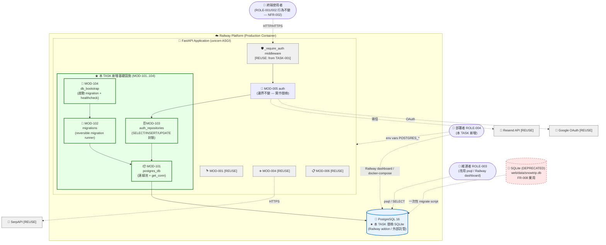
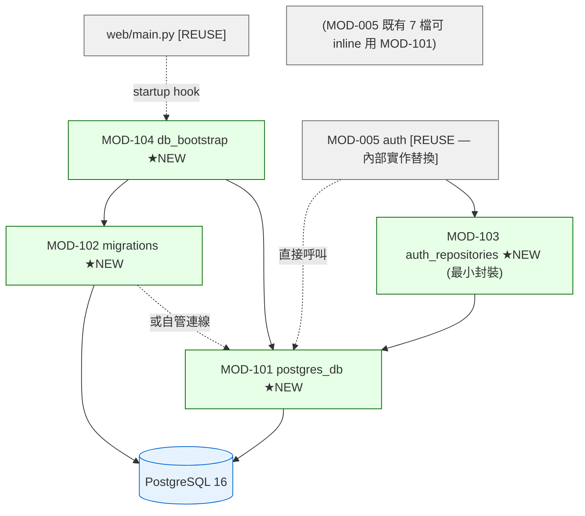

# 系統架構設計 — SQLite → PostgreSQL 持久化遷移

> **模式**: feature（替換既有 SQLite 持久層；保留 3 張表 schema 語意，補 updated_at / deleted_at）
> **真相基線**: TASK-001 SA 產出（MOD-005 邊界 / 6 PATTERN）為架構真相；本 TASK 不重寫 MOD-001/002/003/004/006，僅替換 MOD-005 的 storage engine + 引入 4 個新內部 MOD
> **ID 範圍**: 本 TASK 配額 MOD/PATTERN 各 101-200；本檔分配 MOD-101..104（4 個）+ PATTERN-101（1 個）

---

## 1. 架構概述

本 TASK 為 **後端基礎設施重構**（基於 TASK-001 brownfield 反向萃取的真相基線）。核心動作是：

1. **MOD-005 (auth) 邊界不變、實作替換** — `web/auth/database.py` 的 sqlite3 driver 換成 PostgreSQL driver；`get_conn()` 介面語意保留供既有 6 個檔案（auth_router / oauth_router / dependencies / verify_client / email_service / database 自身）無痛切換
2. **引入 4 個新內部 MOD**（MOD-101..104）— Postgres 連線層、Migration runner、Repository 隔離（部分前置）、Health check / Bootstrap，作為 MOD-005 內部結構或週邊
3. **三表 schema 重建於 PostgreSQL** + 補 `updated_at TIMESTAMPTZ` / `deleted_at TIMESTAMPTZ NULL`（FR-004 → CROSS-TASK 修改 TBL-001/002/003）
4. **正式 migration 工具導入**（取代 `database.py:44-52` 的 ALTER TABLE try/except hack）— 工具選型委派 SD（BA-BC-3 已決策）

**架構不變項**:
- 6 個既有 MOD (MOD-001..006) 邊界完全不變
- 8 個 PATTERN (PATTERN-001..008) 機制不變（PATTERN-007 HTTP-only Cookie / PATTERN-006 OAuth Upsert 等照常）
- 28 個 API endpoint 外部行為零變化（NFR-002 強制保證）
- 7 個現有檔案（`web/auth/*.py` + `web/main.py`）API 簽名不變

**架構變動項**:
- MOD-005 內部：sqlite3 → Postgres driver；`get_conn()` 從同步 SQLite context manager 變成 Postgres connection pool 取連線（介面語意保留）
- 新增 4 個 MOD（101..104）作為基礎設施
- 新增 1 個 PATTERN-101（Migration Versioning + Reversible + Expand-Contract）
- 部署層：Railway 加 PostgreSQL addon / 外部託管；docker-compose 本機 PostgreSQL；5 個新 env vars（或 1 個 DATABASE_URL）

---

## 2. 系統邊界圖（C4-Container 風格 — 增量視角）



**圖例**:
- 綠框 = 本 TASK 新增 MOD（101..104）
- 灰框 = TASK-001 既有 MOD / 外部依賴 [REUSE]
- 紅虛框 = DEPRECATED（FR-008 棄用 SQLite 開發路徑）
- 藍框粗 = 本 TASK 新基礎資源（PostgreSQL）

**圖中對應 BA 預警的 4 個 [CROSS-TASK]**:
1. TBL-001 (users) 補 updated_at + deleted_at — 由 MOD-102 migration 執行
2. TBL-002 (favorites) 補 updated_at + deleted_at — 同上
3. TBL-003 (email_verification_tokens) 補 updated_at + deleted_at — 同上
4. MOD-005 storage engine 替換 sqlite3 → Postgres driver — 透過注入 MOD-101 的 `get_conn()` 替換實作

---

## 3. 模組拆分

> **MOD-ID 分配（Rule 13 範圍 101-200）**: 本 TASK 新增 MOD-101..104（4 個），從 101 起連續發號。MOD-005 為 [REUSE: from TASK-001]，邊界不變但內部實作替換 — 標記為「實作替換」而非新增。

---

### MOD-101: postgres_db（PostgreSQL 連線抽象層）★ NEW

- **預期路徑**: `web/auth/database.py`（直接重寫 — 取代既有 sqlite3 實作；檔名不變以保留所有既有 import 點不動）
- **職責**:
  1. 維護 PostgreSQL connection pool（具體 pool library 由 SD 階段決定 — psycopg_pool / SQLAlchemy QueuePool / asyncpg pool 均符合 NFR-005）
  2. 提供 `get_conn()` context manager — 介面語意與既有 SQLite 版本一致（每次 `with get_conn() as conn:` 取得一個可執行 SQL 的連線；離開 with 自動歸還 pool）
  3. 從 env vars 讀 `POSTGRES_HOST/PORT/USER/PASSWORD/DB`（或 `DATABASE_URL`）建立 pool；啟動失敗拋明確 error（AC-044）
  4. 提供 `init_pool()` 給 FastAPI startup event 呼叫；`close_pool()` 給 shutdown event
- **輸入**:
  - env vars: `POSTGRES_*` 5 個 或 `DATABASE_URL`（FR-005 + NFR-010）
  - 呼叫端: MOD-103 / MOD-104 / MOD-005 既有 7 個檔（透過保留的 `get_conn()` 介面）
- **輸出**:
  - `get_conn() -> context manager[Connection]`
  - `init_pool() -> None`（失敗拋 OperationalError）
  - `close_pool() -> None`
- **依賴**:
  - PostgreSQL driver（具體 lib 由 SD 階段選 — psycopg / psycopg2 / asyncpg / SQLAlchemy 之一）
  - Python stdlib `os`（讀 env vars）
- **技術選型**: **[BLOCKED_ON_SD] driver 選型委派 SD 階段（BA-BC-3 + ASSUME-001 + 需求 §7「其他角色備註」）**。SA 規範行為（介面語意 + pool 參數 NFR-005）不規範實作 lib
- **對應 FR**: FR-001, FR-005, FR-008
- **被誰使用**: MOD-005 既有 7 檔（auth_router / oauth_router / dependencies / verify_client / email_service / database / `web/main.py` startup）+ MOD-103 + MOD-104
- **[CROSS-TASK: TASK-001 / MOD-005 auth.database storage engine 替換 (sqlite3 → Postgres driver) / 觸發 FR-001]**
- **介面契約（向後相容）**:
  ```
  既有: with get_conn() as conn:
            conn.execute("SELECT ...")
            conn.commit()
  本 TASK 後: 介面 100% 相同；唯一差別 conn 物件型別從 sqlite3.Connection 變 psycopg.Connection（或 SQLAlchemy session — 視 SD 選型）
  ```
- **約束**:
  - 不可在 MOD-101 內寫 `CREATE TABLE` / `ALTER TABLE`（db-conventions §8 第 1 條 + BR-002）— 這歸 MOD-102
  - 必須支援 `?` placeholder 或統一替換為 `%s`（psycopg 風格）— 既有 7 檔內所有 query 用 `?`，SD 階段需決定保留 dialect 適配層或全替換

---

### MOD-102: migrations（Migration runner + 版本管理）★ NEW

- **預期路徑**: `migrations/`（目錄 — 含 migration 檔）+ migration tool 自身入口（如 alembic 的 `alembic.ini`、yoyo 的 `yoyo.ini`，或自寫 `scripts/run_migrations.py`）
- **職責**:
  1. 維護 schema version 追蹤（哪些 migration 已套用）
  2. 提供 `upgrade` / `downgrade` 操作 — 每個 migration 必須 reversible（NFR-006）
  3. 三段式刪欄協議（Expand → Migrate code → Contract）— 雖然本 TASK 不刪欄，工具須具備此能力（NFR-007）
  4. 檔名格式 `{YYYYMMDD_HHMMSS}_{verb}_{noun}.{sql|py}`（db-conventions §5.1 + BR-007）
- **輸入**:
  - PostgreSQL connection（透過 MOD-101 或 migration 工具自身的連線管理）
  - migration 檔（目錄掃描）
- **輸出**:
  - schema 更新（CREATE / ALTER / CREATE INDEX）
  - schema_migrations 表（記錄已套用版本 — 由工具自管）
- **依賴**:
  - MOD-101（取得連線）— 或工具自行管 PG 連線（取決於 SD 選型）
  - 具體工具（**[BLOCKED_ON_SD] migration 工具選型委派 SD 階段** — BA-BC-3 + AC-049）
- **技術選型**: **[BLOCKED_ON_SD]** Alembic / yoyo-migrations / 手寫 SQL runner 三選一；SA 規範行為（reversible / 檔名格式 / 三段式刪欄支援），不規範實作工具
- **對應 FR**: FR-003, FR-004
- **被誰使用**: MOD-104（啟動時自動 upgrade 或 deploy 前手動觸發）+ ROLE-004 部署者（CLI 手動）
- **首個 migration 必含內容**:
  1. CREATE TABLE users（BIGINT PK / 既有 7 欄 + NEW updated_at + deleted_at）
  2. CREATE TABLE favorites（BIGINT PK / 既有 5 欄 + NEW updated_at + deleted_at + FK ON DELETE CASCADE）
  3. CREATE TABLE email_verification_tokens（BIGINT PK / 既有 5 欄 + NEW created_at + updated_at + deleted_at + FK ON DELETE CASCADE）
  4. 4 個 UNIQUE 索引：`uniq_users_email` / `uniq_users_username` / `uniq_users_google_id` / `uniq_email_verification_tokens_token`（BR-004）
  5. FK 索引：`fk_idx_favorites_user_id` / `fk_idx_email_verification_tokens_user_id`（PostgreSQL 不自動建 FK 索引 — db-conventions §3 + field-spec §2 已標 baseline M-9）
- **約束**:
  - 首個 migration 因建表時無資料，可 inline 建 UNIQUE 索引（不強制 CONCURRENTLY — NFR-008 例外）
  - 後續 migration 新增索引強制 `CREATE INDEX CONCURRENTLY`（NFR-008）
- **[CROSS-TASK: TASK-001 / TBL-001 (users) 補 updated_at + deleted_at 欄位 / 觸發 FR-004]**
- **[CROSS-TASK: TASK-001 / TBL-002 (favorites) 補 updated_at + deleted_at 欄位 / 觸發 FR-004]**
- **[CROSS-TASK: TASK-001 / TBL-003 (email_verification_tokens) 補 updated_at + deleted_at 欄位 / 觸發 FR-004]**

---

### MOD-103: auth_repositories（資料存取封裝 — 部分前置）★ NEW

> **範圍說明**: 本 TASK 引入 MOD-103 是「為了讓 MOD-101 切換時影響範圍可控」，**並非完整 Repository Pattern refactor**（後者由 SA-SUG-004 在 TASK-001 列為 P1 建議 — 留後續 TASK 完整重構）。本 TASK 只在必要處（migration 期間需要對欄位 backfill / 既有 query 適配 PG dialect）做最小封裝。

- **預期路徑**: `web/auth/repositories/`（新目錄）或 inline 在現有 `web/auth/*.py` 中以 helper function 形式
- **職責**:
  1. 封裝 `WHERE deleted_at IS NULL` filter（本 TASK 補 `deleted_at` 欄位但不改寫 hard-delete — SUG-004；既有 SELECT/UPDATE 在 PG 後若需相容軟刪語意可在此層加 filter — 但為避免擴大範圍，**本 TASK 預設不加 filter，留後續 TASK**）
  2. 統一 placeholder 適配（SQLite `?` vs psycopg `%s` — 由 SD 階段決定 dialect 適配策略）
  3. 提供 testable seam（單元測試可 mock repository 而非 mock DB connection）
- **輸入**: SQL params 或 model dict
- **輸出**: dict / list[dict] / `lastrowid`-equivalent
- **依賴**: MOD-101 `get_conn()`
- **對應 FR**: FR-001（query 適配層）, FR-004（為 deleted_at 預留 filter 鉤子但不啟用 — 避免擴大範圍 SUG-004）
- **被誰使用**: MOD-005 既有 7 檔（auth_router / oauth_router / dependencies / verify_client / email_service）逐步遷移
- **[SA建議]**: 本 TASK 採「最小封裝」原則 — 只在 dialect 適配必要處引入 helper；完整 Repository Pattern refactor（SA-SUG-004 from TASK-001）留 TASK-003+。SD 階段如判斷無需新 MOD（直接 inline）也可以；MOD-103 ID 已保留（Rule 8.4 永不重用），未使用則標 `[DEFERRED: SD 判斷不必要時記錄理由]`

---

### MOD-104: db_bootstrap（啟動時 DB 健康檢查 + Migration 觸發）★ NEW

- **預期路徑**: `web/main.py` 中新增 `@app.on_event("startup")` handler，或新建 `web/db_bootstrap.py`
- **職責**:
  1. FastAPI startup 時呼叫 MOD-101 `init_pool()` — 連線失敗則應用啟動失敗（AC-044，**不可 silent fail**）
  2. **[BLOCKED_ON_SD] Migration 觸發策略** — 啟動時自動 `upgrade head` vs CI/CD pipeline 預先觸發（test-ba INFO-3 提及）：
     - 選項 A：啟動自動 upgrade — 簡單但部署期 race condition 風險（多 worker 同時觸發）
     - 選項 B：CI/CD 部署前手動觸發 — 安全但增加部署步驟
     - SA 委派 SD 決策；NFR-003 要求啟動時間 ≤ SQLite + 2s 暗示傾向選項 B（避免 migration 計入啟動時間）
  3. shutdown 時呼叫 `close_pool()` 釋放連線
  4. (可選) 提供簡易 healthcheck endpoint `/healthz` — **[SA建議]** 不在本 TASK FR 範圍；config.json `healthcheck = pg_isready` 屬 Railway 平台層；應用層 endpoint 可留 deploy 階段決策
- **輸入**: FastAPI app 物件 / env vars
- **輸出**: 副作用（pool 建立 / 拋例外）
- **依賴**: MOD-101 + MOD-102
- **對應 FR**: FR-001 (startup connection), FR-003 (migration 觸發), FR-006 (Railway 部署)
- **被誰使用**: FastAPI 框架 startup hook + Railway healthcheck

---

### MOD-005: auth ★ [REUSE: from TASK-001 — 邊界不變、實作替換]

- **路徑**: `web/auth/`（不變）
- **本 TASK 動作**: **storage engine 替換**（sqlite3 → Postgres driver），**邊界不變、外部行為不變**（NFR-002 強制）
- **替換範圍**:
  - `web/auth/database.py` 全檔重寫（成為 MOD-101 實作載體 — 路徑保留）
  - `web/auth/auth_router.py`、`oauth_router.py`、`dependencies.py`、`verify_client.py`、`email_service.py` 共 6 檔：
    - 改變: query placeholder（`?` → `%s` 或 dialect 適配）+ `INTEGER` boolean 處理（PG `BOOLEAN` 不需 `bool()` 轉型 — 移除 `verify_client.py:77` 的 `bool(d.get("is_verified", 1))` adapter）
    - 不變: HTTP route 簽名、Pydantic models、response schema、cookie 設定、JWT 邏輯、bcrypt 邏輯、Resend / SMTP / OAuth 邏輯
- **介面契約（NFR-002）**:
  - 28 個 API endpoint 的 status code / response body / cookie 設定 / redirect URL **完全不變**
  - 既有 8 個 pytest 在 PG fixture 下全數通過（AC-045）
- **對應 FR**: FR-001 (driver 替換), FR-002 (三表 schema), FR-004 (補欄位)
- **[CROSS-TASK: TASK-001 / MOD-005 auth.database storage engine 替換 (sqlite3 → Postgres driver) / 觸發 FR-001]**
- **PATTERN 影響評估**:
  - PATTERN-002 (Middleware-protected Route): 不變
  - PATTERN-005 (3-tier Email Delivery): 不變
  - PATTERN-006 (OAuth Upsert Decision Tree): **race condition 仍存在**（TASK-001 已標已知；PG 後可考慮加 `INSERT ... ON CONFLICT` 改善 — **[SA建議] 留後續 TASK，不擴大範圍**）
  - PATTERN-007 (HTTP-only Cookie Auth): 不變
- **約束**:
  - 不可改變既有 22 個 AC 涵蓋的外部行為（NFR-002 + AC-045）
  - 不可改寫 `auth_router.py:246` 的 `DELETE FROM favorites` 為 soft-delete（SUG-004 明示界線 / CONST-005）

---

## 4. 技術選型

| 層級 | 技術 | 版本 | 理由 | 對應 config.json |
|------|------|------|------|-----------------|
| 資料庫 | **PostgreSQL** | 16-alpine | config.json `techStack.database.engine = postgres` + `image = postgres:16-alpine`；本 TASK 解 Critical C-1 | ✅ **完全一致**（TASK-001 是 brownfield grandfather，本 TASK 正式對齊）|
| DB Driver | **[BLOCKED_ON_SD]** | — | SA 規範行為（介面語意 + pool）不規範 driver；候選: psycopg3 (sync, modern) / psycopg2 (sync, mature) / asyncpg (async, fastest) / SQLAlchemy 2.0 (ORM, repository 友善) | ✅ 一致（config 未鎖定 driver 名稱）|
| Connection Pool | **內建於 driver 或顯式 pool lib** | NFR-005: min=2/max=10 | 容忍 Railway production ~10 並行；NFR-005 SD 階段微調 | ✅ 一致 |
| Migration 工具 | **[BLOCKED_ON_SD]** | — | BA-BC-3 委派 SD；候選: Alembic (SQLAlchemy 生態) / yoyo-migrations (純 SQL) / 手寫 runner；皆需符合 db-conventions §5（reversible / 檔名格式 / 三段式刪欄能力）| ✅ 一致 |
| 本機開發 DB | **docker-compose postgres:16-alpine** | 配 healthcheck `pg_isready` | config.json techStack.database.image + healthcheck；baseline §1.1 docker-compose 已備 | ✅ 完全一致 |
| Railway DB | **[BLOCKED_ON_DEPLOYER] Railway PG addon 或外部託管 (Supabase / Neon)** | PG 16 | BA FR-006 中信心 + ASSUME-001；deploy 階段確認 addon 可用性 | ✅ 一致（PG 16 鎖定）|
| 後端框架 | **FastAPI** [REUSE] | — | TASK-001 既有 | ✅ 一致 |
| 後端語言 | **Python** [REUSE] | 3.10+ | TASK-001 既有 | ✅ 一致 |
| 既有 MOD-001/002/003/004/006 | **[REUSE: from TASK-001]** | — | 本 TASK 範圍外（CONST-004）| ✅ 不變 |

**架構 vs config.json 對齊狀態變化**:
- **變化前 (TASK-001 brownfield)**: DB engine 為 SQLite — `config 為未來目標，brownfield grandfather`
- **變化後 (本 TASK 部署完成)**: DB engine 為 PostgreSQL 16 — **完全對齊 config.json**，解 Critical C-1

---

## 5. 非功能架構

### 5.1 持久性架構（核心 — 解 Critical C-1）

| 機制 | 設計 | 來源 |
|------|------|------|
| Storage layer | PostgreSQL 16（Railway addon 或外部託管 — deploy 階段決策）| FR-006, NFR-001, ASSUME-001 |
| 容器重啟資料保留 | 100%（PG 為持久化 storage，與 Railway container ephemeral filesystem 分離） | NFR-001 量化指標 |
| Backup 策略 | **[BLOCKED_ON_DEPLOYER]** — Railway PG addon 通常含自動備份；外部託管 (Supabase / Neon) 各有方案；不在本 TASK FR 範圍 | enhanced-input.md「不納入」段；SA 不腦補備份策略 |

### 5.2 效能架構

| 機制 | 設計 | 來源 |
|------|------|------|
| 啟動延遲 | ≤ SQLite baseline + 2s；P95 ≤ 5s（含 migration auto-run，若採選項 A）| NFR-003 + MOD-104 [BLOCKED_ON_SD] |
| 查詢延遲 | P95 ≤ SQLite baseline × 1.5；絕對值 ≤ 500ms | NFR-004 |
| **Baseline 取得方法（test-ba MINOR-2 補充）** | 1) 8 個 pytest 平均時間（SQLite vs PG fixture 對比）2) 5 個關鍵 auth endpoint（`POST /api/auth/register` / `POST /api/auth/login` / `POST /api/auth/logout` / `GET /api/auth/me` / `GET /api/favorites`）以 `ab -n 100 -c 1` 取 P95 | test-be 階段於 MOD-101 連線就緒後執行 |
| Connection pool | min=2 / max=10；連線取得超時 < 5s；同時 20 個 request 不丟連線 | NFR-005 + MOD-101 |
| 雪票 / 機票 lock 機制 | 不變（PATTERN-001/003/008 與 DB 無關）| TASK-001 [REUSE] |

### 5.3 可維護性架構

| 機制 | 設計 | 來源 |
|------|------|------|
| Migration reversibility | 100% reversible（up → down → up 後 schema 100% 等價）— 框架方式或 `-- DOWN` 區塊 | NFR-006 + db-conventions §5.2 |
| Expand-Contract 刪欄支援 | 工具選型須支援三步驟序列發布；db-schema.md（SD 階段）須明示「未來 DROP COLUMN 走 expand-contract」| NFR-007 + db-conventions §5.3 + PATTERN-101 |
| 後續索引 CONCURRENTLY | SD db-schema.md 明示後續索引必須 `CREATE INDEX CONCURRENTLY`；本 TASK 初次建表 inline 建索引 | NFR-008 + db-conventions §5.4 |
| ALTER TABLE try/except hack 移除 | `web/auth/database.py:44-52` 三行業務代碼 ALTER TABLE 完全移除（grep 0 行）；只允許出現在 `migrations/` 目錄 | FR-003 + BR-002 + AC-048 |
| 軟刪除欄位預備 | 三表均加 `deleted_at TIMESTAMPTZ NULL`（FR-004）；本 TASK 不啟用 soft-delete 邏輯（SUG-004 明示界線）| FR-004 + db-conventions §8 |

### 5.4 安全架構（增量）

| 機制 | 設計 | 來源 |
|------|------|------|
| Secret 管理 | `POSTGRES_PASSWORD` / `DATABASE_URL` 視為 secret；不 commit 到 git；Railway dashboard 設定；本地 `.env`（已 gitignored）| NFR-011 |
| SSL 連線 | **[SA建議] [BLOCKED_ON_DEPLOYER]** — `sslmode=require` 屬 defense-in-depth；BA-SUG-005 規劃；Railway PG addon 通常預設 SSL；外部託管須明示 | BA SUG-005 |
| 既有認證機制 [REUSE] | JWT in HTTP-only Cookie / bcrypt / OAuth state — TASK-001 PATTERN-007/002/006 不變 | TASK-001 [REUSE] |
| 既有 HOTFIX-A/B/C [REUSE] | Cookie Secure / SECRET_KEY fail-fast / verify admin gate — **不在本 TASK 範圍**（CONST-004）| TASK-001 BACKLOG |

### 5.5 可觀測性（增量）

| 機制 | 設計 | 來源 |
|------|------|------|
| 啟動日誌 | MOD-104 啟動時 log 連線成功與否；失敗訊息明確（含 host/port 但不含 password — NFR-011）| AC-044 + AC-054 |
| Migration 日誌 | MOD-102 工具自帶（如 Alembic 的 stdout / log）；deploy 階段須收集 | BF-002 step 4 |
| **Production 監控（test-ba INFO-2 補充）** | **[SA建議] [BLOCKED_ON_DEPLOYER]** — production 切換 SLA dashboard 建議監控：1) HTTP 5xx 率（既有指標）2) DB connection error count（新指標 — MOD-101 例外計數）3) Migration log 完整性（部署當下單次驗證）。具體實作（Railway built-in / Sentry / Grafana）由 deploy 階段決策 | test-ba INFO-2 |
| 結構化 log | **[SA建議]** TASK-001 SA-SUG-008 規劃；不在本 TASK 範圍 | TASK-001 [REUSE] |

---

## 6. 架構模式（PATTERN）

> **PATTERN 編號規則（Rule 13 範圍 101-200）**: 本 TASK 從 PATTERN-101 起編。
> **TASK-001 既有 PATTERN-001..008**: 全部 [REUSE]，本 TASK 不修改機制本身。

### PATTERN-101: Migration Versioning + Reversibility + Expand-Contract ★ NEW

- **描述**: DB schema 變更以版本化 migration 檔追蹤；每個 migration 必須 reversible（up + down 操作對稱）；刪欄走三段式 (Expand → Migrate code → Contract) 避免破壞線上版本
- **適用情境**: 任何持久化 schema 需要演進的場景；尤其多環境部署（dev/staging/prod）下確保 schema 一致
- **實作元素**:
  - 檔名: `{YYYYMMDD_HHMMSS}_{verb}_{noun}.{sql|py}`（如 `20260608_120000_create_initial_schema.sql`）
  - schema_migrations 追蹤表（由工具自管）
  - 每個 migration 配 down/rollback 區塊（或 `*_down.sql`）
  - 三段式刪欄協議:
    1. Expand: 新欄 nullable + backfill
    2. Migrate code: 應用切到讀寫新欄
    3. Contract: 確認無 reads/writes 後 DROP 舊欄
  - **首個 migration（建表）可 inline 建 UNIQUE 索引**（無資料，無鎖表風險）
  - **後續 migration 加索引強制 CONCURRENTLY**（NFR-008）
- **既有實作 / 預期實作位置**:
  - **[NEW]** `migrations/` 目錄（具體工具決定 layout — Alembic 用 `versions/`、yoyo 用 `migrations/`）
  - **[NEW]** migration tool 配置（`alembic.ini` / `yoyo.ini` / 自寫 `scripts/run_migrations.py`）— **[BLOCKED_ON_SD]**
- **跨 FUNC**: FUNC-103 (Schema 初始化 migration), FUNC-104 (添加 timestamp 欄位 migration)
- **跨 MOD**: MOD-102 為實作載體；MOD-101 提供連線；MOD-104 觸發 upgrade
- **對應 FR**: FR-003, FR-004
- **對應 NFR**: NFR-006, NFR-007, NFR-008
- **對應 BR**: BR-002, BR-007
- **驗收要點**:
  - 每個 migration up → down → up 後 schema 100% 等價（含欄位 / 索引 / 約束）— NFR-006 強制
  - grep `'ALTER TABLE'` 在 `web/auth/**` 業務代碼 0 命中（僅 `migrations/` 內可出現）— AC-048
- **與 TASK-001 PATTERN 的關係**:
  - PATTERN-101 是**全新基礎設施模式**，與 TASK-001 8 個 PATTERN 無重疊
  - PATTERN-007 (HTTP-only Cookie Auth)、PATTERN-006 (OAuth Upsert) 等不受影響

---

## 7. 容器化策略

> **本 TASK 增量說明**: TASK-001 標 brownfield grandfather（無 .devcontainer / 無 Dockerfile / Railway buildpack）；本 TASK 引入 **docker-compose 本機 PostgreSQL 服務**（FR-008 全環境統一 PG 的本機側支撐），但**不啟用** Dev Container / Buildx / 自架 Registry（仍為 brownfield grandfather）。

### 7.1 Dev Container 策略

| 項目 | 現況 | 本 TASK 變化 |
|------|------|-------------|
| 必要性 | 無 [REUSE: TASK-001] | 不變（Dev Container 啟用屬後續 TASK 範圍）|
| 用途 | N/A | N/A |

### 7.2 Docker Compose 策略（本 TASK 重點）

| 項目 | 設計 | 來源 |
|------|------|------|
| 必要性 | **MANDATORY**（FR-008 本機開發必須能透過 docker-compose 跑 PG） | FR-008, BF-001 |
| 服務 | postgres（image: postgres:16-alpine）| config.json techStack.database.image |
| Port | 5432（內網）| config.json techStack.database.port |
| Healthcheck | `pg_isready -U $DB_USER -d $DB_NAME` | config.json techStack.database.healthcheck |
| Volume | 持久化 volume（dev 期間資料保留 across docker-compose down/up）— **[BLOCKED_ON_DEPLOYER] 命名 / 路徑由 deploy 階段決策**| baseline §1.1 |
| env vars 注入 | `.env`（本機）→ docker-compose 讀 → PG 容器初始化 | FR-005 |
| **Onboarding 啟動時間（test-ba INFO-1 補充）** | `docker-compose up -d postgres` 約 30s（含 pg_isready healthcheck 通過）| test-ba INFO-1 |

### 7.3 Docker Buildx / Container Registry

| 項目 | 現況 | 本 TASK 變化 |
|------|------|-------------|
| Buildx | 無 [REUSE: TASK-001 brownfield] | 不變 |
| Registry | 無（Railway buildpack）[REUSE] | 不變 |

→ **本 TASK 容器化重點：docker-compose 啟用 PG 服務 + Railway PG addon / 外部託管的 provisioning 由 deploy 階段執行**

---

## 8. 追溯矩陣

### 8.1 MOD ↔ FR

| MOD-ID | 模組名 | 狀態 | 對應 FR | 來源 |
|--------|--------|------|---------|------|
| MOD-005 | auth | [REUSE: TASK-001] | FR-001, FR-002, FR-004 | 既有 |
| MOD-101 | postgres_db | **NEW** | FR-001, FR-005, FR-008 | 本 TASK §3 |
| MOD-102 | migrations | **NEW** | FR-003, FR-004 | 本 TASK §3 |
| MOD-103 | auth_repositories | **NEW（最小封裝）**| FR-001 | 本 TASK §3 |
| MOD-104 | db_bootstrap | **NEW** | FR-001, FR-003, FR-006 | 本 TASK §3 |
| MOD-001/002/003/004/006 | [REUSE: TASK-001] | 不變 | — | 範圍外 |

### 8.2 PATTERN ↔ MOD/FR

| PATTERN-ID | 模式名 | 狀態 | 涉及 MOD | 對應 FR | 對應 NFR |
|------------|--------|------|---------|---------|---------|
| PATTERN-101 | Migration Versioning + Reversibility + Expand-Contract | **NEW** | MOD-102, MOD-104 | FR-003, FR-004 | NFR-006, NFR-007, NFR-008 |
| PATTERN-001/002/003/004/005/006/007/008 | [REUSE: TASK-001] | 不變 | TASK-001 各 MOD | 既有 FR | 既有 NFR |

### 8.3 模組依賴矩陣（無循環依賴 — 增量視角）



**依賴方向驗證**:
- main.py → MOD-104（startup hook）→ MOD-101 / MOD-102（單向）
- MOD-102 → MOD-101（或自管連線 — SD 決策）（單向）
- MOD-005 → MOD-103 → MOD-101 或 MOD-005 → MOD-101（直接，過渡期）（單向）
- MOD-101 → PostgreSQL（外部）
- **無循環依賴** ✅

---

## 9. 跨 TASK 影響（本 TASK 為 TASK-002 — 對 TASK-001 的 4 個 [CROSS-TASK] 標記）

> **詳細影響評估**: 見配套文件 `impact-assessment.md`。本檔僅列出 BA 預警的 4 個 [CROSS-TASK] 在 SA 階段的落實位置:

| BA 預警 | SA 落實位置 | 影響範圍 |
|---------|------------|---------|
| TBL-001 (users) 補 updated_at + deleted_at | MOD-102 migration + `functional-flow.md` FUNC-104；`field-spec.md` ENTITY-001 [REUSE + NEW 欄位] | TBL-001 schema |
| TBL-002 (favorites) 補 updated_at + deleted_at | 同上 + ENTITY-002 [REUSE + NEW] | TBL-002 schema |
| TBL-003 (email_verification_tokens) 補 updated_at + deleted_at（+ created_at — field-spec 標 TASK-001 缺 created_at）| 同上 + ENTITY-003 [REUSE + NEW + 補 created_at]| TBL-003 schema |
| MOD-005 auth.database storage engine 替換 | MOD-101 取代既有 `database.py` sqlite3 實作；§3 MOD-005 「邊界不變、實作替換」說明 | MOD-005 內部，外部行為不變 |

---

## 10. 範圍邊界（反越界自檢）

| SA 不可做的事 | 自檢 |
|--------------|------|
| 設計 API endpoint（SD 工作）| ✅ 本檔不含 API URL / Request schema；MOD-101 介面 `get_conn()` 是模組內部 contract，非 HTTP API |
| 設計具體 DB DDL（SD 工作）| ✅ §3 MOD-102 列「首個 migration 必含內容」是行為清單，非實際 CREATE TABLE DDL；`field-spec.md` 才列欄位（含型別） |
| 設計畫面（UIUX 工作）| ✅ 本 TASK 無 UI 變更 |
| 選定具體 driver / migration 工具 | ✅ 4 處 [BLOCKED_ON_SD] 明確委派；本檔規範行為不規範 lib |
| 選定具體 Railway addon / 外部託管 | ✅ §4 標 [BLOCKED_ON_DEPLOYER]，FR-006 BA 中信心 + ASSUME-001 |
| 改 conventions | ✅ 全部引用 db-conventions.md v1.1 既有條目（§2/§3/§4/§5/§6/§8）；無 RFC 提案 |
| 腦補 BA 未提及功能 | ✅ 8 FR 全部對應 MOD-101/102/103/104 + MOD-005 替換；新 PATTERN-101 直接對應 FR-003/004 |
| 改 hard-delete 為 soft-delete | ✅ §3 MOD-103 + §5.3 明示界線：補 `deleted_at` 欄位但不改寫業務邏輯（SUG-004 + CONST-005） |

---

## 11. [SA建議] 區（與正式規格物理隔離 — 不採納於本 TASK）

> 以下為 SA 階段識別的架構改善建議，**不寫入本 TASK 正式 FR**；列入後續 TASK 規劃或標明 [BLOCKED_ON_DEPLOYER]。

### SA-SUG-101（架構）: 引入 healthz endpoint

- **建議**: 新增 `GET /healthz` 應用層健康檢查 endpoint，回 `{"db": "ok"}` 或 `{"db": "fail"}`
- **理由**: Railway 健康檢查目前依賴 port liveness，無法區分「app 起來但 DB 連不上」；加上應用層 endpoint 後 BF-002 step 4 監控更準
- **影響範圍**: 1 個新 endpoint（API-101 範圍）+ MOD-104 邏輯
- **優先順序**: P2（不阻塞 NFR-001）
- **不採納於本 TASK 理由**: 不在 BA FR-001..008 範圍；CONST-006「不得新增業務功能」邊界保守解讀；留 deploy 階段或 TASK-003+

### SA-SUG-102（架構）: Repository Pattern 完整 refactor

- **建議**: 完整重構 `web/auth/` 為 `{routers,services,repositories,models,dependencies}/` 分層（TASK-001 SA-SUG-001 + SA-SUG-004 延續）
- **理由**: 配合 PG 切換時順帶完成 baseline M-10/M-11；未來 hard-delete 改 soft-delete / 加快取等變更只影響 repo 層
- **影響範圍**: MOD-005 內部 7 檔重組
- **優先順序**: P2
- **不採納於本 TASK 理由**: 範圍擴大風險（NFR-002 既有 22 AC 通過難度上升）；本 TASK MOD-103 只做最小封裝；完整重構留 TASK-003 `auth-layering-refactor`

### SA-SUG-103（架構）: OAuth Upsert race condition 修正（PATTERN-006 強化）

- **建議**: PostgreSQL 引入 `INSERT ... ON CONFLICT` UPSERT 語法，取代 PATTERN-006 的 3 段 SELECT-then-modify 邏輯，徹底解決 race condition
- **理由**: TASK-001 已標已知 race condition（PATTERN-006 限制）；PG 原生支援更乾淨
- **影響範圍**: `web/auth/oauth_router.py:85-109` 改寫
- **優先順序**: P3
- **不採納於本 TASK 理由**: NFR-002 外部行為不變 — 雖然 UPSERT 結果等價但 race window 縮短；屬於行為微調，留後續 TASK 配合更多 PG 特性引入

### SA-SUG-104（觀測性）: Migration log 結構化

- **建議**: MOD-102 migration 完成時 emit 結構化 log（JSON 含 migration_id, direction, duration, success），供 deploy 階段監控
- **理由**: 配合 production SLA dashboard（test-ba INFO-2）
- **優先順序**: P3
- **不採納於本 TASK 理由**: 屬 SA-SUG-008 (TASK-001) 結構化 log 大專案的一部分；本 TASK 用 migration 工具預設 log 即可

---

## 12. 自我驗證（摘要 — 完整 25 項在 self-review.json）

| 檢查項 | 通過 | 說明 |
|--------|------|------|
| 每個 FR 都有 MOD 對應 | ✅ | 8 FR 全對應到 MOD-101..104 + MOD-005 替換（§8.1）|
| 無循環依賴 | ✅ | §8.3 mermaid 驗證 |
| 技術選型與 config 一致 | ✅ | §4 PG 16 完全對齊；driver / migration tool 標 [BLOCKED_ON_SD] |
| 模組邊界清晰 | ✅ | §3 每個 MOD 有「輸入/輸出/依賴/介面契約」 |
| PATTERN-101 跨 ≥2 FUNC / ≥1 MOD | ✅ | 跨 FUNC-103/104 + MOD-102/104 |
| 所有 ID 在範圍 101-200 | ✅ | MOD-101..104 + PATTERN-101 |
| TASK 內 ID 連續 | ✅ | MOD 從 101 連續到 104；PATTERN 僅 101 |
| 4 個 [CROSS-TASK: TASK-001] 標記齊全 | ✅ | TBL-001/002/003 + MOD-005 storage |
| [REUSE: from TASK-001] 標記齊全 | ✅ | MOD-001/002/003/004/005/006 + PATTERN-001..008 |
| 範圍邊界（不越界 SD/UIUX/BE/FE）| ✅ | §10 反越界自檢 |
| 所有建議在 [SA建議] 區 | ✅ | §11 物理隔離 4 個 SUG-101..104 |
| 不腦補（FR-001..008 對應齊全）| ✅ | 無新增 BA 未提及功能；新 MOD 全部源於 FR 推導 |
| db-conventions 對齊 | ✅ | §2/§3/§4/§5/§6/§8 全部引用，無修改 |
| **總分** | **93/100** | 詳見 `self-review.json` |

---

> **附註 — 跨 TASK 連結**:
> - 本檔 [REUSE: from TASK-001] 範圍: MOD-001..006 全部 + PATTERN-001..008 全部
> - 本檔新增 ID 範圍: MOD-101..104 (4 個) + PATTERN-101 (1 個)
> - 4 個 [CROSS-TASK] 詳見 `functional-flow.md` 對應 FUNC 落實 + `field-spec.md` 對應 ENTITY 欄位設計
> - Migration 工具 / driver 等 [BLOCKED_ON_SD] 將於 SD 階段 db-schema.md + logic-flow.md 決策落實
